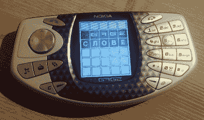

# 由于新的 SDK，Wordle 来到诺基亚 N-Gage

> 原文：<https://hackaday.com/2022/04/08/wordle-comes-to-the-nokia-n-gage-thanks-to-new-sdk/>

你可能从未想到你会在 2022 年读到为诺基亚臭名昭著的 N-Gage 手持游戏系统开发的新软件，我们当然也从未想到我们会写下它。但是我们在这里。当然，我们不是在谈论一个商业名称——这是由“taco phone”super fan[Michael fitz Mayer]开发的 *Wordle* 的一个非官方端口。

[Michael]告诉我们，第一个版本非常简单，目前在《纽约时报》版本中使用一个包含所有 2309 个术语的单词列表。翻译成芬兰语、俄语和德语的工作正在进行中，不过有趣的是，这项工作目前似乎受到了阻碍，因为[代码不支持带连字符的单词](https://github.com/ngagesdk/wordle/issues/2)；也就是说，如果你在玩俄语游戏，你可能会发现自己处于一个无法取胜的境地。我们确信这只是一个巧合，并不意味着任何形式的政治评论，但仍然…你不能编造这些东西。

In Soviet Russia, N-Gage plays you!

那么，如何为一台 2000 年代早期的失败游戏机开发一款新游戏呢？答案是使用目前正在开发的现代 N-Gage SDK，它允许您使用流行的工具和库(如 Visual Studio 2022、CMake 和 SDL)为系统编写代码。但是[迈克尔]不仅仅是这个新 SDK 的用户，[他也是这个操作背后的大脑。](https://hackaday.com/2022/01/27/an-up-to-date-development-environment-for-the-nokia-n-gage/)

希望这个新的开发平台将为这个被诽谤的设备带来某种复兴，[他甚至启动了一个 Discord server](https://discord.com/invite/dbUzqJ26vs) 来讨论[side talking](https://sidetalking.com/)的过去、未来和现在。如果你惊讶地发现自己正在寻找一辆二手 N-Gage 在易贝卖多少钱，加入这个俱乐部吧。