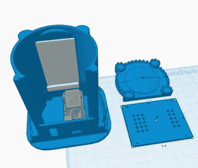

# 迷你黑暗塔克隆还原你的童年

> 原文：<https://hackaday.com/2022/04/15/mini-darktower-clone-restores-your-childhood/>

还记得*黑暗塔*吗？没有吗？嗯，这是 1981 年的一款非常酷的组合桌游、RPG 和电脑游戏。奥逊·威尔斯在电视上推销它，并如此解释它:“收集三把钥匙，围攻塔，并击败里面的敌人”。这座塔本身是一台安装在“懒人苏珊”上的电池供电计算机，它在几个 7 段显示屏上显示数字，通过三个旋转木马显示图片，还有一个 12 键键盘。多亏了一场官司，剩下的拷贝很少，能正常工作的就更少了。

*暗黑之塔*的工作副本在网上售价数百，但当这些 40 多年的旧塔容易出现电池泄漏和连接松动时，谁能负担得起这样的奢侈？当然不是[强大工作室]，他们希望把*黑暗之塔*作为礼物送给朋友，而[决定建造一个迷你复制品来代替](https://www.youtube.com/watch?v=neajD8c7Fl8)。幸运的是，这个项目是完全开源的。你可以看看下面的构建视频，里面有很多链接，包括一个指向代码的链接。

在这个时代，复制塔的内部并不需要太多。[Mighty Studios]用一个羽毛 S2、一个 320 x 420 TFT LCD 屏幕、一个扬声器和几个瞬时按钮实现了它。屏幕可以显示所有的图片(在最初的游戏中一次只显示一张)，任何必要的数字，以及所有必要的菜单选项。

[Mighty Studios]在这个案子上非常幸运，因为[Stinkevil]已经创建了一个骰子塔版本，并将其放在 Thingiverse 上。经过一点调整和一些打孔，[强大工作室]有一个迷你塔缩放到羽毛 S2，只有足够的空间来塞所有的组件和电线。在原始规则书的 PDF 和某人的游戏 Java 版本之间，[Mighty Studios]在将规则集邮寄给他们的朋友之前，有足够多的规则集作为编程指南。我们不得不承认，我们很嫉妒。

不想聚敛军队，征服恶势力？你可以用微控制器模拟所有类型的棋盘游戏。

 [https://www.youtube.com/embed/neajD8c7Fl8?version=3&rel=1&showsearch=0&showinfo=1&iv_load_policy=1&fs=1&hl=en-US&autohide=2&wmode=transparent](https://www.youtube.com/embed/neajD8c7Fl8?version=3&rel=1&showsearch=0&showinfo=1&iv_load_policy=1&fs=1&hl=en-US&autohide=2&wmode=transparent)

感谢提示，[foamyguy]！