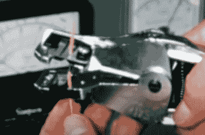

# NASA 硬件技术:像 1958 年一样焊接太空电子设备

> 原文：<https://hackaday.com/2022/04/13/nasa-hardware-techniques-soldering-space-electronics-like-its-1958/>

YouTube 上的[潜望镜电影]有许多旧的电视广告和美国政府的卷轴存档在他们的频道上，有一些真正有趣的主题可以深入了解。我们在这里强调的第一个是 1958 年的一部关于 NASA 焊接技术的电影(视频，嵌入下面)，它有一些有趣的细节，关于在太空竞赛期间事情是如何做的，并且可能会继续做下去。如果他们尝试，关于清洁的整体信息真的不会再清楚了——它是如此重要，看起来电影中的那些家伙花在刷牙和清洁上的时间比实际使用那些超级干净的烙铁要多得多。

特别值得注意的是电线剥皮和与元件连接的一些细节，例如使用热丝装置去除电线的绝缘层，而不是使用我们周围的剥离剂，剥离剂会切入绝缘层并在此过程中轻微扭曲电线。那是不行的。如果他们不得不使用切割型剥离器，它必须精确地适合工作的尺寸，并每天校准。

The road to the Moon is paved with calibrated wire strippers.

当将预先镀锡的导线焊接到有引线的元件上时，需要一个夹子来防止导线移动，因为元件引线上有一个热分流器来保护精密元件免受过热。他们甚至规定了在要焊接的端子上缠绕电线的长度，电线的弯曲度不能超过 180 度。

所有这一切的底线是，工作必须尽可能完美，因为一旦组件在地球上疾驰，几乎没有机会派人去修理危险的焊接工作。他们称之为太多的科学而不能称之为艺术，也称之为太多的艺术而不能称之为科学，我们当然能够理解这一点。

正如你所料(这也不是什么大秘密)，NASA 对所有硬件的组装都有一些非常严格的标准，比如这个[伟大的工艺标准](https://hackaday.com/2016/11/03/specifications-you-should-read-the-nasa-workmanship-standards/)，非常值得研究。焊接对我们许多人来说是一个重要的主题，我们已经讨论了焊料冶金的[主题](https://hackaday.com/2019/05/30/the-fascinating-world-of-solder-alloys-and-metallurgy/)，以及查看[古代硬件黑客如何在没有太多现代知识的情况下进行焊接](https://hackaday.com/2018/09/18/soldering-like-its-205-bc/)。

 [https://www.youtube.com/embed/_RXugDd0xik?version=3&rel=1&showsearch=0&showinfo=1&iv_load_policy=1&fs=1&hl=en-US&autohide=2&wmode=transparent](https://www.youtube.com/embed/_RXugDd0xik?version=3&rel=1&showsearch=0&showinfo=1&iv_load_policy=1&fs=1&hl=en-US&autohide=2&wmode=transparent)

谢谢[迈克]和[芬恩]的提示！