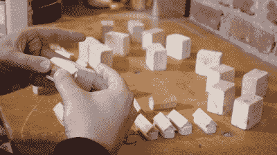

# 蹦极低音古筝真的很棒

> 原文：<https://hackaday.com/2022/04/12/bungee-corded-bass-zither-really-slaps/>

我们以前肯定都在一根拉长的橡皮筋上演奏过一些低音即兴部分，对吗？[Nicolas Bras]发现最棒的音乐橡皮筋是橡皮筋，并用其中的七根制作了一个可以用鼓槌弹拨或敲击的低音提琴。请务必在休息后观看构建/演示视频。

 【尼古拉斯】就是你所谓的五金店黑客。这已经不是他第一次表演乐器了；事实上，在过去的 15 年里，他一直在用聚氯乙烯和其他常见物品制作乐器。

在这个建筑中，有一个不太常见的东西是大型音箱[Nicolas],用来捆绑蹦极绳。他还为顶部覆盖着三角形木头的 bungees 定制了桥，这使它们看起来像小排屋。

为了实际演奏这个东西，[Nicolas]将排屋安排在双音符琴弦的两点琴桥系统中，这在琴桥和蹦极挂钩之间听起来不错，但在琴桥之间就不那么好了。总的来说，不管他怎么弹，古筝都有一个很棒的，圆润的声音，我们可能只需要自己把其中的一个串起来。

不喜欢弦乐？然后你可能会对 PVC 管感到满足，它能完美地播放“爆米花”。

 [https://www.youtube.com/embed/TV9vXzCGoug?version=3&rel=1&showsearch=0&showinfo=1&iv_load_policy=1&fs=1&hl=en-US&autohide=2&wmode=transparent](https://www.youtube.com/embed/TV9vXzCGoug?version=3&rel=1&showsearch=0&showinfo=1&iv_load_policy=1&fs=1&hl=en-US&autohide=2&wmode=transparent)

谢谢你的提示，[基思]！