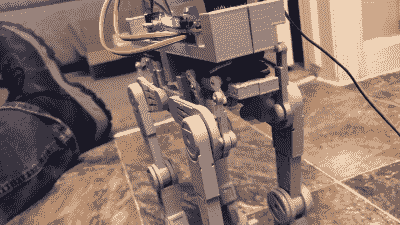

# 2022 年科幻竞赛:电动 AT-AT 步行机通过伺服系统四处走动

> 原文：<https://hackaday.com/2022/04/15/2022-sci-fi-contest-motorized-at-at-walker-gets-around-with-servos/>

AT-AT 步行机是《星球大战》宇宙中最可怕的武器之一，尽管它慢得令人难以置信，而且容易被义军的牵引索缠住。然而，你可以用伺服系统来建造你自己的小规模的例子，就像卢克·j·巴克巧妙地展示的那样。

Taking off the outer shell reveals the servo motors driving the leg linkages.

该建筑是 Thingiverse 上的[LtDan] [电动 AT-AT 的混搭，最初由 90 rpm DC 齿轮马达驱动。[卢克]重新混合了设计，改为由八个伺服电机驱动。它们由 SparkFun RedBoard Edge 控制，这是一种兼容 Arduino 的微控制器板，非常适合 AT-AT 外壳。](https://www.thingiverse.com/thing:1083338)

AT-AT 被设定了一个简单的正弦波行走周期，缓慢而沉重地行进着。这完全像是真实的虚构的东西，尽管没有爆能枪在冰冻的平原上发出的灼热的嘶嘶声。

四足车辆从未真正用于军事用途，但这并不是说没有人尝试过。休息后的视频。

 [https://www.youtube.com/embed/F8O341sPUUk?version=3&rel=1&showsearch=0&showinfo=1&iv_load_policy=1&fs=1&hl=en-US&autohide=2&wmode=transparent](https://www.youtube.com/embed/F8O341sPUUk?version=3&rel=1&showsearch=0&showinfo=1&iv_load_policy=1&fs=1&hl=en-US&autohide=2&wmode=transparent)

