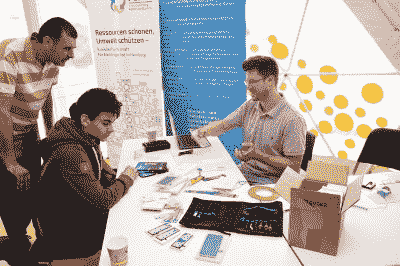
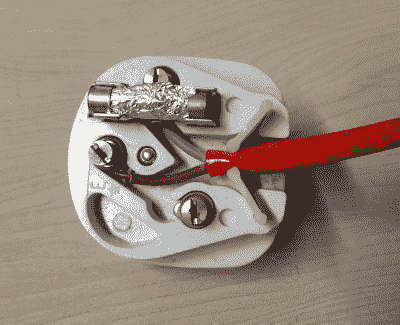
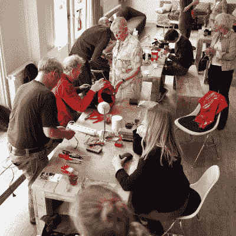

# 问 Hackaday:修不修咖啡馆？

> 原文：<https://hackaday.com/2022/05/03/ask-hackaday-repair-cafe-or-not/>

除了制造东西和谈论我们想要制造的东西之外，我们社区的大部分工作都涉及到维修。我们有能力在自己的东西坏了的时候修理它，我们可以修理别人扔掉的坏掉的东西，我们也可以修理别人的坏掉的东西。随着我们的消费者社会围绕着那些设计用来阻碍修理的产品而发展，这是保持活力的一项基本技能；这既是为了逃避不得不根据公司老板的心血来潮不断更换我们的财产，也是为了对抗永无止境的浪费浪潮。

## 修理咖啡馆:一件好事

[A German repair café.](https://commons.wikimedia.org/wiki/File:Repair_Lab_(48115819578).jpg) , Redaktion NdW, CC BY 2.0

所以我们修理坏掉的东西，例如，在我面前的长凳上是一个以前坏掉的相机，我给了它新的生命，在我的一个黑客空间的墙上是一台从垃圾箱里救出来的大屏幕电视，它和一个坏掉的 PSU 放在一起，在另一个黑客空间里，一台胶囊咖啡机通过一个用电缆扎带固定在一起的塑料歧管提供饮料。

我们为自己这样做，我们在我们的社区内这样做，而且越来越多地，我们为更广泛的社区这样做。“修理咖啡馆”运动是当地组织之一，他们举办会议，免费修理公众带来的坏东西。他们的工作几乎涵盖了你在家里能找到的任何东西，从纺织品、家具到电子产品，他们是一个非常好的事业，应该不惜一切代价予以鼓励。

尽管我对修理咖啡馆运动十分钦佩，但我还是决定不参与当地的运动。不是因为他们不是一群好人，也不是因为他们没有做好工作，而是因为不同的原因。这象征性地回到了三十年前的一个下午，当时我坐在赫尔的一所大学的实验室里，有人教我如何给英国的电源插头接线。

## 它从电源插头开始

This is probably the worst-wired mains plug I could muster when [I wrote about appliance testing](https://hackaday.com/2017/05/04/appliance-electrical-safety-testing-weve-got-it-down-pat/).

当然，我已经知道如何连接电源插头，就像我多年来在修理坏掉的电器时那样，但关键是，作为一名电子工程专业的学生，我被教导要正确地做这件事。事实上，在这三年的培训中，我学到了更多关于电气安全的知识，而不仅仅是如何给插头接线，我获得了大量的高压经验，以及我和我的朋友们试图确保我们为之安装设备的 90 年代初的狂欢者不会被电死的大量电气安全测试。如果你还记得锐舞时代，你真的不在*那里*，伙计！

所以我可以做高压电工作，而且我受过安全操作的训练。当我写这篇文章的时候，我周围都是我刚刚用过的设备。但这是我问题的症结所在，作为一个受过训练的人，我有责任把它做好。

换句话说，如果有人后来被我修好的东西电死了，我要比没有受过训练的人承担更大的责任，因为我应该知道如何安全地做事。由于我可能不知道在一件旧的主电源电气设备中还隐藏着什么，我很不情愿地决定它可能存在风险，因此我最好不要参加维修咖啡馆。这违背了我个人的许多主张，但如果出了什么问题，那就是我的责任。

[Ilvy Njiokiktjien](https://commons.wikimedia.org/wiki/File:Repair_Cafe_by_Ilvy_Njiokiktjien.jpg), CC BY-SA 3.0.

Hackaday 的读者群包括参与修理咖啡馆、经营修理咖啡馆或参与更广泛的修理咖啡馆运动的人。我想问他们，我上面的担心是否有效，或者我是否什么都不担心，事实上，我担心的是更广泛的维修和责任问题。修不修咖啡馆，这是个问题！