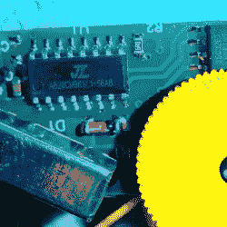

# Remoticon 2021 //耶鲁安·多姆堡[Sprite_tm]砍伐佛花

> 原文：<https://hackaday.com/2022/04/14/remoticon-2021-jeroen-domburg-sprite_tm-hacks-the-buddah-flower/>

没有人喜欢打开一个黑客目标，发现里面有一个黑色的环氧树脂团，但所有的希望都没有失去。至少如果你有[耶鲁安·多姆伯格]别名[Sprite_tm]的奉献精神和技能就不会了。

这一切都始于[大克莱夫]订购了一朵廉价的中国音乐冥想花，却发现了一个黑色的斑点。但诱人的是，闪亮的塑料垃圾还包括一个 2 MB 的闪存 EEPROM。接下来的问题是:你能用你自己的音乐来代替内容吗？剧透:是的，你可以！[Sprite_tm]一个分布在全球各地的佛牌芯片黑客团队开始工作。([幻灯片此处](http://meuk.spritesserver.nl/had-buddha/#/))。)

[耶鲁安]从`binwalk`开始，嗯，得到的不多。(大克莱夫)丢弃的数据具有足够高的熵，看起来要么是随机的，要么是加密的，除了几个微小的部分。看一看数据，有一些 T2 结构。[耶鲁安]闻到狗屎加密。原则上，每一个好的加密方法都有数百万个坏的加密方法。但是在实践中，天真的密码学家倾向于被少数坏模式所吸引。

第一个坏模式是 XOR。正确使用的话，XOR 运算可以是一种好的力量，但是如果你用 0 对你的密钥进行 XOR 运算，自然地，你会得到作为你的密文的密钥。这些数据中有很多零。这意味着有许多长字符串开始是相同的，但它们似乎永远继续下去，好像它们是伪随机的。第二个坏的加密模式是对伪随机数使用线性反馈移位寄存器，因为参数空间足够小，以至于[Sprite_tm]可以强行使用它。最后，他指出了他们的第三个错误——让破解加密变得如此有趣，以至于让他保持动力！

解密后，EEPROM 数据是一个文件系统。机器语言原来是用于 8051 的，但仍然存在代码驻留在微控制器 ROM 上的问题。所以[Sprite_tm]买了一朵这样的花，并开始在黑色斑点周围探索。他编写了一个转储程序，通过 SPI 输出内部 ROM 的内容。Ghidra 做了一些很好的分解，这让他明白了内存是如何布局的，以及流程是如何工作的。他还在芯片的闪存中发现了一个“秘密”的 ROM 区域，这是他通过尝试一些随机函数并寻找副作用而获得的。第一次击中的是一个 *memcpy* 。太好了。

【Neil555】的罗塞塔石碑

与此同时，互联网还在这个设备上工作，【Neil 555】还买了一朵花。但这个有一个芯片，而不是一个 blob，识别这个部分会引导他们到一个 SDK，它有一个音频套件，使用 WMA 音频编码的衍生物。这足以让音乐进入花朵。(提示一个简短的滚动。)胜利！

好吧，如果你只想把你的音乐拷到芯片上，那就是胜利。作为最后的刺激，[Sprite_tm]将逆向工程的佛花示意图与[Thomas Flummer]非常漂亮的 DIY Remoticon 徽章融合在一起，并将我们自己的介绍主题音乐上传到徽章上的设备中。加分？他增加了 led 来熄灭负责“加密”的 LSFR。恶心的烧伤！

 [https://www.youtube.com/embed/5ZtVT8V1Xy0?version=3&rel=1&showsearch=0&showinfo=1&iv_load_policy=1&fs=1&hl=en-US&autohide=2&wmode=transparent](https://www.youtube.com/embed/5ZtVT8V1Xy0?version=3&rel=1&showsearch=0&showinfo=1&iv_load_policy=1&fs=1&hl=en-US&autohide=2&wmode=transparent)

编者按:这是我们得到的 Remoticon 2 的最后一个视频。感谢所有发表演讲的人，感谢所有出席和参与[现场不和谐暗道](https://discord.com/invite/NkbHrAW7NG)的人，感谢所有让黑客之火不灭的人。没有你我们做不到，我们期待着回归“正常”的超级大陆。