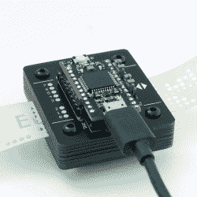

# 纸带阅读机自我校准，说出 USB

> 原文：<https://hackaday.com/2022/04/16/paper-tape-reader-self-calibrates-speaks-usb/>

由穿孔纸带的光学阅读器组成的输入设备在计算的早期就已经存在，那么为什么现在要停止呢？[于尔根]的[纸带阅读器](http://www.e-basteln.de/computing/papertape/overview/)项目通过 USB 连接到任何现代计算机，就像一个串行通信设备。由于该设备的自动校准，它可以与各种纸质材料一起工作。至于阅读速度，它几乎只限于一个人在不损坏磁带的情况下能以多快的速度阅读磁带。

Stacked 1.6 mm PCBs act as an enclosure, of sorts.

虽然[Jürgen]的设备使用发光二极管和光电晶体管来检测穿孔的存在与否，但它不依赖于硬件校准。相反，该器件读取每个光电晶体管的模拟读数，并使用软件调整的阈值来区分 1 和 0。这使得它可以轻松处理各种类型和颜色的胶带，甚至可以处理半透明材料。如果设备有机会校准，每秒读取 500 个字符不成问题。

有兴趣自己做吗？项目的构建部分有所有的设计文件；它只使用通孔元件，由于该设备是由 1.6 毫米厚的 PCB 堆叠而成，因此不需要单独的外壳。

纸带和阅读器对他们有一定的魅力。Cyphercon 4.0 徽章配备了磁带阅读器，我们甚至看到了[将 I ² C 字节流直接编码到磁带](https://hackaday.com/2021/05/03/i2c-paper-tape-reader-is-not-what-you-think/)上的不寻常方法。