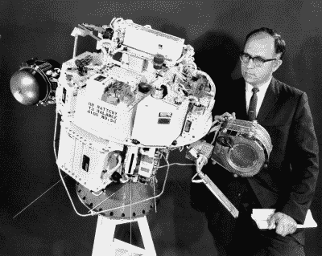
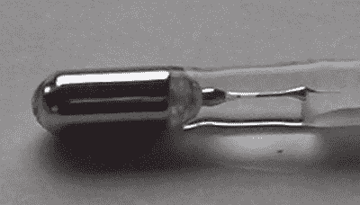
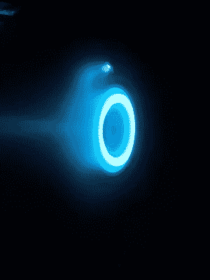
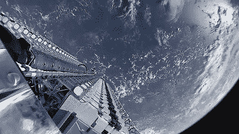

# 水星推进器:及时避免了一场世界性的灾难

> 原文：<https://hackaday.com/2022/04/18/mercury-thrusters-a-worldwide-disaster-averted-just-in-time/>

航天器设计领域必然会被效率所困扰。在太空做任何事情的成本都是天文数字，而且与发射重量密切相关。因此，任何可以降低这些数字的技术都是开发的首选。

近年来，水星推进器有望成为这样的技术之一。唯一的问题是潜在的毁灭性环境成本。今天，我们将看看水星推进器的好处，以及它们是如何在短时间内被取缔的。

## 电动推力

正如我们在之前的深度解说中所探索的[，离子推进器已经在无数的太空任务中被证明是有价值的。他们不是利用化学反应来产生推力，而是利用电场来加速离子。与传统火箭相比，它们无法产生同样大的推力。然而，它们更省油。这意味着他们可以用同样多的燃料产生更多的速度变化。](https://hackaday.com/2022/03/03/ion-thrusters-not-just-for-tie-fighters-anymore/)

NASA experimented with mercury-based ion thrusters on the SERT-I (pictured) and SERT-II spacecraft. However, mercury was deemed too toxic to use in future missions. Credit: NASA, public domain

虽然它们的推力很小，你永远无法用它来将车辆发射到轨道上，但它们主要用于卫星的定位，帮助它们在一段时间内保持位置，抵抗高层大气的阻力。它们也可以用来推进没有重力对抗的远程探测器。

如今，大多数推进器使用惰性气体如氙或氪作为燃料。然而，这些气体价格昂贵，而且它们的分子相对较轻。另一方面，汞要重得多，仍然非常容易电离，并且容易以液体形式储存在航天器上。也非常非常便宜。由于汞的毒性，许多行业经常不得不支付处理汞副产品的费用。俗话说“你甚至不能把它送给别人”在这里确实适用。

## 问题是

Mercury has a multitude of uses, such as the thermometer seen here. However, the silvery liquid metal is now used less often due to knowledge of its negative health effects. Credit: [CambridgeBayWeather](https://commons.wikimedia.org/wiki/File:Maximum_thermometer_close_up_2.JPG), public domain

虽然从理论上讲，汞是一种优秀的离子推进器燃料，但它的毒性太强，不容忽视。它会对神经系统和大脑产生不良影响，它在环境中的存在会对人类产生重大负面影响。从降低智商到损害记忆，一路下来都是坏的。它是一种随着时间在体内积累的毒素，经常通过食物链进入人体。事实上，许多海洋生物中的汞浓度意味着孕妇被特别建议避免多种海鲜。

出于这个原因，美国宇航局在 20 世纪 70 年代的初步实验后，放弃了使用汞作为推进剂。除了污染大气，汞还带来了其他风险。推进器上的工作人员有职业危害。此外，发射台上的爆炸或坠毁会将有毒物质扩散到周围环境中。

由于这些原因，水星很快被美国宇航局认为是一种“死燃料”，尽管有好处，但使用起来太危险了。

## 关于事态发展

NASA moved on to xenon-fuelled Hall effect thrusters after mercury was deemed too dangerous to use. Credit: NASA JPL, public domain

然而，正如经常发生的情况一样，据报道，一家硅谷初创公司通过老调重弹“颠覆”了一个成熟的行业。 [*【彭博】*在 2018 年](https://www.bloomberg.com/news/articles/2018-11-19/this-space-startup-could-lace-the-atmosphere-with-toxic-mercury)发表了一篇报道，关于初创公司 Apollo Fusion 的活动。业内人士告诉 outlet，这家初创公司正在寻找一种使用汞作为推进剂的新推进器技术。

这很快给世界各地的许多人敲响了警钟。随着 SpaceX 计划在几年内发射超过 10，000 颗卫星，以及许多其他公司急于建立自己的大规模卫星舰队，前景非常可怕。如果阿波罗核聚变公司得到一份合同，为数千颗卫星配备水星推进器，那么整个地球的大范围污染问题就会突然摆在桌面上。

一篇科学论文显示，由 2000 颗携带 100 公斤推进剂的卫星组成的星座将在十年内每年向高层大气释放 20000 公斤的汞。由于汞离子的重量，大部分最终会落回地球，占现有全球汞排放量的 1%。模型显示，75%的汞最终会进入海洋，对海洋生物和捕鱼作业造成负面影响。

60 Starlink satellites seen prior to deployment in 2019.
Concerns abounded that if mercury thrusters were used for upcoming constellations of thousands of satellites, it could spread significant pollution into the atmosphere and around the world. Credit: [SpaceX, public domain](https://en.wikipedia.org/wiki/Starlink#/media/File:Starlink_Mission_(47926144123).jpg)

几十年来，人们付出了巨大努力来减少环境中的汞含量。联合国的一项条约《汞问题微型公约》为签约国控制汞的使用提供了一个框架。128 个国家签署了该条约，涉及限制从电池到灯具、肥皂和化妆品等各种物品中汞的使用。

在 2013 年签署时，回归水星推进系统的想法根本不在讨论范围内。阿波罗融合直到 2016 年才成立。更糟糕的是，美国的法规意味着很难阻止任何希望将水星发射到太空的公司。通信卫星属于联邦通信委员会的管辖范围，[该委员会允许卫星运营商自我证明他们的飞行器](https://peer.org/mercury-may-reach-orbit-through-regulatory-blindspot/)对人类或环境没有有害影响。

## 稳妥的决议

令人欣慰的是，科学家游说反对这项技术的努力取得了成果。今年 3 月，联合国召开了一次关于汞的水俣公约的会议，并通过了一项决议，在 2025 年前逐步停止使用汞作为卫星推进剂。

由于大多数航天国家都是该公约的签署国，这使得水星推进器的商业案例几乎不可行。至于阿波罗核聚变，该公司坚持致力于离子推进领域，尽管这次可能已经放弃了汞推进剂。该公司被美国航天发射公司 Astra 收购，作为 SpaceX 去年 Transporter-2 任务的一部分，它已经在太空飞行了氙推进器[。](https://astra.com/news/apollo-fusion-thruster-spaceflight/)

无论如何，看来未来几年将被送入轨道的数以千计的卫星将在没有喷射水银的推进器的情况下进入太空。这对我们地球上的所有人来说应该是一个巨大的安慰，因为这里已经有太多的汞污染了。