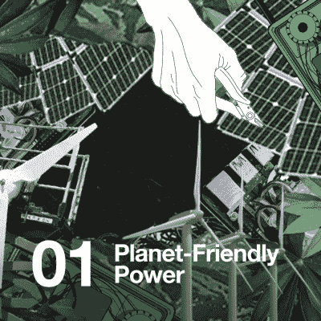

# 2022 年 Hackaday 奖黑客聊天拉开了序幕

> 原文：<https://hackaday.com/2022/04/15/the-2022-hackaday-prize-hack-chat-kicks-things-off/>

2022 年 Hackaday 奖已经开始，我们已经看到了一些令人难以置信的提交材料，这些人相信他们的想法可能会让世界变得更美好。但是和所有的比赛一样，在你太投入之前理解所有的规则是有好处的。我们保证在细则中没有隐藏任何东西，但我们当然不会责怪任何想确保这一点的人。

这就是为什么我们的母公司 Supplyframe 的设计和合作伙伴负责人 maje NTA strong heart,[在本周的黑客聊天](https://hackaday.io/event/184650-2022-hackaday-prize-hack-chat)中停下来，回答社区关于这一全球硬件设计挑战的所有问题。一个小时涵盖了很多内容，Majenta 确保每个人的问题和关注都得到满意的解决。毕竟，有了 Supplyframe DesignLab 的常驻资格和总额为 125，000 美元的奖金，我们希望确保每个人都搞清楚事实。

 那么，黑客社区对今年的奖项有什么迫切的问题呢？一些人想了解更多关于可持续性、循环性和气候危机恢复力的主题。例如，在这个上下文中，循环到底是什么意思？虽然挑战 2“再利用、回收、改造”最清楚地体现了这一想法，但 Majenta 解释说，这一次评委将特别考虑限制原材料提取和废物产生的想法。

举个实际的例子，2022 年 Hackaday 奖评委 James Newton 指出了由 Norbert Heinz 设计的直接颗粒挤压机。该项目去年获得了第五名，它允许废弃塑料在桌面 3D 打印机中轻松重新利用。这包括打印机本身产生的对象，但无论出于何种原因，不再需要或需要。这种印刷物体的“生命周期”，其中相同的塑料可以一次又一次地印刷成新的物体，是今年奖项背景下圆形的完美封装。

其他人希望澄清竞赛规则。具体来说，在将现有项目纳入竞争方面存在一些困惑。它必须是一个全新的想法吗？如果你已经在这个项目上工作了多年，但以前从未公开展示过，那会怎样？不要担心——现有项目绝对可以参加 2022 年 Hackaday 奖。事实上，即使该项目之前已经进入了 Hackaday 奖，它仍然是一个公平的游戏。

 但是有一个重要的警告:为了有资格获得今年的奖项，项目**必须**被记录在一个新的 Hackaday.io 页面上。此外，如果它是一个以前参加过黑客大赛的项目，你必须展示出它与以前参加时有"*显著不同，并展示出在比赛过程中有意义的发展*，正如官方规则中的[所述。通俗地说，这意味着任何试图将旧的和过时的 Hackaday.io 页面提交到比赛中的人都会发现他们的参赛资格被取消。](https://cdn.hackaday.io/files/1845557896001120/HDP%20Official%20Rules_2022.pdf)

聊天快结束时，Erin Kennedy 提起了导师的话题，她是一位资深黑客奖得主，读者可能更熟悉她的名字“ [Erin RobotGrrl](https://hackaday.io/robotgrrl) ”。在前几年，像的 Andrew“Bunnie”Huang 和的 Mitch Altman 这样的硬件名人可以为获奖作品背后的个人和团队提供建议和指导。虽然对这一努力感到非常自豪，但 Majenta 解释说，至少目前为止，在项目的这一方面可以重新调整之前，导师会议是暂停的。主要问题是搞清楚所涉及的后勤工作；在几组忙碌的人之间安排视频通话就像听起来一样棘手。也就是说，如果竞争对手有足够的兴趣，在 2022 年重新举办导师会议也不是完全不可能的。

我们感谢 Majenta 花时间直接回答来自社区的问题，并希望那些在聊天中提出问题或关注的人最终会决定参加比赛。带着一个有价值的目标和大量的获胜机会，我们真诚地希望看到尽可能多的人在 10 月 16 日截止日期之前提交参赛作品。如果你准备好迈出下一步，[请前往竞赛页面，向我们展示你的实力](https://hackaday.io/contest/184555-supplyframe-designlab-2022-hackaday-prize)。

* * *

Hack Chat 是一个每周一次的在线聊天会议，由来自硬件黑客世界各个角落的顶尖专家主持。对于黑客来说，这是一种有趣和非正式的联系方式，但如果你不能现场直播，这些概述帖子以及发布到 Hackaday.io 的[文字记录确保你不会错过。](https://hackaday.io/event/184650-2022-hackaday-prize-hack-chat)