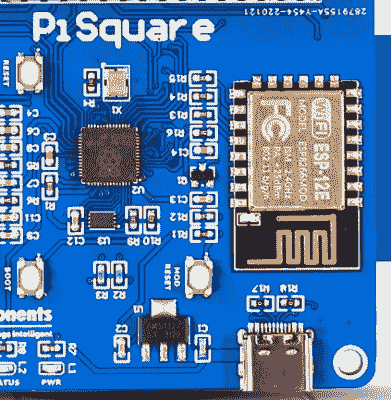

# 有许多方法可以轻易毁掉你的 PCB 天线设计

> 原文：<https://hackaday.com/2022/11/01/the-many-ways-you-can-easily-ruin-your-pcb-antenna-design/>

PCB antenna impaired by copper fill and other attenuation sources.

我们都见过印刷电路板(PCB)天线:印刷电路板上那些弯弯曲曲的迹线通常连接到蓝牙、WiFi 或其他无线通信芯片。在 ESP8266 和 ESP32 平台等模块上，PCB 天线通常集成在模块的 PCB 上，但即使是这样一个现成的模块，也有可能完全破坏这种天线的有效性。[MisterHW]在本文中[讨论了这些和其他设计问题。](https://hackmd.io/oaFVCqXNSZO_LdZHaAnW_g?view)

它涵盖了一系列糟糕设计的例子，从在天线下方进行接地填充，到在天线附近放置金属，再到在天线附近或顶部放置电介质材料。所有这些问题的影响通常是衰减信号，有时达到天线基本上无用的程度。

最终，最好的 PCB 天线设计是附近没有铜填充，并且天线附近或下面的层上没有走线。毕竟，任何金属走线或元件都是天线，任何电介质材料都会抑制信号。幸运的是，有一个[免费的 KiCad 库](https://github.com/sad-electronics/wch-kicad-lbr)，里面有现成的 PCB 天线设计，可以帮助你开始定制设计，还有许多其他资源，本文都有涉及。

如果你想真正专业地检查天线设计的有效性，你需要使用网络矢量分析仪。这些也将有助于您调整 PCB 天线使用的电容。

(专题图片:PCB 天线因过度热情的铜填充而变得无用。)