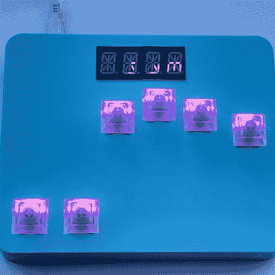

# 微微和弦键盘是同时复古和新的

> 原文：<https://hackaday.com/2022/05/06/pico-chording-keyboard-is-simultaneously-vintage-and-new/>

理论上，和弦——即按下多个键来创建单个字符或整个单词——看起来是最好的输入法之一。也许对速度来说不是最好的，至少在一段时间内是这样，但是对保存键的总数来说绝对是好的。当然，更少的键也使得  构建键盘更容易(只要你不必编写和弦软件)。事实上，我们大胆猜测，打造你自己版本的[【CrazyRobMiles】的微微和弦键盘](https://github.com/CrazyRobMiles/PICO-Chord-keyboard)最困难的部分将是教你的手指如何一起弹奏和弦，而不是一次敲一个。

[CrazyRobMiles]的灵感来自用于 Microwriter 的 Cykey chording 设计，以及后来的 Microwriter Agenda，后者还配备了 qwerty 泡罩键盘。两者都在六个按键上方有小屏幕——每个手指一个，拇指两个。最初的 Microwriter 运行在 8 位微处理器上，Pico Chord Keyboard 使用——你猜对了 Raspberry Pi Pico。

我们喜欢[CrazyRobMiles]配有四个 14 段显示屏，这给了它一种很好的老式感觉，但在 Kailh 开关上使用了透明的键帽。这实际上很重要，因为发光二极管不仅显示你在什么模式(字母对数字对符号)，它们还教你如何在特殊训练游戏模式中和弦每个字母。休息后请务必查看视频。

我们生活在一个键盘相对较大却只有几个键，而小键盘却有所有键的世界，这难道不酷吗？

 [https://www.youtube.com/embed/ZogL7Nv60Xc?version=3&rel=1&showsearch=0&showinfo=1&iv_load_policy=1&fs=1&hl=en-US&autohide=2&wmode=transparent](https://www.youtube.com/embed/ZogL7Nv60Xc?version=3&rel=1&showsearch=0&showinfo=1&iv_load_policy=1&fs=1&hl=en-US&autohide=2&wmode=transparent)

