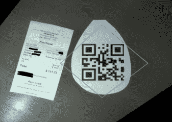

# 扫描收据证明比预期的更棘手

> 原文：<https://hackaday.com/2022/04/21/scanning-receipts-proves-trickier-than-anticipated/>

这是听起来非常简单的事情之一:给收据拍照，通过光学字符识别(OCR ),然后将结果信息发送到任何你想要的费用跟踪网站或软件。有公司提供这样的服务，所以靠自己复制不会太难……对吧？

总之，这就是[【Marcel robi taille】在着手创建他的自制“收据摄取”系统](https://blog.marcelrobitaille.me/receipt-ingestion/)时的想法。但实际上，故障排除和实施要花费太多时间，他说如果手工输入所有收据，速度会更快。不过，我们很高兴他坚持了下来，否则你不会在 Hackaday 上读到它，我们也无法从他提供的详细描述中了解到任何东西。

只花了一个晚上就拼凑出了一个粗略的演示，初步结果非常有希望。该代码可以检测收据的边缘，适当地旋转捕获的图像，然后提取关键信息，如日期、总金额、企业名称等。然后，他能够破解 Splitwise 的 API，这是一种拆分账单的在线服务，方法是在添加新账单时捕捉浏览器发送的数据。有了这些信息，编写一些 Python 代码将捕获的数据推送到服务中就变得很简单了。到目前为止，一切顺利。

Using a QR code as reference point.

但就像许多以一个幸福的家庭在美丽的家园开始新生活为开头的恐怖电影一样，有一个怪物潜伏在阴影中。从干净平整的收据中获取数据是一回事，但从一张花了半天时间揉皱在你后口袋里的收据中获取任何有用的信息又是另一回事。在受控条件下有效的有希望的概念证明在现实世界中完全失败了，据[Marcel]报告，他试图扫描的收据中只有五分之一真正通过。

最后，[Marcel]意识到处理不可靠收据的最好方法是关注图像中的不同对象。他想出了一种二维码标记，可以放在桌子上，与要扫描的收据放在一起，他的软件可以将它用作已知的参考点。这大大提高了图像旋转和变换的可靠性，从而使 OCR 更加可靠。这也使得区分哪些图像需要扫描变得容易得多——如果没有找到二维码，软件就会跳过那张照片，继续寻找。

使用 OCR 数字化大量印刷内容的独特挑战带来了一些有趣的问题解决方案，我们很高兴[Marcel]与我们分享了这个特殊的故事。虽然仍有一些边缘案例需要追查，但他几乎每天都在使用该软件，并且[已经将它发布在 GitHub](https://github.com/MarcelRobitaille/Receipt-Ingestion) 上，供任何希望利用他的成果的人使用。