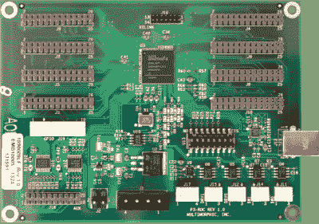

# 一个伟大的资源，为准弹球机制造商

> 原文：<https://hackaday.com/2022/04/29/a-great-resource-for-the-would-be-pinball-machine-builder/>

我们这些超过一定年龄的人很可能会有一些美好的回忆，花了很多时间和零花钱来喂当地的街机弹球机。有一段时间，它们似乎无处不在，但可悲的是，这些天它们似乎在很大程度上已经失宠，正变得更加特殊，需要特别寻找。除了一些随机出现的机器——在英格兰巴斯的玛丽·雪莱博物馆有一个有趣的弗兰肯斯坦主题的机器——去当地的游乐场玩一趟通常很令人失望，如果你问我们，现代的游戏机已经不能满足你的需求了。那么，一个老派黑客除了学习如何按照我们想要的方式从头开始构建一台机器之外，还能做什么呢？这方面的一个很好的资源是优秀的[弹球制造商网站](https://pinballmakers.com/wiki/index.php?title=Main_Page)，它展示了相当多的不同平台，以及大量的资源和指南来帮助你。

P3-ROC pinball machine controller mainboard – note the Xilinx Spartan 6 FPGA

建造一台工作机器需要一些来自广泛领域的严肃技能，包括木工、金属敲打、图形设计、电子、游戏设计和编程。对于一个新手来说，要学的东西太多了，想知道从哪里开始一定很困难。幸运的是，弹球制造商有这些学科的每一个部分，还有更多，以及特殊的弹球特定的建设技术指南。想知道怎么构造弹弓吗？掩护！构建一个电子平台怎么样？有许多选择，有些基于当时开放的弹球项目(OPP)，有些则不然。现在，谁想建造一个黑客日主题的弹球机(自然是黑暗主题)，请举手，游戏会是什么？答案在下面！

好家伙，这些年来我们已经讨论了很多弹球机，这里有一个[漂亮的机器内置在咖啡桌形状因子](https://hackaday.com/2021/12/28/clear-off-the-coffee-table-its-pinball-time/)中，它可能会帮助你把它从工作间偷偷带到客厅。如果这太大了，当你把你的作品推进房子时，你“看”到了，这里有一个[非常小的基于 PI 的虚拟机](https://hackaday.com/2022/03/27/tiny-pinball-is-as-cute-as-pi/)让你感觉更好。最后，如果建造一个不是你的游戏，而你渴望真正的交易，你可能需要[一些老机器的调试帮助](https://hackaday.com/2022/01/10/get-a-grip-on-troubleshooting-your-vintage-pinball-machine/)！

谢谢[基思]的提示！