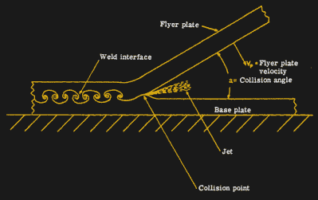
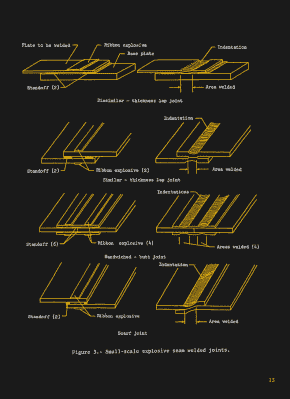
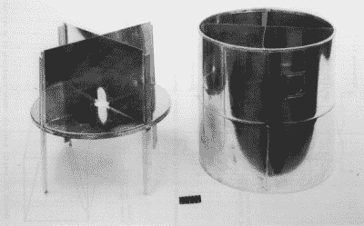

# 爆炸焊接砰的一声爆炸了

> 原文：<https://hackaday.com/2022/04/25/explosion-welding-goes-off-with-a-bang/>

焊接通常是一个高温和嘈杂的过程。它通常涉及一些奇特的化学和适当的知识，以达到良好的效果。不管你说的是电弧，钨极氩弧焊，还是金属焊条惰性气体保护焊，这些陈述都适用。

爆炸焊接也是如此，尽管它完全不同于你以前见过的任何传统手工焊接方法。今天，我们将探索这项技术是如何工作的，以及它的应用。向洞里开火！

## 不要把他们分开，把他们吹在一起！

Explosion welding occurs near-instantaneously, but is done in a progressive fashion. The angle of collision, as well as the speed of the explosive front, is key to getting a quality weld. Image credit: NASA, public domain

与其他金属连接技术相比，爆炸焊接技术相对较新。在 20 世纪的两次世界大战中，经常发现弹片粘在装甲板上。近距离观察表明，弹片实际上是焊接在金属装甲上的，而不是简单地嵌入其中。考虑到弹片和装甲之间的碰撞经常发生在没有典型焊接操作的极端高温的情况下，这表明是弹片和装甲之间的高速撞击将金属融合在一起。

同样的结果后来在实验室重现，爆炸焊接在第二次世界大战后发展成为一种精细的技术。1962 年，杜邦[为爆炸焊接工艺](https://www.freepatentsonline.com/3137937.html)申请了专利，后来以“Detaclad”商标为人所知。

NASA explored the use of ribbon explosives to weld a variety of different joints in a memorandum published in the 1980s. Image credit: NASA, public domain

爆炸焊接是在金属保持固态的情况下发生的，因此这被称为“固态”焊接技术。在最常见的形式中，被称为“衬垫”的厚金属板被平放，在顶部放置大约一英寸或更小的垫片。然后，将称为“覆层”的较薄金属板放置在隔离物的顶部，从而在要焊接在一起的两块板之间存在小间隙。为了去除杂质和保证焊接质量，两块板在连接前被磨平。

然后，炸药粉末被包装在包覆层的顶部。粉末装药通常从包覆层的一个或一个角或一侧开始引爆。这就在炸药中产生了一种席卷效应，爆炸前沿以均匀的速度穿过包覆层的顶部。这逐渐迫使覆层与下面的衬垫接触。这一过程产生空气、氧化物和杂质的等离子体射流，在两个板之间的闭合间隙之前射出，在此过程中清洁板的表面。

产生的焊缝是由两种金属的塑性变形引起的，而不是像传统焊接工艺中那样由它们的液化引起的。与液相焊接技术相比，这些结合可具有高达 100%的母体材料强度，并且通常在热影响区域周围具有较少的问题。在这方面，结果与摩擦焊接获得的结果相似。两块金属板在其整个表面上以连续和均匀的方式连接在一起。

该工艺能够将不同的金属焊接在一起。这甚至包括奇怪的组合，如钢和铝，甚至一些活性金属。专门研究这种技术的公司通常会列出超过 260 种不同的金属组合，这些金属组合可以用这种方式结合。

当然，由于爆炸反应的剧烈程度，爆炸焊接通常仅限于平板和简单的圆柱形。该技术通常用于制造化学和石化工业中使用的具有包覆金属表面的管道或储罐。爆炸焊接甚至被用在阿波罗飞船上，依靠这一过程来制造一个坚固的钛-钢过渡接头。

NASA had ideas for structures that could be welded in space using explosive techniques, and demonstrated that idea with the 18-inch model seen here. The idea never really caught on, however, and explosion welding is primarily used for simple cladded plate work these days. Image credit; NASA, public domain

航天局甚至在 1983 年发表了一份关于这个主题的技术备忘录，分享了实用的小规模爆炸缝焊的细节。所涉及的技术依赖于 RDX 炸药来产生长的、均匀的接缝，这些接缝具有如此高的、一致的质量以至于可以被密封。该论文指出，该技术被用于加拿大核反应堆的修复，尽管它也可以用于其他情况，如密封管道或其他容器。

鉴于烈性炸药的使用，这不是一种特别容易在家里车库里自己动手做的技术。然而，如果你发现自己需要将一种金属板粘在另一种完全不同的金属板上，以制造具有有用综合性能的东西，爆炸焊接可能正是你需要的工具。只是一定要在安全和遥远的地方做它，并且在你击中引爆器之前呼叫！

 [https://www.youtube.com/embed/u9_bqafUJfA?version=3&rel=1&showsearch=0&showinfo=1&iv_load_policy=1&fs=1&hl=en-US&autohide=2&wmode=transparent](https://www.youtube.com/embed/u9_bqafUJfA?version=3&rel=1&showsearch=0&showinfo=1&iv_load_policy=1&fs=1&hl=en-US&autohide=2&wmode=transparent)

[标题图片:仍来自“[爆炸焊接](https://www.youtube.com/channel/UCZnyjRw3Q8mMEVLda1pc2yA)”，JRP RC Judd Phillips]