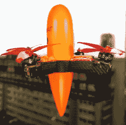

# 模块化反无人机无人机为自卫牺牲自己

> 原文：<https://hackaday.com/2022/04/22/modular-anti-drone-drone-sacrifices-itself-for-self-defense/>

部分赛车无人机，部分遥控飞机，部分火箭……所有的威胁。你还能如何描述一架高速飞行的四轴飞行器，它是为击落其他小型四轴飞行器而设计的？【阿列克谢】的[拦截无人机借鉴了上述所有飞行学科的元素。](https://www.youtube.com/watch?v=CHqrzPAni58)

[Aleksey]采用标准赛车无人机零件制造，确保其结构中不使用任何违禁零件。相反，拦截无人机依靠一个非常强大的发动机和一个轻型框架来保持“火箭升天”类别的功率重量比。

A close up shows the details: Detachable motors and rotors and the stowed net.

但是，如果没有办法把目标从空中带走，哪种拦截无人机是完整的呢？这是最大分歧的开始。马达都指向远离飞行器中心线的方向。根据命令，这些马达实际上与框架分离，每个马达都展开并部署一张旨在缠绕目标转子的网的一角，使其与重力的战斗嘎然而止。

拦截无人机如何在攻击中幸存？没有了它的马达，四轴飞行器的核心就落到了地球上。阻止坠落的是降落伞，很像模型火箭中使用的降落伞。一个音频信标发出警报来帮助某人找到它——这是一个直接来自遥控飞机爱好的举动。

当然，在地方上有很多讨论合法性的空间，但不管对该工艺的预期用途有什么看法，该系统看起来非常光滑，而且有一些很棒的黑客技术就在其中。不想造无人机——杀人——无人机？也许你需要的只是一个南瓜和好(坏？)定时。

 [https://www.youtube.com/embed/CHqrzPAni58?version=3&rel=1&showsearch=0&showinfo=1&iv_load_policy=1&fs=1&hl=en-US&autohide=2&wmode=transparent](https://www.youtube.com/embed/CHqrzPAni58?version=3&rel=1&showsearch=0&showinfo=1&iv_load_policy=1&fs=1&hl=en-US&autohide=2&wmode=transparent)

谢谢[克里斯]的提示。