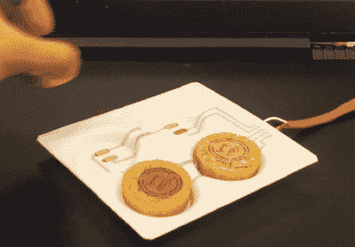

# 通过 3D 打印在真空成型塑料上添加导电迹线

> 原文：<https://hackaday.com/2022/04/22/add-conductive-traces-on-vacuum-formed-plastic-with-3d-printing/>

真空成型零件上的表面导体出现在许多黑客中，从角色扮演盔甲到 3D 触摸板和智能物体。但是制造它们总是很痛苦。要么它们必须在成型后手绘，这看起来很邋遢，而且劳动强度大，要么它们必须用一些难以使用的可拉伸油墨技术印刷。 [[Freddie Hong]和他的团队有另一个解决方案](https://deepai.org/publication/vacuum-formed-3d-printed-electronics-fabrication-of-thin-rigid-and-free-form-interactive-surfaces)，使用大多数黑客已经拥有的技术——3D 打印机和真空成型器。

Smart tray created by this method.

他们用导电 PLA 细丝直接在塑料基板上 3D 打印轨迹，然后真空成型整个东西。灯丝受热时会变形——这是打印机灯丝。

我们喜欢这个过程。我们发现导电细丝在垂直层上不可靠，但在 XY 平面上是可靠的。他们的方法只需要一层。此外，他们建议在大部分导体上 3D 打印一层不导电的 PLA，就像 PCB 阻焊膜一样。

导电细丝具有相当大的体积电阻。他们建议在应用顶部掩膜层之前电镀它。他们还在探索用彩色细丝 3D 打印标志、条纹等，甚至在模型部件上制作铆钉等表面细节，或在真空成型过程中塑料变薄的地方增加厚度。

设计 3D 打印需要猜测什么样的塑料片在真空成型的最终部件中结束。他的团队使用商业程序 [t-sim](https://www.t-sim.com/) 进行预测，并使用 [Grasshopper](https://www.grasshopper3d.com/) 将结果导入 [Rhino3D](https://www.rhino3d.com/) 。这对于一个家庭黑客来说似乎太多了。在测试纸上画线和真空成型似乎更简单。

我们以前看过真空成型。我们做了一篇关于 3D 打印的文章，并在 2015 年报道了 Ted Brull 的 T2 Kevo 真空成型器。

感谢[howielowe]的提示。