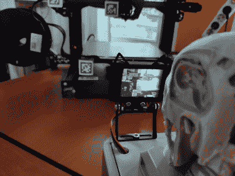

# 机器视觉帮助您终止失败的 3D 打印作业

> 原文：<https://hackaday.com/2022/04/25/machine-vision-helps-you-terminate-failing-3d-print-jobs/>

如果你是一名 3D 打印机用户，你可能很熟悉那种可怕的感觉，在提交一项大任务后几个小时回到打印机，却发现它出现了一个错误并停止打印，或者更糟的是，将半卷细丝变成了一堆无用的扭曲塑料。虽然一些打印机配有远程监控设施，但[Kutluhan Aktar]的却没有，所以他建造了一个设备来监视他的 3D 打印机，如果有什么不对劲就通知他。

 该设备通过使用摄像头跟踪打印头的运动并寻找运动中的任何重大变化来实现这一点。例如，如果 Y 轴突然停止移动，并且没有在合理的时间内恢复，它将生成一条警告消息，并通过电报发送给其所有者。如果所有三个轴都停止移动，那么要么打印完成，要么出现严重错误，这两种情况都需要用户干预。

使用的相机[Kutluhan]是一台 HuskyLens AI 相机，可以检测物体并输出一组描述其运动的 3D 坐标。一组类似 QR 的 AprilTags 附着在 3D 打印机的移动部件上，帮助相机识别相关组件。该软件运行在一个 3D 打印的外壳中的树莓 Pi 上，顶部有一个 T-800 终端头，给它带来一点额外的存在。

[Kutluhan]对该项目的描述涵盖了如何设置相机并将其连接到电报机器人以使其能够发送自动消息的许多细节，因此即使你不打算在 3D 打印机上 3D 打印一些东西，这也是一个有趣的阅读。毕竟，像 [Octoprint](https://hackaday.com/2018/01/03/upgrading-a-3d-printer-with-octoprint/) 这样的软件有许多类似的功能，但拥有一个独立的观察者仍然是一个很好的安全功能，以防止某些类型的[灾难性故障](https://hackaday.com/2016/03/21/ask-hackaday-mrrf-edition-3d-printers-can-catch-fire/)。

 [https://www.youtube.com/embed/gIvlC43ikNE?version=3&rel=1&showsearch=0&showinfo=1&iv_load_policy=1&fs=1&hl=en-US&autohide=2&wmode=transparent](https://www.youtube.com/embed/gIvlC43ikNE?version=3&rel=1&showsearch=0&showinfo=1&iv_load_policy=1&fs=1&hl=en-US&autohide=2&wmode=transparent)

