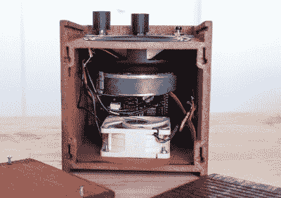

# 洛菲皮让寒冷的节拍继续到来

> 原文：<https://hackaday.com/2022/04/25/lofipi-keeps-the-chill-beats-coming/>

如今，许多人喜欢在放松和学习时听一些高保真音乐。这导致了一个致力于生产上述 beats 的家庭手工业，并且这种格式越来越流行。[尼古拉斯·夏洛克]决定打造一款定制的音频设备，专门用来播放这些舒适的音乐。

正如在 Reddit 上看到的，这款车依靠树莓派 3B，搭配 X400 音频放大器板，并连接到一个大小适中的中音扬声器。硬件被组装在一个用木质效果 PLA 细丝打印出来的盒子里，给它一种不错的老式家庭音响美感。作为奖励，层线排列的方式可以增强木纹效果。插上电源，你会立即从 boot 获得高保真节拍。

 最初，系统从 lofigenerator.com 运行代码的一个端口，该端口通过算法从零开始创建低保真节拍。然而，[Nicholas]出于良心不能分享移植的代码，他重新调整了系统，使用命令行媒体播放器 mpv 来播放 YouTube 播放列表。它将播放典型的低保真播放列表，但也可以针对平台上的任何内容进行调整。

这是一个很好的建设，真正适合高保真节拍的理想。当你试图学习或集中注意力时，你不会想打开 YouTube 标签来分散注意力。相反，你可以简单地在 Lofipi 上轻弹，然后发出共鸣。

Raspberry Pi 便宜的价格和强大的互联网和媒体功能使它在这样的构建中非常受欢迎。他们在某种程度上重现了[接收广播](https://hackaday.com/2021/08/26/a-simpsons-tv-for-a-golden-age/)的想法，而不是强迫我们按照今天的现代点播媒体范式做出选择。如果你对此有想法，请在评论中提出，如果你有自己的伟大项目，[请给我们写信。](http://hackaday.com/submit-a-tip)