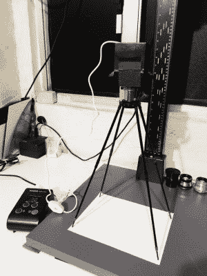

# 简单的照片放大机使任何暗房大增

> 原文：<https://hackaday.com/2022/04/26/simple-photo-enlarger-makes-great-addition-to-any-darkroom/>

基于化学的摄影有时看起来像是一种黑暗的艺术，但它不必如此。[丹·K]开发了简单的放大机，以帮助传播这样一种观点，即经典的摄影暗房工具从根本上来说是非常容易理解和制造的。

The assembled enlarger.

照片放大机用光照射底片，然后把光聚焦在一张可以显影的相纸上。[丹的]放大机设计旨在使用从任何一元店或文具店容易获得的材料来建造，并且可以在短短几个小时内建造完成。为了简单起见，它可以使用单一胶片格式和固定尺寸的相纸。

一个简单的 M-mount 相机镜头被压入主光学系统，选择前苏联的部分是因为它容易对焦和便宜的价格。一个小胶合板箱构成了一个体面的身体，一个白色荧光粉 LED 提供光源。最终的设备设计用于在标准的 8×10 纸张上打印 35mm 底片。

如果你想自己冲洗底片，又不想买商业放大机，[丹]的产品可能就是你要找的。我们以前也见过其他类似的版本。与此同时，如果你有自己漂亮的暗室黑客，一定要[给我们写信！](http://hackaday.com/submit-a-tip)