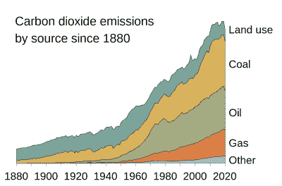
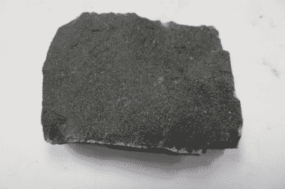

# 没有技术的大规模碳捕获

> 原文：<https://hackaday.com/2022/05/10/large-scale-carbon-capture-without-the-technology/>

我们人类正处于某种困境，因为我们向大气中排放了太多的二氧化碳，导致了气候变化，这甚至可能会将我们灭绝。对有些人来说，这可能仍然是一个有争议的说法，但知道需要做些什么应该是一个立场，你不一定要成为一个气候变化活动家，把自己粘在炼油厂的门口。

很明显，我们可以减少二氧化碳的排放来解决这个问题，但这不是减少大气中二氧化碳的唯一方法。从空气中去除怎么样？这是一种被足够重视的方法，许多工业碳捕获解决方案被提出，甚至在冰岛建造了一个试点工厂。最有希望的想法是，来自发电站的二氧化碳可以被注入多孔玄武岩中，并在那里反应生成碳酸钙。所有这些都令人印象深刻，但是有没有一种方法可以在不借助太多技术的情况下实现这一点呢？是时候拿出信封背面的计算器来看看了。

## 空气中有如此多的二氧化碳，去除它可行吗？

This graph helps illustrate the scale of the problem. Efbrazil, [CC BY-SA 4.0](https://commons.wikimedia.org/wiki/File:CO2_Emissions_by_Source_Since_1880.svg).

首先，无论是衡量问题的严重程度，还是证明试图解决问题是徒劳的，量化我们释放了多少二氧化碳都是值得的。有几个略有不同的数字，取决于你准备看哪里，但大多数人都同意，人类每年要对超过 400 亿吨的二氧化碳负责。从人均来看，美国人均 15.52 吨，加拿大人均 18.58 吨，而在本文撰写的大西洋彼岸，英国人均 5.5 吨。为了证明想象几个碳捕获工厂就能净化空气中的二氧化碳并产生重大影响是徒劳的，重复这些数字是值得的，因为这个问题的规模如此之大，即使是最高产的工业扩张也很难跟上。

通过非工业手段捕获和储存大量碳的第一种也是最明显的方式当然是以生物质的形式。种植树木成为持久的森林听起来很有吸引力，表面上看也很容易做到，但是减少这些排放有多实际呢？[根据 2019 年发表的瑞士联邦理工学院苏黎世研究的国家地理报告](https://www.nationalgeographic.com/environment/article/how-to-erase-100-years-carbon-emissions-plant-trees#close),美国面积大小的新森林覆盖区域可以在一百年内减少大气中 25%的二氧化碳，这是一个很好的新闻，但似乎没有一块美国大小的土地可以用来种树。如果全球有种植的意愿，这可能是一个可以实现的目标，但除了政客们的口头承诺，很难想象这样一个雄心勃勃的项目会有多大进展，直到切萨皮克湾的水拍打在白宫的前台阶上。很明显，虽然森林将在解决我们的二氧化碳问题上发挥作用，但它们无法独自解决这个问题。

Could basalt hold the key to reducing atmospheric CO2? Amcyrus2012, [CC BY 4.0](https://commons.wikimedia.org/wiki/File:Basalt.JPG)

另一个有趣的想法来自谢菲尔德大学的一项研究，该研究提出英国可以通过所谓的加速风化达到净零排放目标的 45%。二氧化碳被岩石自然吸收，因为它们被溶解在雨水中的二氧化碳的弱酸性作用所风化，这个想法建议通过农民将粉状岩石用作土壤敷料来放大这种作用。

这是一个表面上的玄武岩注入想法，其中涉及的巨大岩石表面积将导致更多的二氧化碳从空气中提取出来，因为它的天气。因此，二氧化碳被锁住了，从而抵消了排放。玄武岩很常见，理论上是可行的，但他们承认这种规模的操作需要小心处理。我们准备好为了抵消气候变化而失去整座大山了吗？也许还没有，但是泰晤士河口环绕唐宁街 10 号的水域可能会再次引起人们的关注。

很明显，对于气候变化没有神奇的解决方案可以让我们继续排放二氧化碳，就好像什么都没发生一样。我们没有可以种植的超级森林，没有可以建造的智能工厂，也没有可以净化空气的神奇土壤敷料。然而，通过对这些技术的研究，我们发现每一种技术都可以在抵消一部分排放方面发挥作用，同时首先做出有意义的减排努力，这可能有助于我们实现梦寐以求的净零排放。问题是，我们有这样做的公众和政治意愿吗？