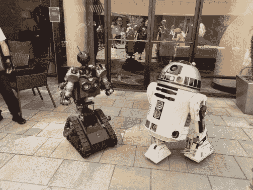
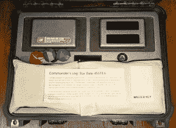
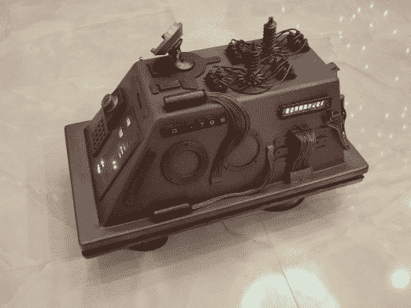
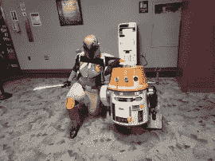
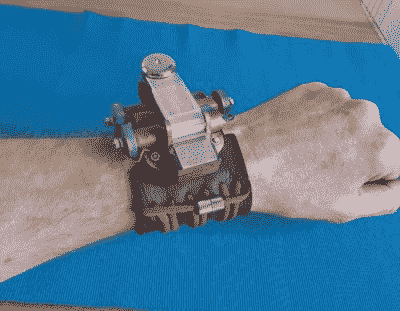
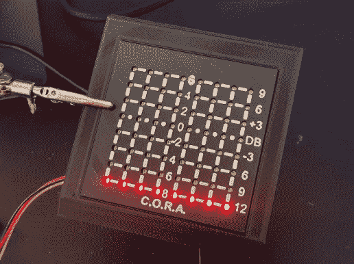
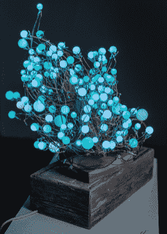

# 2022 年科幻竞赛:获胜者在

> 原文：<https://hackaday.com/2022/04/28/2022-sci-fi-contest-the-winners-are-in/>

科幻竞赛于周一结束，我们集思广益，选出了我们最喜欢的作品。这不是一件容易的事情，因为除了许多项目看起来非常出色之外，许多项目还在文档方面全力以赴，制作了这些优秀的例子，我们都可以从中学习，不管你是否喜欢科幻。但是我们在骗谁呢？从我们得到的回复来看，你是。

## 获胜者

【RubenFixit】的 [*星际迷航*穿梭控制台](https://hackaday.io/project/184963-star-trek-shuttle-console)是一个以*迷航*为主题的盒子里的逃生室。该项目对细节的非凡关注和详尽的项目日志绝对赢得了我们评委的心。从 LCARS 图形到 3D 打印的等线性芯片槽和模拟晶体，应有尽有。[鲁本]估计这一次大约花了 300 个小时，它显示。

我们在竞赛中不乏机器人项目，但[RudyAramayo]的 [R.O.B.](https://hackaday.io/project/159056-rob) 赢得了我们的评委。这不是一个笑话，超过 140 磅的定制金属制品和正义的胎面。它也是由周围一些昂贵的硬件制成的，所以这可能不是你周末建造的机器人。我们喜欢 Arduino 测试代码套件上的评论:“看在上帝的份上，当你的代码变成自动驾驶汽车时，你必须测试它。”

最后，【zapwizard】的[功能剃刀嵴控制杆](https://hackaday.io/project/184433-functional-razor-crest-control-lever)集道具和视频游戏控制器于一身。我们完全可以看到 Grogu 在玩这个，我们对物理构造中的细节的关注——定制齿轮和限速器——以及对道具制作细节的关注感到惊叹。有些零件是定制的不锈钢板。3D 打印零件用铝带覆盖，化学老化。太棒了。哦，是的，它也是一个工作的 USB 操纵杆。

这三名获胜者将获得价值 150 美元的 Digi-Key 购物礼包。

      

### 生活在未来

今年的比赛展示了许多科幻服装的真实项目，这太棒了。我们不知道它对黑客观众说了什么，但今年太多的参赛作品不只是道具——有很多真正的工程在进行。也许我们真的生活在未来。

*   [j]的 [Spec Mk II](https://hackaday.io/project/181376-spec-mk-ii) 是三录仪的科学-现实版本。它有一个分光计，热感相机，光谱分析仪，和一个 2D 激光雷达测距仪。这不是未来的事，但也许有可能。
*   [andrewfentem]的[加速器 22](https://hackaday.io/project/184732-accelerator-22-science-fiction-table-hockey) 是一款未来太空空气曲棍球游戏，只不过它是真实的。这是正在进行的一系列项目之一，通过用电磁铁推动物体来创造互动的表面。这里，球拍发出电磁脉冲使冰球反弹，就像变魔术一样。
*   [维克多·塞拉诺]的[机器人士兵](https://hackaday.io/project/157950)是将十年来机器人技术的修补成果放进一个滚动的冲锋队玩具中的结果。它可以自我平衡，有图像跟踪和第一人称视角的虚拟现实覆盖。这是一个光滑的机器人建造！绝对要看视频演示。
*   最后，[凯文·哈林顿]的[孩子](https://hackaday.io/project/175622-the-child-animatronic-hack-of-baby-yoda-plush-toy)和[马蒂亚斯·库比什]的[扁平猫](https://hackaday.io/project/184998-flatcat-your-next-robot-is-a-pet)都穿过恐怖谷，或者可能绕过它。你必须决定。不管怎样，未来就是现在。

### 明星明星

在*星球大战*和*星际迷航*之间永无休止的粉丝战中:这一轮到了*大战*。一半的功劳归于[CuriousMarc]和他神奇的[鼠标机器人](https://hackaday.io/project/184859)和[R2-D2](https://hackaday.io/project/184992)复制品，但如果我们必须为 T10 曼达洛人 T11 设立一个子类别，我们就可以。[Kenneth Zaborny]的[直升机机器人](https://hackaday.io/project/9223-star-wars-rebels-chopper)已经存在多年了，它看起来仍然很棒！*星球大战*粉丝刚刚代表。

      

### 从片场偷来的

 我们喜欢【梅丽莎·马托斯】的[仓库 13 特斯拉枪](https://hackaday.io/project/184727-warehouse-13-tesla-gun)——这是一部多相的反派作品。它有 Nixies，3D 打印框架，以及一个低调的四档电源旋钮。[军团实验室]的[薛定谔的触发器](https://hackaday.io/project/184643-schrdingers-trigger)不是最干净或最精致的，但它用黑客风格的勇气弥补了这一点，因此它看起来更真实*。而【cyzoonic】的 [Cyberdeck1](https://hackaday.io/project/183892-cyberdeck1) ，我们之前在 Hackaday 上[报道过的，依然震撼。[Bram]的](https://hackaday.com/2022/03/12/rugged-cyberdeck-makes-the-case-for-keeping-things-water-tight/) [RayTime](https://hackaday.io/project/184363-raytime) 手表来自另一个宇宙，我们爱它。*

 *### 太空服

这个类别实际上只有一个竞争者，而且[Andrea Piccinno]的 [3X0](https://hackaday.io/project/182971-3x0-3d-printable-exoskeleton-concept) 全押。从他自己的 3D 摄影测量扫描开始，许多 3D 打印、弹簧和减震器正朝着半人半机器的方向发展。这是一个需要你关注的项目。

### 最重要的设备

这一类是看起来像未来的东西，因为它们是明亮的，闪闪发光的。[卢克·j·巴克]的《太空堡垒卡拉狄加 的 c . o . r . a .[符合要求，同时看起来很像星巴克飞船上的真实交易。为什么闪烁的发光二极管是一个东西？这是未来，宝贝！虽然它不会闪烁，但我们不得不为[埃迪]的](https://hackaday.io/project/184461-cora-from-battlestar-galactica)[万花筒](https://hackaday.io/project/184538-kaleidoscope)脱帽致敬:它是一束手工焊接到固定电阻上的 RGB LEDs，自然的元件公差有助于实现微妙、美丽的照明。在星舰军官宿舍的背景下可能看起来不错。

    

总的来说，我们得到了大量令人敬畏的参赛作品！感谢所有参赛的人，剩下的人肯定应该[检查所有项目](https://hackaday.io/submissions/sci-fi-contest/list)。发生的事情太多了，我们无法公正地对待。

*