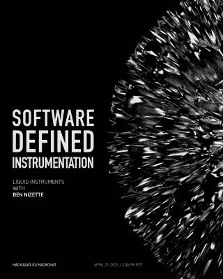
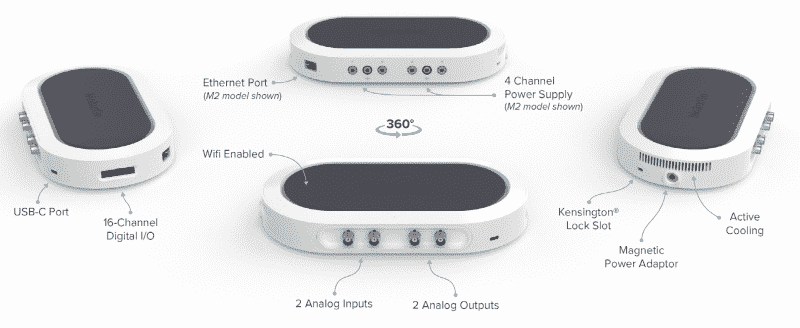

# 用软件定义的仪器建立瑞士陆军实验室

> 原文：<https://hackaday.com/2022/04/29/building-a-swiss-army-lab-with-software-defined-instrumentation/>

很有可能任何经常阅读 Hackaday 的人都有一个触手可及的电压表，示波器也很有可能不远了。但除此之外，事情变得有些模糊。我们确信你们中的一些人可以进入一个充满高端测试设备的适当实验室，即使只是在工作时间，但由于成本和空间的限制，我们大多数人不得不将就使用这些必需品。

理想的解决方案是一个神奇的小盒子，它可以是你当时需要的任何仪器:有时是示波器，有时是频谱分析仪，甚至可能是通用的数据记录器。为了简化事情，这种设备没有自己的物理显示器或控制器，相反，你可以把它插到你的电脑上，通过软件控制它。这不仅可以使设备更小更便宜，而且可以创建定制的用户界面，精确匹配用户想要完成的任务。

 痴心妄想？不完全是。正如嘉宾主持人 [Ben Nizette 在*软件定义的仪器黑客聊天*](https://hackaday.io/event/184771-software-defined-instrumentation-hack-chat) 中解释的那样，用廉价的袖珍型设备取代一架测试设备的梦想比你可能意识到的更接近现实。虽然软件定义的仪器可能不适合所有应用，但可以说，普通学生或爱好者可能需要或希望的任何功能都可以通过市场上已有的硬件来满足。

Ben 是 Liquid Instruments 的产品经理，该公司生产 Moku 系列的多种仪器。具体来说，他负责 Moku:Go，这是一款专门面向教育和创客市场的入门级设备。这款超薄设备的成本并不比基本的数字示波器高多少，但由于软件定义仪器(SDi)的魔力，它可以代替 11 种仪器，对目标用户来说，性能都绰绰有余。

那么有什么问题呢？正如你所料，这是聊天中人们首先想知道的。据 Ben 说，最大的缺点是所有的仪器必须共享同一个模拟前端。为了保持可负担性，这意味着该单元所能做的一切都受到相同的基本“速度限制”的限制——在 Moku:Go 上是 30 MHz。即使在该公司更高端的专业型号上，最大带宽也是以数百兆赫来衡量的。

此外，SDI 传统上受限于它所连接的计算机的速度。但是 Moku 硬件设法通过在内部 FPGA 上运行软件方面的东西来回避这个特定的问题。缺点是该设备的一些功能，如数据记录器，实际上无法将数据实时传输到连接的计算机上。用户必须等到测量完成后才能得出结果，尽管 Ben 说有足够的内存来存储几个月的高分辨率数据。

当然，一旦这个社区听说有 FPGA 在板上，他们就想知道他们是否能得到它。为此，Ben 说 Moku:Go 将在 6 月得到他们的“云编译”服务的支持。基于浏览器的应用程序已经可用于 Moku:Pro，允许您将 HDL 上传到 Liquid Instruments 服务器，以便进行构建和优化。这使得高级用户可以完全访问 Moku 硬件，这样他们就可以构建和部署他们自己的定制功能和工具，精确地满足他们的需求，而无需单独的开发工具包。Ben 知道[过时总是云解决方案](https://hackaday.com/2022/04/25/insteon-abruptly-shuts-down-users-left-smart-home-less/)的一个问题，他说他们还与 Xilinx 合作，允许用户在自己的计算机上进行构建，同时仍然实施专有的“秘方”,使其成为 Moku。

人们很难不对软件定义仪器的前景感到兴奋，特别是像 Liquid Instruments 和 Red Pitaya 这样的公司将硬件成本降低到学生和黑客可以负担得起的程度。我们要感谢 Ben Nizette 花时间与社区谈论他一直在做的事情，特别是考虑到 Hackaday 指挥中心和 Liquid 澳大利亚总部之间存在相当大的时差。任何愿意在太阳升起之前跳到网上谈论 FPGAs 和相位计的人都是我们书中的 AOK。

* * *

Hack Chat 是一个每周一次的在线聊天会议，由来自硬件黑客世界各个角落的顶尖专家主持。对于黑客来说，这是一种有趣和非正式的联系方式，但如果你不能现场直播，这些概述帖子以及发布到 Hackaday.io 的[文字记录确保你不会错过。](https://hackaday.io/event/184771-software-defined-instrumentation-hack-chat)