# 复古电脑节东方再掀标杆

> 原文：<https://hackaday.com/2022/05/02/vintage-computer-festival-east-raises-the-bar-again/>

当我到达信息时代科学和历史博物馆参加今年的东[老式计算机节](https://vcfed.org/events/vintage-computer-festival-east/)时，我完全期望它与去年相比是一个减少的事件。毕竟，怎么可能不是呢？由于 COVID 改变了时间表，节目主持人 Jeffrey Brace 和他的团队只有六个月的时间来组织一场通常需要一整年时间规划的活动。准备时间如此之短，他们完全应该放松一下。

但是任何参加过东 VCF 2022 的人都可以证明，他们不需要它。这个活动不仅满足了去年的节日所设定的高期望，还成功地超越了它们。有更多的研讨会，更多的讲座，更多的供应商，更多的寄售室，更多的直播，更多的…嗯，所有的一切。与 10 月份与会者收到的灰度讲义相比，今年的计划甚至有了一点亮色。无论用什么标准来衡量，这都比以往任何时候都要好。

然而，这确实让我处于一个不值得羡慕的境地。正如我们在疫情中学到的那样，一个像 VCF 这样大范围的事件的虚拟再现可以让你尝到所提供的东西，但是所有的细微差别都丢失了。看某人的激情项目的照片比不上真正见到那个人，当他们带你了解所有细节时，看到他们眼中闪烁的骄傲。

因此，请记住这一点，通过这个纲要的一些项目，引起了我的注意。这不是一个“最佳”名单，这个节日当然也不是一个竞赛。但是每个与会者都会带着他们自己的一些最喜欢的回忆离开，所以我将在这里记录我的回忆。如果你想留下自己的回忆，我强烈建议你在 2023 年 4 月去泽西海岸参加下一届东部老式电脑节。

## 手持设备的历史

令人不安的是，很多人认为便携式计算始于 2007 年苹果推出第一款 iPhone，但那些一直关注科技世界的人知道，组织者、PDA、掌上电脑、平板电脑和其他古怪的小工具可以追溯到个人计算的最早期。戴夫·谢维特带来了一些精选的手持计算设备，从 Curta 机械计算器到 Palm Pilot 和 BlackBerry 等标志性产品。

 [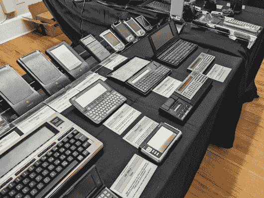](https://i0.wp.com/hackaday.com/wp-content/uploads/2022/04/vcfeast22_history1.jpg?ssl=1)  [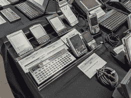](https://i0.wp.com/hackaday.com/wp-content/uploads/2022/04/vcfeast22_history2.jpg?ssl=1)  [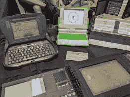](https://i0.wp.com/hackaday.com/wp-content/uploads/2022/04/vcfeast22_history3.jpg?ssl=1) 

在一个充斥着像 VCF 一样稀有昂贵的硬件的活动中，你通常应该保持低调。但在这种情况下，戴夫邀请与会者拿起并摆弄展出的设备，感受一下使用它们的感觉。嗯，不全是。我没有看到他把 Curta 递给随机的路人，但你只能对索尼 CLIE 或 TRS-80 Model 100 造成这么多损害。

## 检出 Core64

这些年来，我明白了“老式计算”的含义是不同的，取决于你问谁。对一些人来说，这是 Commodore 64 等早期台式机的时代。其他人正在寻找大铁主机和前面板闪光灯。作为现代设计，Andy Geppert 的 Core64 在技术上不属于任何一个阵营，但它确实允许你交互地玩第一批数字计算机中毫无疑问最迷人的组件之一:核心内存。

 [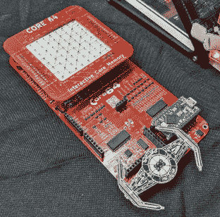](https://i0.wp.com/hackaday.com/wp-content/uploads/2022/04/vcfeast22_core1.jpg?ssl=1)  [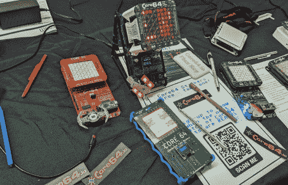](https://i0.wp.com/hackaday.com/wp-content/uploads/2022/04/vcfeast22_core2.jpg?ssl=1) 

过去我们在黑客日报道过 Core64，安迪甚至在 2021 年主持了一场 [*复古记忆黑客聊天*。但这是我第一次有机会亲自看到硬件，我来告诉你，它*牛逼*。当我到达那里时，他带来的工具包早已售罄，但他手头仍有几个演示单元供与会者使用，他很高兴与任何感兴趣的人谈论这个项目。该设备有几种操作模式，但通过点亮每个铁氧体后面的 led，可以直接在矩阵上绘图的模式在年轻人群中尤其受欢迎。](https://hackaday.com/2021/11/01/retro-memory-hack-chat/)

它作为教育工具的应用显而易见，但 Core64 不仅仅是你生活中的微型硬件黑客。如今，使用核心内存的机会并不多，真正手工编织这些东西的机会就更少了，这使得它成为一个特别引人注目的小工具，对于那些想要获得一些关于帮助人类登上月球的技术之一的实践经验的人来说。

## 你现在能听到我吗？

乍一看，Jason Perkins 为 IT 组织的 *Dial 1 展览似乎有点不适合参加计算机节。虽然在技术上涉及到计算机硬件，但它被推到了后面，在两张桌子后面，桌子高高地堆着一大堆电话。展出的样品从老式旋转电话到相对现代的无绳电话都有。显示器旁边的墙上甚至挂着一部付费电话，这在今天是非常罕见的。*

 [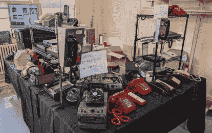](https://i0.wp.com/hackaday.com/wp-content/uploads/2022/05/vcfeast22_phone1.jpg?ssl=1)  [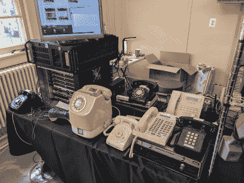](https://i0.wp.com/hackaday.com/wp-content/uploads/2022/05/vcfeast22_phone3.jpg?ssl=1)  [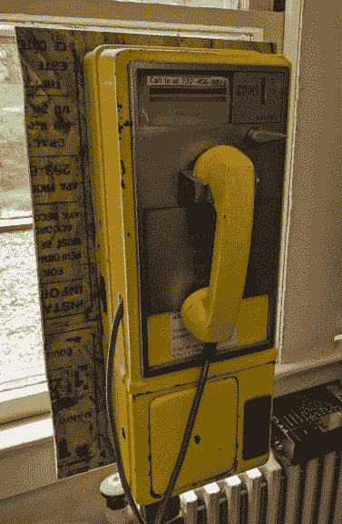](https://i0.wp.com/hackaday.com/wp-content/uploads/2022/05/vcfeast22_phone2.jpg?ssl=1) 

所有的电话都连接到一个 PBX 上，每个电话上都有一个小标签标明它的分机。与会者可以自由地拿起任何他们感兴趣的手机，并拨打它的同行。甚至还列出了一个公共电话号码，这样你就可以用手机打电话进入系统。这个展览给了年轻观众一个亲身体验技术的机会，他们可能从来没有亲眼见过，这是一个巨大的成功。在 2022 年看到青少年使用付费电话有一定的新奇感，这并没有错过他们——有几次我看到年轻的游客用付费电话给他们的朋友拍照，具有讽刺意味的是，这是 21 世纪手机的袖珍超级计算机。

## TRS-80 又来了

对于那些从未参加过 VCF 活动的人来说，你可能会有这样的印象，展厅看起来像一个电脑博物馆——一排排古老的机器排列在舞台上，太旧太脆弱，无法通电，更不用说实际使用了。在某些特殊情况下，你是对的。但在很大程度上，VCF 是在给这些经典机器注入新的生命，同时也是在把它们当做历史文物来欣赏。*综述！由彼得·切廷斯基为 TRS-80 开发的[新游戏](https://pski.net/2021/03/21/roundup-is-a-new-game-for-the-trs-80-model-i-iii-and-4/)*就是一个完美的例子。

当然，仅仅为 TRS-80 开发一款游戏并不一定是什么了不起的成就。毕竟，过去不乏由单个开发者开发的游戏，你可以说大多数 TRS-80 的所有者可能对 BASIC 足够熟练，他们会在某个时候摆弄自己的简单游戏(或从书中抄袭)。

这里的技巧是 Peter 没有使用 20 世纪 80 年代的开发工作流程。相反，他的游戏是在 Macbook Pro 上使用现代开发工具开发的。格子背心软件的 TRS-80 屏幕设计师被恰如其分地命名为 [*，他可以使用一个与旧网格纸工作表并非完全不同的界面来创建艺术资产。*](https://plaidvest.com/screendesigner/index.html) *[zmac 交叉编译器](http://48k.ca/zmac.html)让你在你的 Windows、Linux 或 Mac OS 机器上为 Tandy 构建二进制文件，而 [trs80gp 仿真器](http://48k.ca/trs80gp.html)让你测试它们。把结果记在一堆软盘上(或者磁带上，视情况而定)，你就可以在明年的 VCF 上拥有自己的桌子了。*

## 随意采样

 [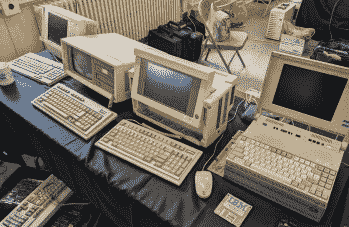](https://i0.wp.com/hackaday.com/wp-content/uploads/2022/05/vcfeast22_gallery3.jpg?ssl=1) The many faces of the Compaq Portable [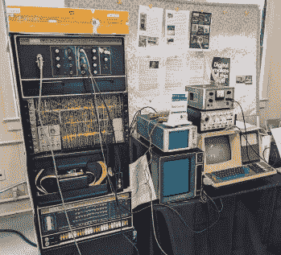](https://i0.wp.com/hackaday.com/wp-content/uploads/2022/05/vcfeast22_gallery6.jpg?ssl=1) Spacewar running on a PDP-8 [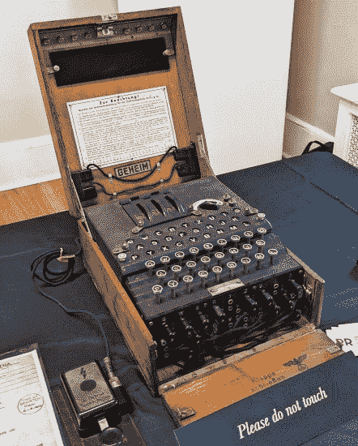](https://i0.wp.com/hackaday.com/wp-content/uploads/2022/05/vcfeast22_gallery11.jpg?ssl=1) An authentic German Enigma machine [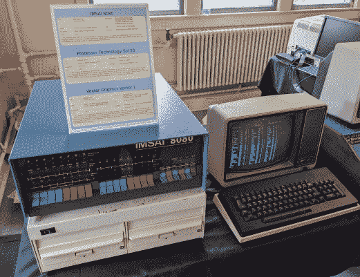](https://i0.wp.com/hackaday.com/wp-content/uploads/2022/05/vcfeast22_gallery7.jpg?ssl=1)  [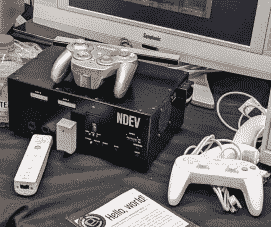](https://i0.wp.com/hackaday.com/wp-content/uploads/2022/05/vcfeast22_gallery10.jpg?ssl=1) Wii Development Kit [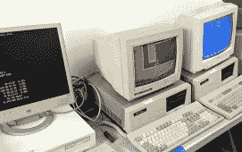](https://i0.wp.com/hackaday.com/wp-content/uploads/2022/05/vcfeast22_gallery9.jpg?ssl=1)  [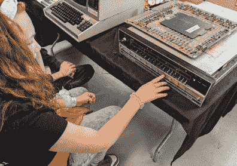](https://i0.wp.com/hackaday.com/wp-content/uploads/2022/05/vcfeast22_gallery8.jpg?ssl=1)  [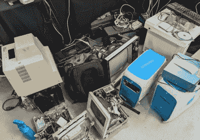](https://i0.wp.com/hackaday.com/wp-content/uploads/2022/05/vcfeast22_gallery5.jpg?ssl=1) Somebody’s got a new project on their hands. [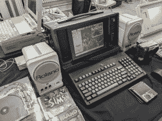](https://i0.wp.com/hackaday.com/wp-content/uploads/2022/05/vcfeast22_gallery4.jpg?ssl=1) You may not like it, but this is what peak PC gaming looks like. [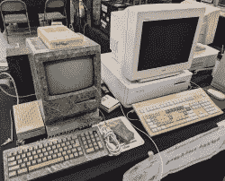](https://i0.wp.com/hackaday.com/wp-content/uploads/2022/05/vcfeast22_gallery2.jpg?ssl=1)  [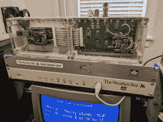](https://i0.wp.com/hackaday.com/wp-content/uploads/2022/05/vcfeast22_gallery1.jpg?ssl=1) Pushing old Weather Channel gear into service.

## 留下印象

无论他们的年龄或背景如何，我在 2022 年老式计算机节上交谈过的每个人都对这个活动持积极的态度。一天下来，甚至我自己 11 岁的女儿也留下了深刻的印象，她通常利用空闲时间在《我的世界》挖洞。我想说，她在活动结束后也变得更聪明了——花一个下午的时间将程序切换到小型机的前面板，相比之下，现代智能手机中以前难以理解的魔法似乎变得古雅了。她说她很兴奋明年去，而且不仅仅是“T2”爸爸说我必须去“T3”的方式。

毫无疑问，部分吸引力在于信息时代校园本身，它为 VCF 游客提供了一系列令人难以置信的展品。说真的，除此之外，在一个可操作的射电望远镜的步行距离内还有沉船博物馆吗？但即便如此，古董计算机联盟的热情成员能够精心策划一场活动，成功吸引住那些甚至没有展出的计算机或设备一半古老的客人，坦率地说，这是一个小小的奇迹。考虑到今年的主题是“大众电脑”，我认为他们做到了。