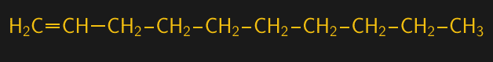
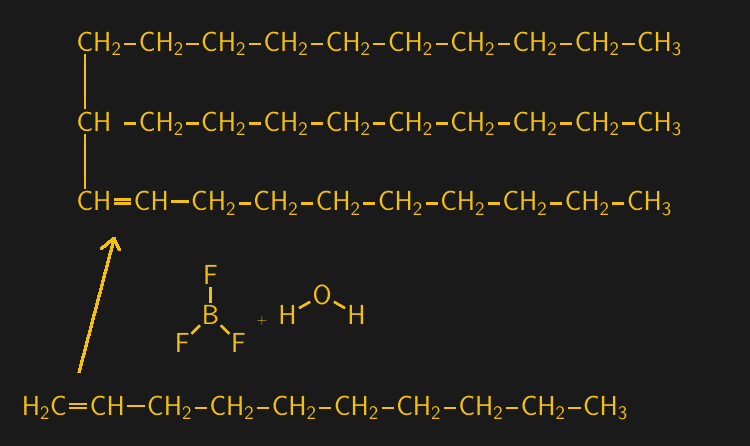

# 大化学:合成油

> 原文：<https://hackaday.com/2022/05/02/big-chemistry-synthetic-oil/>

自从我开车以来，我一直在换机油。实际上，比那更久——在我拿到驾照之前，我做了很多家用汽车的维护和修理工作。那时候这样做似乎是很自然的，而且一直延续到今天，尽管事实上把工作外包出去可能会更便宜。我坚持这样做主要是因为我喜欢了解我的车发生了什么。

换油需要补给，但是最近几次我去 BigBoxMart 都是空手而归。我不知道这是似乎永无止境的供应链问题之一还是其他什么，但通常有大量石油的通道严重缺货。那里大部分是合成油，我以前从未尝试过。

我一直抵制使用合成机油，因为这看起来像是一个噱头，让我从自己的血汗钱中获得更多不必要的东西。但现在看来，我可能别无选择，只能使用合成油，我想我会做通常会做的事情:研究合成油的细节，并与大家分享我的发现。

## 老技工的故事

首先，我要说的是，似乎有很多关于机油，特别是合成机油的“民间传说”,对于那些认为汽车不仅仅是交通工具的人来说，也有很多强烈的感受。因此，很容易找到坚持认为合成材料是润滑之神的礼物的视频和博客帖子，以及以最强烈的措辞抨击合成材料的视频和博客帖子。当然，两个阵营都视对方为异端，他们润滑的偏好肯定会把他们带入汽车绝望和痛苦的深渊。我想这就是我们两极分化的世界。

虽然我真的不想在机油大战中选边站，但我绝对不想做任何有可能损坏我精心保养的汽车引擎的事情。由于从未使用过合成油，我确实觉得有必要做一点尽职调查:合成油有可能对只使用传统机油的老式发动机造成损害吗？

简短的回答是:可能不会。当合成油首次问世时，它们的化学性质与当前的发动机技术并不完全兼容。具体来说，早期的酯基合成材料会导致含有聚酯树脂的发动机密封件出现问题。随着发动机密封技术和合成油配方的改进，那些日子已经一去不复返了。现代合成材料已经过测试，可与发动机密封件中常用的各种材料兼容，如腈、硅树脂、聚丙烯酸酯和氟橡胶，如氟橡胶。经证明，经过适当测试认证的油在接触合成油时不会导致密封材料过度膨胀或收缩、硬化或强度降低。

所以基本上，如果你有一个在过去 30 年左右制造的发动机，并且你使用了符合制造商推荐的合成油，你应该没问题。

 [https://www.youtube.com/embed/pPFSR-2lhxY?version=3&rel=1&showsearch=0&showinfo=1&iv_load_policy=1&fs=1&hl=en-US&autohide=2&wmode=transparent](https://www.youtube.com/embed/pPFSR-2lhxY?version=3&rel=1&showsearch=0&showinfo=1&iv_load_policy=1&fs=1&hl=en-US&autohide=2&wmode=transparent)

## 关于基地的一切

但是合成机油到底是什么让它合成的呢？和传统机油有什么区别？事实证明，这两种油之间的区别比你想象的要小，但它们的区别非常有趣，这些区别以一种我以前从未真正欣赏过的方式揭示了润滑工程的世界。

所有的机油，无论是传统的还是合成的，都是高度工程化的产品，含有令人眼花缭乱的添加剂，每一种都有特定的用途。然而，所有机油都是从基础油开始的，根据硫含量、粘度和所含饱和烃的量等特性，基础油可分为五大类，稍后将详细介绍:

<caption>API base oil groups. Note that mineral oils all have some degree of sulfur and unsaturated hydrocarbons based on the crude oil they are sourced from and the refining method. PAO base oils lack these compounds. Source: [American Petroleum Institute](https://www.api.org)</caption>
| API 基础油类别 |
| --- |
|  | 基础油类别 | 硫(%) |  | 饱和度(%) | 粘度指数 |
| 矿物 | **第一组(溶剂精制)** | > 0.03 | 和/或 | < 90 | 80 至 120 |
| **第二组(氢化处理)** | < 0.03 | 和 | > 90 | 80 到 120 |
| **第三组(加氢裂化)** | < 0.03 | 和 | > 90 | > 120 |
| 合成的 | 第四组 | 聚α-烯烃润滑剂 |
| **第五组** | 所有其他基础油 |

第 I、II 和 III 组基础油都来自原油，并且用于将原油原料精炼成适于发动机油的较轻馏分的方法在很大程度上决定了基础油中的硫含量以及其中不饱和烃化合物的浓度。饱和烃是指聚合物主链中的每个碳都充满了氢；换句话说，饱和化合物没有碳碳双键。这一点很重要，因为不饱和键是氧化的潜在部位，氧化会损害基础油的性质。

## 合成的，是的，但是…

因此，既然传统矿物油的基础油是以原油的形式直接来自地下，那肯定意味着合成油避免了与化石燃料相关的污点。事实证明，事实并非如此。如果说我们从这个[“大化学”系列](https://hackaday.com/series_of_posts/big-chemistry/)中学到了什么，那就是我们日常生活中使用的几乎所有东西都全部或部分来自石化产品。合成油也是一样。

IV 类基础油几乎全部是聚α-烯烃，或 pao。与塑料一样，pao 也是合成聚合物，但与其说 pao 具有非常长且错综复杂的交叉状侧链，不如说 pao 大多是少量短侧链连接在一起。但是，塑料和 pao 在原材料和制造过程方面有很多共同点。

大多数聚合物的起点是天然气。天然气中的主要化合物是甲烷(CH [4] )，这是最简单的碳氢化合物，也是烷烃家族的一员，其主链是完全饱和的碳。但大多数天然气矿床也含有大量更复杂的烷烃，如四碳丁烷、三碳丙烷和二碳乙烷。乙烷是许多聚合物化学的起点，可以通过选择性冷凝从原料天然气中分离出来。

Ethane is distilled from natural gas and converted to ethylene by steam cracking.

乙烷气体可以通过蒸汽裂解转化为乙烯气体，蒸汽裂解利用高温高压分解饱和烃并引入碳碳双键。含有至少一个双键的碳氢化合物被称为烯烃，乙烷的烯烃形式被称为乙烯。而乙烯，由于其化学活性和位于中心的双键，是一种极其有用的结构单元。

合成油的下一步是从乙烯中制造长链烯烃。用于此目的的化学过程[齐格勒过程](https://en.wikipedia.org/wiki/Ziegler_process)很复杂，超出了本文的范围——老实说，超出了我的理解范围。但可以说，它使用[一种含铝的有机催化剂](https://en.wikipedia.org/wiki/Ziegler%E2%80%93Natta_catalyst)将多种乙烯化合物粘在一起。齐格勒方法允许对低聚反应进行精细控制，并且可以生产特定长度的烯烃。当碳主链有十个碳和一个双键时，它被称为 1-癸烯。

1-decene is a ten-carbon alpha-olefin, produced from oligomerizing ethylene using the Ziegler process.

烯烃，也称为烯烃，其特征在于它们的双键沿着碳主链的位置。当双键位于第一个或α碳旁边时，生成的分子称为α-烯烃。1-癸烯是用于生产聚-α-烯烃的最常见的α-烯烃，聚-α-烯烃是通过 1-癸烯与三氟化硼(BF [3] )和水或醇的催化剂反应来实现的。该反应针对 1-癸烯的α碳上的脆弱双键，将其连接到另一个 1-癸烯分子的α碳上。

1-decene chains are added to a growing PAO by boron trifluoride and water. The oligomerization reaction is allowed to continue for about five cycles before being stopped. The leftover double-bond on the last decene to be added is later removed by hydrogenation, to remove a potential oxidation site.

与塑料不同，聚合反应只允许进行几轮，产生 1-癸烯的小低聚物。五或六轮是典型的，导致 PAO 完全没有硫化合物和不饱和键-通过在压力下使 PAO 与氢气反应，来自最后反应的剩余双键被饱和。这消除了最后一个可能的氧化点，形成了稳定的 PAO 基础油。

## 差不多完成了

pao 的产量很大，并被运送到混合设备，在那里基础油被混合在一起，以达到适当的粘度。添加添加剂，如清洁剂、分散剂、消泡剂和耐磨剂，以满足最终产品的规格。

虽然这个名字可能会引起误解，但在许多情况下，合成机油比矿物油更有优势。当用矿物基础油生产机油时，几乎不可能避免潜在的性能限制问题，尤其是氧化部位。另一方面，合成油几乎可以完全避免引入这些氧化位点，从而使最终产品的寿命更长，性能更好。来自[润滑专家](https://lubrication.expert/)的 Rafe 有一个关于这个主题的精彩视频:

 [https://www.youtube.com/embed/8CsEvzWlAwA?version=3&rel=1&showsearch=0&showinfo=1&iv_load_policy=1&fs=1&hl=en-US&autohide=2&wmode=transparent](https://www.youtube.com/embed/8CsEvzWlAwA?version=3&rel=1&showsearch=0&showinfo=1&iv_load_policy=1&fs=1&hl=en-US&autohide=2&wmode=transparent)

我不知道自己是否能在不更换机油的情况下行驶 25，000 英里，合成材料制造商经常宣传这是可能的，但现在我知道这种说法背后的原因，并且合成材料的成本至少与投入其中的工程数量相符。