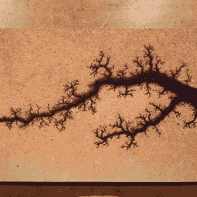

# 互联网上最致命的项目？

> 原文：<https://hackaday.com/2022/05/02/the-most-deadly-project-on-the-internet/>

在决定这篇文章的标题是否是 clickbait 之前，请先花点时间看一下下方【BigClive】的精彩视频[。然后，去你当地的搜索引擎，搜索短语“分形燃烧死亡”。我们会等的。](https://www.youtube.com/watch?v=FBeSKL9zVro)

既然这样，我们必须承认，当我们在[bigclivedotcom]的 YouTube 频道上看到“互联网上最致命的项目”这个主题时，我们有点怀疑。这是一个很大的索赔。但后来我们看了视频，做了一些谷歌搜索。可悲的是，这个项目有超过 30 个记录在案的杀人案例，以及更多永久性严重伤害的案例。

The results of Fractal Wood Burning with High Voltage

分形燃烧是一种爱好，通过在导电浆料中涂抹木材，然后在木材的两侧施加高压，通常使用不适合高压的东西，如跨接电缆，来燃烧木材。高电压由一个*未经改造的*微波炉变压器提供。使用 MOT 的其他项目通常将高压次级绕组取出，重新缠绕成低压、高安培变压器，并用于点焊机甚至弧焊机。

正如[BigClive]所指出的，来自未经修改的 MOT 的电压范围为 2-3 千伏(即两到三千伏)，阻抗非常低，就在“不要靠近它！”领土。

虽然黑客社区中的许多人会让我们感到愤怒，但许多从事此类项目的人并不熟悉任何类型的电气安全，而是对木工项目中包含的艺术效果更感兴趣。当然，这些人通常不会对自己的生命漫不经心，但看似无害的“酷”因素似乎让这个高度危险的项目看起来更具吸引力，而不是危险，特别是当它在抖音等社交媒体平台上变得更受欢迎时。

从这一切中有什么收获？作为与世界分享我们的项目的黑客，我们有责任传达其他人跟随我们的脚步可能给自己带来的任何危险。60 秒的抖音视频肯定不足以做到这一点，不超过一对跳线电缆适合安全处理 2-3 千伏。也许这样的考虑会帮助我们决定用什么媒介来与世界分享我们的项目。你有什么想法？

当然，高电压并不是引发争论(或火灾)的唯一方式。众所周知，锂离子电池也是如此，这些关于锂离子安全的[课程](https://hackaday.com/2019/11/13/lessons-in-li-ion-safety/)是一个很好的复习课程。

 [https://www.youtube.com/embed/FBeSKL9zVro?version=3&rel=1&showsearch=0&showinfo=1&iv_load_policy=1&fs=1&hl=en-US&autohide=2&wmode=transparent](https://www.youtube.com/embed/FBeSKL9zVro?version=3&rel=1&showsearch=0&showinfo=1&iv_load_policy=1&fs=1&hl=en-US&autohide=2&wmode=transparent)

