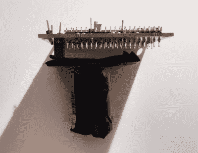
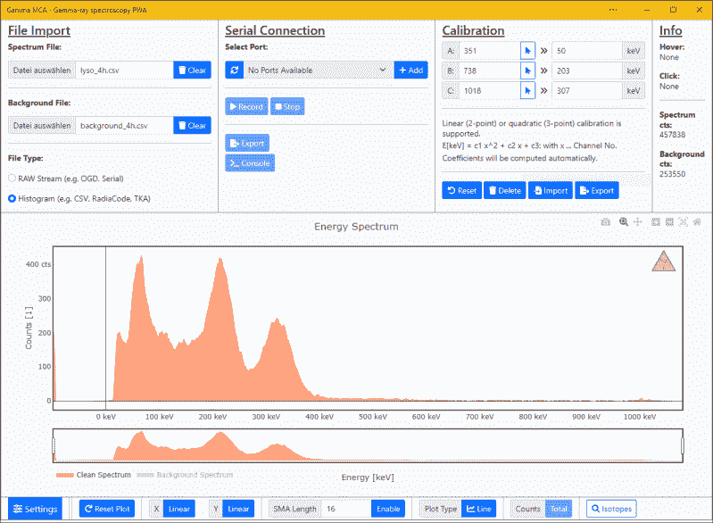

# 使用这款 DIY 伽马射线光谱仪识别放射性样品

> 原文：<https://hackaday.com/2022/05/03/identify-radioactive-samples-with-this-diy-gamma-ray-spectrometer/>

如果你是一个辐射爱好者，你很可能在某个地方有一个盖革计数器。虽然盖革计数器对于检测存在的辐射量是有用的，并且通过一些技巧也可以区分三种类型的辐射(α、β和γ)，但是它们在识别放射性物质方面的用途有限。为此，你需要一种叫做伽马射线光谱仪的不同仪器。

光谱仪通常是针对放射专业人员的昂贵而复杂的仪器。但事情并不一定是这样的:物理爱好者[NuclearPhoenix]设计了一款易于组装的手持式伽马能谱仪，应该符合业余爱好者的预算。它输出光谱图，您可以将其与参考数据进行比较，以识别特定元素。

The scintillator and sensor are wrapped in black tape to block out ambient light.

该设备的核心是一种闪烁晶体，如掺铊的碘化钠，它可以将入射的伽马射线转化为可见光。产生的闪光由硅光电倍增器检测，其输出经过放大和处理，然后由 Raspberry Pi Pico 的 ADC 数字化。Pico 计算脉冲的频谱，并生成一个图，可以存储在它的板上闪存或下载到计算机上。

[NuclearPhoenix]编写了一个方便的程序来帮助分析输出数据，并将所有设计文件开源。最难找到的部分是闪烁晶体，但它们确实会不时出现在易贝这样的拍卖网站上。在之前，我们已经为[配备了基于 Arduino 的伽马能谱仪；如果你一直想](https://hackaday.com/2017/06/28/arduino-does-hard-science/)[推出自己的闪烁体，你也可以这么做](https://hackaday.com/2021/01/12/visualizing-ionizing-radiation-with-diy-plastic-scintillators/)。

