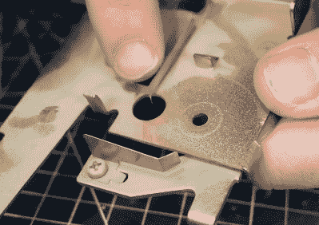

# 可打印的固定时间卡时钟有业主再次看到红色

> 原文：<https://hackaday.com/2022/05/14/printable-fix-for-time-card-clock-has-owner-seeing-red-again/>

当[莫利·克特]看到一个工作时间打卡钟时，他知道他必须为一个仍然保密的即将到来的项目拥有它。时钟似乎工作得很好，只是在打了十几下试打后，墨水很快变得模糊不清。在短暂的拆卸和检查之后，莫利确定色带没有正常前进。

 这款时钟使用了一个类似于现代打字机的色带盒，只是它没有进给卷轴和收带卷轴，而是有一小段色带绕来绕去，每转一圈就要重新上一次墨。

当插入一张卡时，会发生许多事情:在左边打一个新孔，一只手臂将卡推靠在色带上，色带反过来推靠在时钟的机械数字表盘上，在卡上盖章。

最后，色带前进。或者应该是这样的。[莫利]可以很容易地看到一个已经不在那里的东西的影子，一个圆形的东西，两面都有突出的齿，用来啮合时钟本身和色带盒。一个简单的小齿轮。

在给公司发电子邮件后，发现他们想要 95 美元以上的税来更换零件。[Morley]只是笑着启动 Fusion 360，只有卡尺测量和三秒钟的拆卸视频，显示缺失的部分。但他成功了，而且很快。第一版有它的问题，但 2.0 是一个完美的契合，时钟再次均匀地跳动。休息之后一定要去看看。

好吧，也许你没有时间卡要修。但是你肯定会因为拉链坏了而扔掉一件在其他方面都很好的外套吧？

 [https://www.youtube.com/embed/CbMun0C1DBQ?version=3&rel=1&showsearch=0&showinfo=1&iv_load_policy=1&fs=1&hl=en-US&autohide=2&wmode=transparent](https://www.youtube.com/embed/CbMun0C1DBQ?version=3&rel=1&showsearch=0&showinfo=1&iv_load_policy=1&fs=1&hl=en-US&autohide=2&wmode=transparent)

谢谢你的提示，[赞]！