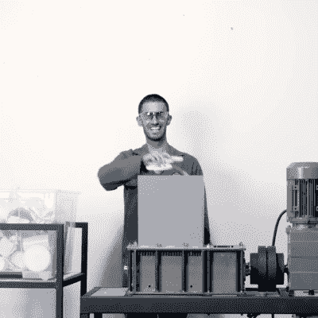

# 2022 年黑客日奖进入第二轮:再利用，回收，改造

> 原文：<https://hackaday.com/2022/05/05/2022-hackaday-prize-enters-second-round-reuse-recycle-revamp/>

丁！这是 [2022 Hackaday 奖](https://prize.supplyframe.com/)第二轮挑战的铃声。如果你的项目重新利用或回收了原本会成为废物的材料，或者帮助你在未来的项目中做同样的事情，我们希望看到。

 黑客通常是节俭的人——我们将[为项目](https://hackaday.com/2017/12/07/my-kingdom-for-a-capacitor/)回收零件，因为原型制作时更容易省钱。但是在[这个最奇怪的时代](https://hackaday.com/2021/07/17/tales-from-the-global-chip-shortage-smoothieboard/)，当我们看到 1 美元的微控制器如此短缺，以至于它们每块卖到 57 美元(如果你能买到零件的话)，利用你手头的东西可能是绝对必要的。如果这将成为新的常态，我们将它自动化是有意义的。从字面上和隐喻上来说，在废弃的印刷电路板中有黄金。在后世界末日的不久的将来，你将如何从我们破碎的电子垃圾中获取最大价值？你造了一台拆装机吗？我们想看看。

 但是电子零件只是你可回收材料的一小部分，塑料可能会发挥更大的作用。如果你是一个 3D 打印机，你无疑会想到[将塑料瓶回收成细丝](https://hackaday.com/2022/04/28/recycling-plastic-into-filament/)。或者，也许你想拿走一些现代世界强加给你的现有塑料，给它们第二次生命？这家工厂[通过用沙子熔化塑料来生产铺路石](https://hackaday.com/2021/02/07/these-plastic-pavers-are-earth-savers/)正在以工业规模生产，但这对家庭游戏玩家有用吗？[珍贵的塑料](https://hackaday.com/2016/04/03/think-globally-build-locally-with-these-open-source-recycling-machines/)有许多鼓舞人心的想法。或者也许你只需要一把 [HDPE 锤子](https://hackaday.com/2015/02/21/turning-plastic-milk-jugs-into-a-useful-tool/)？

你造过[花式碎罐机](https://hackaday.com/2021/04/26/pneumatic-can-crusher-awaits-your-command/)，或者[塑料分拣机](https://hackaday.com/2021/12/13/an-open-source-detector-for-identifying-plastics/)，或者[回收机器人](https://hackaday.com/2019/04/13/this-bot-might-be-the-way-to-save-recycling/)吗？前往 [Hackaday.io](https://hackaday.io) ，写下它，并将其输入奖品！

基本上，任何帮助你回收或再利用身边材料的项目都是公平的。(但请注意，如果你有史诗般的修复技能，你会想在即将到来的第三轮中使用它们:把它砍回来。)这一轮将持续到 6 月 12 日，有 10 个 500 美元的奖项可供争夺，所以开始黑客活动吧！

The [HackadayPrize2022](https://prize.supplyframe.com) is Sponsored by: