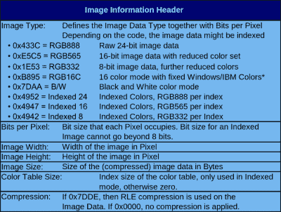

# 为嵌入式硬件创建图像格式

> 原文：<https://hackaday.com/2022/05/08/creating-an-image-format-for-embedded-hardware/>

无论是无处不在的小有机发光二极管显示器还是合适的 LCD 面板，一旦你有了比连接到微控制器的经典 16×2 字符 LCD 更强大的东西，你就有一个绝佳的机会开始显示一些合适的图像。一般来说，这意味着您将使用位图文件，但是正如您可能预料到的那样，当将一种几十年前的文件格式推入一个它从未打算使用的应用程序时，事情会变得有点混乱。这就是为什么[【gfcwfzkm】创建了可移植图像文件(PIF)格式](https://github.com/gfcwfzkm/PIF-Image-Format)。

 这种低开销的图像格式是专门为微控制器设计的，可以在至少有 60 字节空闲 RAM 的设备上解码。使用 PIF 存储的图像不仅需要更少的计算资源来处理，而且同样重要的是，占用更少的闪存空间。这种格式支持彩色和单色图像，GitHub repo 甚至包括一个图形化的 Python 3.10 工具，可以让您将图像转换为这两种格式。pif 文件或. h 头文件，用于直接嵌入到 C 代码中。

[gfcwfzkm]提供了一些源代码，向您展示如何启动和运行 PIF 库，但是在撰写本文时，还没有任何在 Arduino 环境中使用 PIF 的示例代码。对于观众中的老手来说，这没什么大不了的，但是我们很想看看一旦有了一个对初学者更友好的包，社区如何利用这种文件格式。这是待办事项列表中最后一个未检查的项目，所以应该不会太长。

当然，在你的微控制器项目中使用位图显示图像并没有什么不对，而且,[使用众所周知的图像格式](https://hackaday.com/2018/10/05/displaying-bitmaps-on-the-apple-ii/)也有一定的优势。但是，如果一种新的文件类型可以加快访问速度，并在芯片上存储更多的图像，我们肯定准备好升级了。