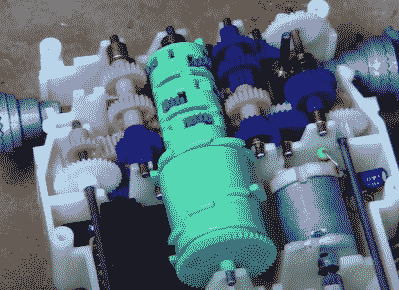

# 韦尔博特去了黑暗面

> 原文：<https://hackaday.com/2022/05/09/verbot-goes-to-the-dark-side/>

被忽视的 80 年代旧玩具机器人会发生什么？根据【冉迪雨】[他们转向了黑暗面](https://www.youtube.com/watch?v=FApica-cKWo)！早在 80 年代，汤米就有了一整套机器人——从钥匙链发条玩具到[滚动、说话的机器，几乎有 2 英尺高](https://hackaday.com/2021/08/22/80s-omnibot-goes-rc-and-gets-a-modern-refresh/)。夹在这条线中间的是 Verbot。Verbot 出名的原因是它是一个语音控制的机器人。不仅如此，它还依赖于说话者。用“前进”这样的命令训练机器人，然后观察它对你的每一个命令做出反应。

正如你可能猜到的，以今天的标准来看，语音识别并不是很好。识别是由一个微控制器处理的——一个三菱公司的产品，可能是一个掩模编程的 8051 变种。对于一个 80 年代的玩具来说，这是相当新奇的——事实上，它有一项专利。

Verbot Mechanical Interrogator in green

Verbot 的真正魔力在于机械设计。Verbot 可以向前、向后移动，转动，“说话”，举起和放下手臂。它只用一个电动马达就完成了所有这些。[Randi]在她的拆卸过程中解释了这个机械魔法。Verbot 使用了“机械询问器”，它实际上是一列行星齿轮、齿轮和杠杆。这个设备看起来更像是属于一个机械计算器，而不是一个塑料玩具。整个系统通过开关的巧妙操作来工作，当选择机械功能时，开关会通知微控制器。然后，微处理器反转电机执行操作。

在这个视频中，兰迪正在研究的特定机器人明确显示了它们的年龄。发黄、破裂的塑料以及其他问题使他们俩都成了废人。与其走复古路线，[兰迪]决定从两个机器人中制造一个邪恶的机器人。她涂了一层黑漆，然后涂了一些橙色高光，这样她就有了一个看起来更像达斯·维德而不是发黄的玩具的工作机器人。

作为一名专业的道具制作人和魔术师，Randi 的背景赋予了她一些优秀的选角技巧。她使用旧零件的硅模具轻松地创建了 Verbot 半透明红色眼睛和按钮的树脂替代品。

这个项目的最终结果是一个工作，滚动的黑暗面机器人。这个小机器人会成为任何黑暗士兵的好伙伴！

 [https://www.youtube.com/embed/FApica-cKWo?version=3&rel=1&showsearch=0&showinfo=1&iv_load_policy=1&fs=1&hl=en-US&autohide=2&wmode=transparent](https://www.youtube.com/embed/FApica-cKWo?version=3&rel=1&showsearch=0&showinfo=1&iv_load_policy=1&fs=1&hl=en-US&autohide=2&wmode=transparent)

