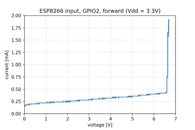

# ESP8266 5 V 耐受吗？这个曲线描绘器说是！

> 原文：<https://hackaday.com/2022/05/12/is-esp8266-5-v-tolerant-this-curve-tracer-says-yes/>

一些人声称 ESP8266 可以容忍其 GPIOs 上的 5 V 逻辑电平，而其他人则强烈反对，指出数据手册中规定的最大值为 3.6 V。然而，数据表不是编译芯片的源代码，也不是普遍正确和完整的。[Avian]决定[深入挖掘这些说法，](https://www.tablix.org/~avian/blog/archives/2022/05/a_footnote_about_esp8266_5v_tolerance/)用实际的 ESP8266 芯片进行实验，然后为我们大家分享结果。

在实验中，他使用了曲线跟踪器——一种能够产生大范围电压并测量消耗电流的设备，然后绘制电压-电流关系。这有助于表征各种变量，从二极管击穿电压到晶体管特性。他使用的曲线描绘器是他自己 DIY 制作的，看起来很专业，很有能力，,值得单独写一篇文章！

[Avian]的实验背后的推理很简单——如果设置为输入的引脚在某个电压阈值下开始消耗更多的电流，那么一定有一些芯片内部结构(有意或无意)会在该电压下受损。手里拿着曲线跟踪器，他设置了一个 ESP-01 模块来设置 GPIO 输入，并开始增加电压。

测试表明，虽然 GPIO 引脚与地之间有一个反向偏置的 ESD 二极管，但 GPIO 引脚与 VCC 供电轨之间似乎没有二极管，这是 5 V 容差的主要问题。内部似乎确实有类似于 6 V 齐纳二极管的功能，它应该在电压变得太高以至于芯片无法处理之前箝位电压。对于 5 V 兼容性来说，这些都不是问题，在有人证明并非如此之前，可以将此解释为对 5 V 容差的确认。

[Avian]不想破坏 ESP8266，所以实验在曲线跟踪器和输入端之间用一个 1 K 串联电阻进行，这可能会使结果有些偏差。另一方面，在输入端前增加串联电阻是一种不受重视的做法，不管是 5 V 还是其他电压。他还指出，虽然引脚似乎不会受到更高输入电压的负面影响，但引导加载程序可能会在启动时将其中一些引脚设置为 3.3 V 输出，从而使你的 5 V 电源与 3.3 V 供电轨短路，这一点值得注意！

[Avian]的研究之旅很有趣，我们建议你去看看他的博客;上次，我们报道了他对[的研究，一个看似无辜的 3.5 毫米插孔](https://hackaday.com/2022/04/10/this-3-5mm-cable-distorts-signals-hides-audio-filtering-circuit/)隐藏着一个迂回的音频补偿电路。自从我们[在 2014 年首次报道 ESP8266](https://hackaday.com/2014/08/26/new-chip-alert-the-esp8266-wifi-module-its-5/) 以来，我们一直在研究它真正能够做到的所有事情，我们早在 2016 年就提出了 GPIO 5 V 兼容性的话题——终于解决了这个问题，这令人欣慰！

我们感谢[阿德里安]与我们分享这一点！