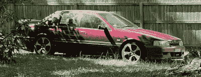

# 90 年代福特获得换挡拨片和数字仪表板升级

> 原文：<https://hackaday.com/2022/05/12/90s-ford-gets-shift-paddles-and-a-digital-dash-upgrade/>

EA Falcon 将福特广受欢迎的澳大利亚轿车系列带入了 20 世纪 90 年代，尽管它在 1991 年底让位于 EB Falcon。很少有人会称之为高科技，但它为平台引入了几项在当时非常重要的创新。然而，一名黑客拿走了一架不起眼的 EA Falcon，并给了它一套自制的现代升级版。

The maroon EA Falcon has scored a Barra heart transplant as well as some nifty digital upgrades.

问题中的例子是 EA Fairmont Ghia，它在仪表盘中配备了一些高科技显示器，这在 80 年代末和 90 年代初非常流行。这破折号已经经历了很多修改，但是，现在具有一个大的 TFT 显示屏和一个较小的有机发光二极管单元，两者都显示了汽车的各种重要统计数据。屏幕被巧妙地黑了进去，一个作为转速表的一部分，另一个取代了原来的燃料和温度计。数据显示在屏幕上，不再需要原来的表盘。

该车还配备了更现代的传动系统。EA 从 BA Falcon 获得了 Barra 六缸发动机，以及由计算机控制的 [BTR 4 速自动变速器。](https://www.whichcar.com.au/features/diy/ford-automatic-transmission)BTR 最早出现在 EB 型号上，在 90 年代初被认为是非常现代的装置，并且易于改装用于手动换档。在这一版本中，方向盘上增加了一对 3D 打印的换挡拨片，以实现类似 Tiptronic 的操作。

现代燃油喷射汽车通常适合以这种方式进行黑客攻击。从 Arduinos 到 CANBUS shields 之类的东西都可以用来打开汽车的系统，并根据自己的需要进行改造。我们一次又一次地看到这样的事情发生，黑客们创造了从花哨的科幻[数字仪表盘](https://hackaday.com/2021/06/27/miata-sci-fi-digital-dash/)到工作主动空气动力学的[的一切！](https://hackaday.com/2022/02/03/arduino-activated-automotive-aerodynamic-apparatus-is-spoiler-alert/)如今，有了现成的东西，天空才是真正的极限。下面视频。