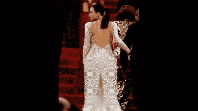

# 有软件裤为什么还要穿衣服？

> 原文：<https://hackaday.com/2022/05/12/why-get-dressed-when-there-are-software-pants/>

在过去的两年里，我们很多人都在家工作，很明显，人们不喜欢整天穿着裤子坐着。在这样一个乌托邦时代到来之前，所有的衣服都被认为是中性的，就像很多男人和女人都穿着宽松、飘逸的裙子和连衣裙一样，你可能要记得在下半身穿些东西，尽管裤子可能会不舒服。但是还有另一种方法——你可以建立[【一切都被黑客入侵】的裤子过滤器](https://github.com/everythingishacked/Pants),继续做一个混乱代理。休息之后请看视频。

These pants go as wide as you please.

没错，不管你是放弃了还是忘记了在赤道以下穿衣服，裤子过滤器已经把你盖住了。它的工作原理和你预期的一样——机器学习跟踪身体标志和姿势，以找出你的 NSFW 区域在哪里，并保持保密。

默认情况下，它会模糊腰带以下的所有东西，或者如果你倾向于暴露紧身白色并喜欢更多的覆盖范围，你可以穿上裤子。你可以调整裤子的宽度，以覆盖 2020 年以来你可能穿上的新冠肺炎，甚至可以改变裤子，以匹配你的衬衫。

我们喜欢[一切都被黑了]有勇气在一个看起来像是当地墨西哥玉米卷店的地方公开测试裤子过滤器。在最初几轮怪异的表情之后，他换成了裤子式的小胡子来挽回面子。

想要为无聊的视频通话增添更多乐趣吗？尝试连接一些老式的硬件，或者[安装一个牵引链，以一个不会让你被解雇的手势结束这些会议](https://hackaday.com/2020/12/28/a-pull-chain-to-end-your-zoom-pain/)。

 [https://www.youtube.com/embed/ZHQ4XACBUqo?version=3&rel=1&showsearch=0&showinfo=1&iv_load_policy=1&fs=1&hl=en-US&autohide=2&wmode=transparent](https://www.youtube.com/embed/ZHQ4XACBUqo?version=3&rel=1&showsearch=0&showinfo=1&iv_load_policy=1&fs=1&hl=en-US&autohide=2&wmode=transparent)

