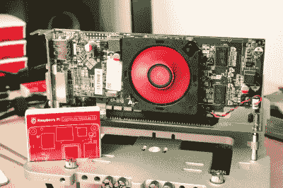
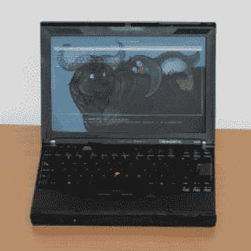

# NVIDIA 发布带有开放味道的驱动程序

> 原文：<https://hackaday.com/2022/05/13/nvidia-releases-drivers-with-openness-flavor/>

今年，我们已经看到了大量的 NVIDIA 源代码、的泄露，以及 NVIDIA Tegra 开源驱动程序的发布。似乎英伟达决定加大投入，刚刚发布了 Linux 的开源 GPU 内核模块[。名为`open-gpu-kernel-modules`的](https://developer.nvidia.com/blog/nvidia-releases-open-source-gpu-kernel-modules/) [GitHub 链接](https://github.com/NVIDIA/open-gpu-kernel-modules)让人们欢欣鼓舞，我们已经在测试代码，制作迷因并推测未来。这个驱动程序目前被宣称是实验性的，只对数据中心卡“生产就绪”——但是你已经可以试用了！

# 驾驶员的当前状态

当然，有细微差别。这是新代码，与众所周知的专有驱动程序无关。它将只适用于从 RTX 2000 和夸德罗 RTX 系列(又名图灵和向前)开始的卡片。好消息是，即使在这一点上，性能也与闭源驱动程序相当。这个项目的一个特点 AMD 和 Intel 驱动程序在 Linux 内核中实现的很大一部分功能，反而是由 GPU 内部的二进制 blob 提供的[。](https://twitter.com/never_released/status/1524483304010903552)这个 blob 运行在 GSP 上，GSP 是一个 RISC-V 内核，只在 Turing GPUs 和 younger 上可用，因此有系列限制。现在，每个 GPU 都加载一个固件，但是[这个很重！](https://twitter.com/marcan42/status/1524695068363624448)

除此之外，这个驱动程序已经提供了与 Linux 内核更加一致的集成，带来的巨大好处只会越来越多。并非一切都是开放的——NVIDIA 的用户空间库和 OpenGL、Vulkan、OpenCL 和 CUDA 驱动程序目前仍然是关闭的。同样的情况也适用于旧的 NVIDIA 专有驱动程序，我猜想，它会腐烂，因为“腐烂”是该驱动程序以前对几代旧的但完全可用的卡所做的。

# 未来的潜力

这个驱动因素的上游肯定会是一个巨大的努力，但这绝对是目标，而且好处也将是可观的。即便如此，这位车手还有更大的潜力。与英国警察没有什么不同，Linux 内核检查它加载的每个内核模块的许可证，并限制它在没有 GPL 许可的情况下可以使用的 APIs 以前的 NVIDIA 驱动程序没有，因为它的开放部分本质上是内核和二进制驱动程序之间的一个薄层，因此不是 GPL 许可的。因为这个驱动程序[是 MIT/GPL 许可的，](https://github.com/NVIDIA/open-gpu-kernel-modules/blob/main/COPYING)他们现在有了一个更大的接口集合，可以更好地将其集成到 Linux 生态系统中，而不是拥有一套专有工具。

Now with 65% more driver, per driver!

调试能力、安全性和整体集成潜力应该会提高。除此之外，还有许多新的可能性。首先，它无疑打开了将驱动程序移植到其他操作系统如 FreeBSD 和 OpenBSD 的大门，而且[甚至可以帮助自由计算。](https://twitter.com/n4of7/status/1524645404427628545) NVIDIA GPU 在 ARM 上的支持在未来将变得更容易，我们可以看到更多[的酷努力](https://hackaday.com/2022/04/28/a-real-gpu-on-the-raspberry-pi-barely/)来利用 GPU 在与 ARM SBC 配对时帮助我们的东西，从令人兴奋的视频游戏到强大的机器学习。[红帽发布会](https://blogs.gnome.org/uraeus/2022/05/11/why-is-the-open-source-driver-release-from-nvidia-so-important-for-linux/)称，在将 NVIDIA 产品恰当地整合到 Linux 生态系统方面，还会有更多的事情发生，无所不用其极。

你通常会看到每个人都为此欢呼，理由很充分。我们的传统是庆祝大公司的这种激进举措，即使不完美——考虑到我刚刚列出的好处和未来潜力，这是理所当然的。随着我们看到更多来自大玩家的这种举动，我们将有很多事情值得高兴，无数的问题将成为过去。然而，当谈到我们所重视的东西的开放性时，情况变得有点奇怪，很难处理。

# 等等，开放是什么意思？

当我们与越来越多地定义我们生活的技术互动时，开放有助于我们添加我们需要的功能，解决我们遇到的问题，从他人的工作中学习新东西并探索极限。如果我们小时候读过的所有激动人心的科幻小说都是可信的，那么我们确实应该与科技协同工作。在许多方面，这个驱动程序并不是那种帮助我们的硬件帮助我们的开放，但它确实检查了许多我们感知为“开放”的框。我们是怎么到这里的？

众所周知，开放代码的每一个部分都不是大公司会做的事情——你必须把 DRM 部分和专利侵权藏起来。这里，许多过去驻留在专有驱动程序中的代码现在运行在不同的 CPU 上，和以前一样不透明。没有一个驱动程序像这个驱动程序那样依赖二进制 blob 代码，然而具有半讽刺意味的是，它离技术上获得 RYF 认证的地方并不远。只是令人反感的二进制 blobs 现在是“固件”而不是“软件”。

Something is amiss if this is considered more open than Novena

来自自由软件基金会的 RYF [(尊重你的自由)](https://hackaday.com/2012/10/10/free-software-foundation-certifies-hardware-that-respects-your-freedom/)认证，虽然本意是好的，但最近[因适得其反和在没有必要的情况下使硬件](https://ariadne.space/2022/01/22/the-fsfs-relationship-with-firmware-is-harmful-to-free-software-users/)[变得更加复杂而受到指责](https://twitter.com/marcan42/status/1040626219278974976)，甚至 Libreboot 项目负责人也说其原则[有待改进。](https://libreboot.org/news/policy.html)我们一直含蓄地将 RYF 认证作为努力实现的开放准则，但 [Novena 笔记本电脑选择不遵守](https://www.bunniestudios.com/blog/?p=3657#comment-1400801)它当然[更好。我们有很多东西要向 RYF 学习，很明显我们需要更多的帮助。](https://twitter.com/marcan42/status/1179010900868521984)

从这里开始——我们认为什么是“开放”呢？谁能帮助我们了解什么是“开放”——具体来说，就是那种让我们走向一个更加乌托邦但又更加现实的世界的开放，在这个世界里，我们与技术的关系是健康而充满爱的。一些指导方针和原则帮助我们检查我们是否在正确的道路上——世界已经发生了足够的变化，旧的想法并不总是适用，就像[云托管软件漏洞](https://ipkitten.blogspot.com/2019/02/closing-agpl-cloud-services-loop-hole.html)被证明是[难以解决的。](https://twitter.com/marcan42/status/1384834585834319875)

但是，更多的代码刚刚开放，这在某些方面是一个胜利。与此同时，如果其他公司决定坚持这个例子，我们将不会达到我们想要的目标，作为黑客，我们不会实现许多突破性的东西，你会看到我们手中有开源工具。而且，如果我们不小心谨慎，我们可能会把这和我们都来这里学习的那种开放混淆。所以是鱼龙混杂。

# 我们的过去仍然挥之不去

如上所述，该驱动程序适用于 2000 RTX 系列及以后的车型。旧卡仍然局限于专有驱动程序或新卡——新卡有被英伟达削弱的历史。例证:近年来，英伟达[重新实现了时钟控制](https://www.phoronix.com/forums/forum/linux-graphics-x-org-drivers/open-source-nvidia-linux-nouveau/998310-nouveau-persevered-in-2017-for-open-source-nvidia-but-2018-could-be-much-better/page4#post998427=)等重要功能，只能通过[签署的带有封闭 API 的固件垫片来访问，这对于逆向工程](https://www.phoronix.com/forums/forum/linux-graphics-x-org-drivers/open-source-nvidia-linux-nouveau/998310-nouveau-persevered-in-2017-for-open-source-nvidia-but-2018-could-be-much-better?p=998324#post998324)来说很棘手，并且自那以来一直不合作——这已经[伤害了这个新项目](https://www.reddit.com/r/linux_gaming/comments/cnpuss/nouveau_developer_explaining_how_exactly_nvidia/)，而且看不到补救措施。不像 AMD 在开放驱动程序退出之前帮助修改卡的代码，这个问题会一直存在。

然而，从这里开始，新艺术将继续存在。在某种程度上，它仍然可以用于不在任何地方的旧卡，在某种程度上，它似乎可以帮助取代前面提到的保持封闭源代码的用户空间库。NVIDIA 官方发布页面表示，新的努力和 NVIDIA 开放驱动程序的努力可能会合并为一个，这是所有人的胜利，即使有点苦乐参半。

由于短缺，你可能不会得到一个 GPU 来运行这个驱动程序。也就是说，我们将从短缺和采矿引发的热潮中恢复过来，价格将下降到我们的系统能够更好地工作的水平——也许不是你配备 MX150 的笔记本电脑，但肯定是我们尚未建立的大量强大的系统。NVIDIA 还没有达到 AMD 和 Intel 的水平，但是他们正在接近。

拉里·尤因，巧合的是使用 GIMP 进行了混音。]