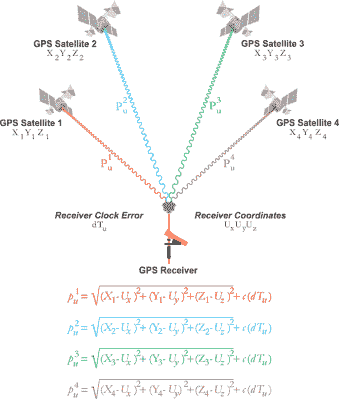
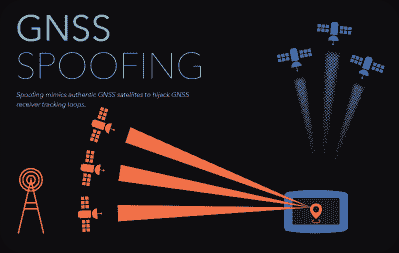

# 了解你的位置:GPS 欺骗和干扰的含义

> 原文：<https://hackaday.com/2022/05/23/knowing-your-place-the-implications-of-gps-spoofing-and-jamming/>

人造卫星在许多方面改变了世界，不仅在转播通信和以以前不可想象的方式观察地球方面，而且还使难以置信的精确导航成为可能。一个所谓的全球导航卫星系统( [GNSS](https://en.wikipedia.org/wiki/Satellite_navigation) ，简称 satnav)使用卫星提供的数据来精确定位地表上的某个位置，误差在几厘米之内。

美国全球定位系统(GPS)是第一个 GNSS，卫星于 1978 年发射，尽管只能以降级精度模式供平民使用。当全精度 GPS 在 20 世纪 90 年代克林顿政府时期向公众发布时，它引起了公众对卫星导航的吸收，从渔船和商船，到今天只使用内置 GPS 接收器的智能手机进行导航。

即便如此，全球导航卫星系统也有其黑暗的一面，它不仅仅局限于军事用途，它还可以引导巡航导弹并锁定目标。这是以干扰和欺骗全球导航卫星系统信号的形式出现的，这种信号可以在监控系统中隐藏非法活动，并在战争中破坏或瘫痪敌人的系统。与其他形式的电子战(EW)一样，干扰 GNSS 信号是一种强大的武器，可以使最现代的航空电子设备和无人机技术变得无用。

考虑到这一点，GNSS 欺骗的威胁有多严重，有哪些方法可以检测或抵消这种威胁？

## 短暂定位

GPS autonomous positioning using the satellite navigation solution (Credit: Jan van Sickle, GPS for Land Surveyors)

全球导航卫星系统的基本概念相当简单明了:地面接收器监听来自作为特定全球导航卫星系统星座一部分的卫星的信号。每个 GNSS 卫星将一组信息编码到该信号中，这些信息包括在给定时间卫星的位置([星历表](https://en.wikipedia.org/wiki/Ephemeris)，以及发送信号时卫星上的当地时间。

通过获取至少四颗卫星的信号并应用[卫星导航解决方案](https://www.e-education.psu.edu/geog862/node/1724)，可以确定接收器的绝对位置。这使用了[三边测量](https://www.gps.gov/multimedia/tutorials/trilateration/)(到已知点的距离)的原理，而不是三角测量(使用角度)。可以推测，这里的一个潜在问题涉及接收机和卫星端的时钟漂移。也许不那么令人期待的是，信号的传播速度也受到大气的严重影响，特别是[电离层](https://en.wikipedia.org/wiki/Ionosphere)。

这部分大气的厚度和成分在一天中会发生变化，并受到太阳辐射的严重影响。因此，GNSS 卫星的部分消息包含所需的[大气校正](https://www.e-education.psu.edu/geog862/node/1738)参数。由于时钟漂移和地球大气成分的不断变化，每个 GNSS 星座都有自己的[增强系统](https://en.wikipedia.org/wiki/GNSS_augmentation)。这些系统一般由地面和卫星系统组合而成，提供额外的信息，接收机可利用这些信息来调整其收到的全球导航卫星系统信息。

例如，为了用于飞机导航，使用固定接收器安装基于地面的增强系统(GBAS)是非常常见的。这些 GNSS 接收器然后通过机场的甚高频通信系统向飞机广播校正参数，帮助它们在接近或离开机场时导航。

除了全球导航卫星系统卫星本身之外，每个全球导航卫星系统星座还有自己的地面主控制站，大气状况的最新信息定期从该站上传到卫星，同时进行时间调整以补偿卫星的机载时钟漂移。这表明全球导航卫星系统星座是一个高度动态的系统，需要不断更新才能正常运行。

然而，有趣的是，有人试图通过干扰或主动欺骗 GNSS 信号来绕过该系统。

## 干扰战

GNSS spoofing illustrated. (Credit: C4ADS)

干扰无线电频率通信的概念非常简单明了:只需在你希望干扰的频率上进行广播，干扰功率要比原发射机所能达到的功率大。由于 GNSS 信号相对微弱，这使得地面系统很容易干扰该信号。当然，由于失去 GNSS 卫星定位是一个已知的问题，这种情况下的备份策略是常见的，并且由于失去卫星通信，这也是非常明显的。

欺骗比干扰微妙得多，也更灵活。GNSS 欺骗并不仅仅是用原始功率发射无线电波，它仍然涉及到对原始信号的压制，但不是拒绝服务(DoS)攻击，欺骗更接近于中间人(MitM)攻击，在这种攻击中，假卫星信号作为真实信号呈现给接收器，当然，欺骗参数会导致接收器计算出远离实际位置的位置。

在 C4ADS (高级国防研究中心)2019 年的一份题为*在我们之上只有星星——揭露俄罗斯和叙利亚的 GPS 欺骗*的报告中，报告了一些关于俄罗斯出于各种原因使用 GNSS 欺骗的观察结果。一个有趣而常见的用途似乎是欺骗全球导航卫星系统信号，使接收器认为他们位于附近的机场。据推测，这将触发无人驾驶飞机和类似飞机的地理围栏限制，然后拒绝起飞。举例来说，这在贵宾来访期间作为反无人机策略可能是有用的。

军事用途就不那么无害了，在最近的俄罗斯和北约演习中，挪威和芬兰报告了严重的 GPS 中断。这限制了商业航班的导航能力，影响了公众，也干扰了手机网络的使用。据说，在 2011 年，伊朗使用 GPS 欺骗来欺骗洛克希德·马丁公司的 RQ-170 无人机降落在它的一个机场，随后被俘获。类似地，由于错误的 GPS 数据被输入自动识别系统( [AIS](https://en.wikipedia.org/wiki/Automatic_identification_system) )，海上交通已经多次中断。

正如 2019 年 C4ADS 报告指出的那样，黑海的船只多次报告了这一情况，2019 年[报告了](https://www.technologyreview.com/2019/11/15/131940/ghost-ships-crop-circles-and-soft-gold-a-gps-mystery-in-shanghai/)一艘美国集装箱船—*号*在中国上海港口注意到非常奇怪的行为。根据它的 AIS 屏幕，一艘船被显示在与*号*号相同的航道上移动，然后从屏幕上消失，然后出现在码头，再出现在航道上，等等。当困惑的船长拿起双筒望远镜搜寻这艘船时，它显然一直停在码头上。

## GNSS 搜索

GPS interference can be pinpointed based on this ring of false AIS positions. Approximately 200 meters in diameter, many of the positions in the ring had reported speeds near 31 knots (much faster than a normal vessel speed) and a course going counterclockwise around the circle. AIS data courtesy Global Fishing Watch / Orbcomm / Spire.

在上海检测到的 GNSS 欺骗令人困惑的是，它不仅仅是将计算的位置移动到附近的固定点，当我们将错误的 AIS 数据整理到地图上时，我们看到的是它们形成了近乎完美的圆。《麻省理工科技评论》的文章和[的文章【天空真相】都提到了这一点。](https://skytruth.org/2019/12/systematic-gps-manipulation-occuring-at-chinese-oil-terminals-and-government-installations/)

有趣的是，当在上海使用来自 [Strava](https://en.wikipedia.org/wiki/Strava) 的匿名路线信息时，可以观察到同样的“圆圈欺骗”,与 AIS 信息无关。不知何故，看起来欺骗数据不断更新，使受影响的接收器似乎在运动，并在这个大圆中行进。

这到底是如何做到的，或者为什么，仍然不得而知，自 2019 年首次报告以来没有重大更新。无论目的是隐藏非法活动，还是由于某种网络攻击或故障，没有人完全确定。即使独立于伊朗、中国和俄罗斯，与 GPS 相关的定位故障[仍不断发生](https://bigthink.com/strange-maps/circle-spoofing/)。

然而，正如来自德克萨斯大学奥斯汀分校的一个团队在 2013 年展示的那样，他们已经使用了价值 2000 美元的设备和一艘价值 8000 万美元的游艇，欺骗 GPS 信号相对简单直接。不需要太多的想象力来描绘今天可能发生的事情，因为自从九年前使用大学预算的那次示威以来，特别是当升级到国家规模的预算时。

根据当前报道，俄罗斯在乌克兰战争期间积极伪造 GPS 数据，这将影响大多数私人和商业用户。出于国家安全原因，美国军方是否在欺骗和干扰尝试的情况下有额外的备份自然是未知的。即便如此，鉴于全球导航卫星系统在当今导航和其他许多方面的重要性，怀疑电子欺骗是否能够被检测到或规避似乎是恰当的。

## 知道是成功的一半

在 Guy Buesnel 的分析中，他指出 GNSS 链中有相当多的风险，不仅仅是故障设备和干扰源。也许过去几年最重要的教训是，仅仅依靠全球导航卫星系统是有风险的，增加其他方法来确定一个人的位置以及检测欺骗行为的能力是至关重要的。

检测和可能规避电子欺骗的这一方面是当前活跃研究的主题，例如由 [Mark L. Psiaki 等人](https://galileognss.eu/with-gnss-spoofing-attacks-on-the-rise-resilience-and-robustness-go-hand-in-hand/#more-3805)在最近的一篇论文中提到。虽然不太可能有解决所有问题并使 GNSS 回到多年前光滑传单向我们承诺的可靠系统的银弹，但我们很可能会看到未来更好、更强大的 GNSS 接收器。我们已经看到智能手机内置的 GNSS 接收器可以使用多个 GNSS 星座，能够使用本地 WiFi 网络等作为增强功能。

使用相当低的技术改进，可以很容易地检测到许多欺骗攻击，例如当一个人的计算位置突然发生巨大变化时，或者当一个人的计算路线与增强系统、蜂窝塔或其他位置信息来源提供的数据不匹配时。

即使 GNSS 不是许多人认为的轻松的灵丹妙药，它仍然是一个主要的导航奇迹，也是现代文明的基石，自第一颗 GPS 卫星发射以来，它将继续得到改进。只需要比爱管闲事的黑客领先一步。