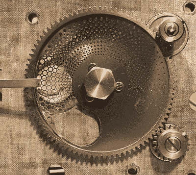

# Wolf 5151 光源的照明效果

> 原文：<https://hackaday.com/2022/05/23/an-illuminating-look-at-a-wolf-5151-light-source/>

虽然最初是为了医疗目的而设计的，但[Nava Whiteford]表示，Wolf 5151 氙内窥镜光源也适用于显微镜和一般光学实验，尤其是因为你可以在二手市场上买到相当便宜的光源。他的成本只有 50 美元，当你考虑到替换一个 300 瓦的奥林巴斯制造的灯泡仅花费你 200 美元时，这是一个大便宜。

也就是说，[纳瓦]最近转向了更紧凑的光源，并认为这是一个足够好的借口来打开 Wolf 5151，看看是什么让它滴答作响。在这篇特别的文章中，他只是在观察事物的光学方面，这可以说是这个设备最有趣的方面。有益的是，整个组件安装在它自己的各种滑板上，可以从光源上拉下来进行更仔细的检查。

A Steampunk dimmer switch.

除了我们之前提到的昂贵灯泡，还有一片厚的似乎是标准平板玻璃的东西被用作红外和紫外过滤器。[Nava]怀疑这个组件负责防止其余的光学元件过热，这一点得到了事实的支持，即安装它的金属板似乎具有 K 型热电偶，以监控其工作温度。在它的前面是一个独特的非球面透镜，其特征是一个粗糙的点，大概是在光束的中心散射光线。

我们投票选出最吸引人的组件，必须是中性密度(ND)过滤器，它用于控制光的强度。在更普通的光源中，你可以将灯泡调暗，但在这种情况下，Wolf 5151 使用了一个钻有一系列孔的金属盘。通过用 DC 马达旋转光盘，镜头可以被可变地遮挡，以减少到达连接到光缆的光圈的光量。

虽然这种医疗设备的制造质量大大超出了我们大多数人用来玩的商业设备，这也许并不奇怪，但它仍然无法与从龙卷风喷气式战斗机上拉下来的 T2 激光模块相比。