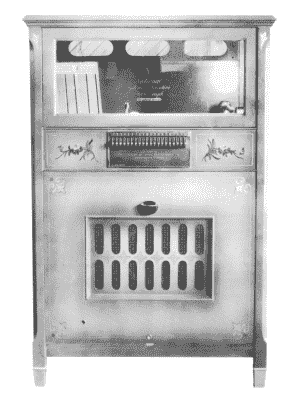
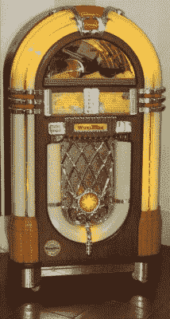

# 再往自动点唱机里放一毛钱

> 原文：<https://hackaday.com/2022/05/24/put-another-dime-in-the-jukebox/>

我们并不总是承认这一点，但大多数人对音乐有一种与生俱来的需求。想想所有带给我们音乐的科技。几十年来，大多数消费者无线电频谱都携带音乐。我们从唱片，到各种形式的磁带，到 CD，到纯数字。有整颗卫星都在传送——大部分是——音乐。撇开盗版不谈，人们也愿意为音乐付费。虽然现在“点唱机”并不常见，但曾经有一段时间，它们是你所在的任何酒吧、餐馆甚至洗衣店的必需品。只需一毛钱，你就可以听到音乐，并与周围的人分享。

甚至在我们能够录制音乐之前，就有了类似点唱机的东西。你会记得，投币机[实际上非常古老](https://hackaday.com/2021/03/12/historical-hackers-hero-builds-vending-machines/)。在 19 世纪 90 年代之前，你可能会发现投币式钢琴或音乐盒。这些机器实际上使用一个有孔的纸卷或金属盘或圆筒来播放它们被设置播放的音乐。

## 早期

1890 年，当一对发明家将硬币接收器与爱迪生留声机连接起来时，这种情况发生了变化。旧金山 Palais Royale 沙龙的顾客可以将一枚辛苦挣来的镍币放入投币口，声音从四个不同的电子管中传出。请记住，在 1890 年还没有我们所知道的电子放大器。据报道，这个盒子在六个月内赚了 1000 美元。

A 1927 not-a-jukebox

模仿者很快跟上，有时是以制造自动钢琴或其他乐器如 Wurlitzer 的公司的形式。通常，投币装置会打开曲柄，你必须转动曲柄才能给老式留声机上发条。你听到的那首歌是播放器上的唱片。这种情况在 1918 年发生了变化，当时一位发明家发现了如何自动停止和重新开始录音。到 1927 年，美国乐器公司有了一台自动点唱机，允许你从 10 张唱片的两面中挑选，总共有 20 种选择。请记住，这些机器当时还不叫点唱机，但今天你会清楚地认出它们是一台点唱机。

大约在同一时间，钢琴制造商 Seeburg 制造了一个带有静电扬声器的投币盒，可以从八个完整的转盘中选择一个。最早的型号按顺序播放唱片，但 1928 年的自动电话可以从八首可用的歌曲中选择。

## 自动化

我们大多数人都可以想象如何构建一个控制器来按需播放一些唱片。你可以把记录叠起来，用多根针。你可以把唱片放在一个旋转的盒子里。你可能会想到很多其他的方法。但是考虑一下:在点唱机的大部分生命周期中，没有微控制器。所有的东西都必须通过开关、螺线管、定时马达、凸轮和诸如此类的东西来运转。想看看典型的点唱机吗？看下面的视频。

 [https://www.youtube.com/embed/NmGaXEmfTIo?version=3&rel=1&showsearch=0&showinfo=1&iv_load_policy=1&fs=1&hl=en-US&autohide=2&wmode=transparent](https://www.youtube.com/embed/NmGaXEmfTIo?version=3&rel=1&showsearch=0&showinfo=1&iv_load_policy=1&fs=1&hl=en-US&autohide=2&wmode=transparent)

## 金色年华

A classic Wurlitzer jukebox

到了 20 世纪 40 年代，自动点唱机开始看起来不像家具，更像你今天所想的展品。这也是这个名字被创造出来的时间。那是 20 世纪 50 年代，在经典的 45 RPM 单曲唱片取代盒子里的其他媒体之前。

就在第二次世界大战前，自动点唱机开始流行起来，有灯光和移动功能。然而在战争期间，不必要的生产被禁止，所以机器在一段时间内回归基本。战争结束后，虽然，机器变得越来越大，以吸引注意力。

有一样东西变得非常流行，那就是壁式盒子。这实际上是一个自动点唱机的遥控器，例如，允许餐馆顾客从他们的座位上付费和选择音乐。

当广播变得突出时，它似乎注定了唱片业的末日，但它没有。自动点唱机是唱片的主要消费者，有人估计，在 20 世纪 40 年代，美国生产的所有唱片中有四分之三被装在投币盒中。然而，到了 20 世纪 60 年代，自动点唱机变得不那么流行了，尽管大约在这个时候开始用立体声播放——这在当时是一件新奇的事情。

它们仍然存在，只是不那么普遍了。现代点唱机最有可能出现在酒吧里，使用 CD 或数字音乐，可能是从互联网上下载的。

## 黑帮的联系

始于 30 年代的一个流行的点唱机品牌是 Rock-ola。以 20 世纪 30 年代的摇滚音乐命名？事实上，不是。该公司是由臭名昭著的黑帮老大大卫·洛克拉创建的，同时也为军方制造天平、家具和步枪。尽管有 1922 年的蓝调民谣“我的男人摇滚我(用一个稳定的滚动)”，术语“摇滚”直到 20 世纪 50 年代才进入音乐界，事实上，它实际上是在那之前完全不同的东西的委婉说法。

Rock-ola 并不是唯一一家与有组织犯罪有关联的点唱机公司。AMI——前身是美国乐器公司——一度被认为是由黑帮经营的。1949 年，芝加哥黑帮老大穆尼·吉安卡纳接管了一家经营机器网络的点唱机经销商。从那里，暴徒有系统地接管了其他分销商，包括世纪音乐公司，该公司在 1954 年经营了 100，000 台机器，而该国总共约有 575，000 台机器。整个事件在 1958 年受到了国会的调查，发现一些点唱机经营者甚至被谋杀来接管他们的路线。

## 寂静之声

点唱机曾经非常受欢迎，如果你在喝酒或吃饭，一定会有音乐。事实上，研究表明，如果点唱机正在播放，它更有可能被喂以更多的硬币来继续播放。为此，经销商过去常常将镍币涂上某种颜色——通常是红色——然后交给所有者。当操作员从点唱机中取出钱时，彩色硬币不属于利润分享。

另外，有时候你不想听点唱机。花一首歌的钱，你可以播放一张名为“三分钟沉默”的空白唱片。“对于一些机器来说，这是播放次数最多的唱片。

## 独立地

我们认识一些喜欢修复旧点唱机的人。然而，它们的相对稀缺性使得获得任何好的都很昂贵，除非你运气好。如果你有一辆真正的破车，你可以把里面的垃圾扔掉，做一些更现代的东西。当然，没有理由说你不能[从零开始建造你自己的](https://hackaday.com/2019/01/06/the-jookbox-is-a-post-modern-jukebox/)。

[Banner image:"[Jukebox–1947 Wurlitzer model 1080](https://www.flickr.com/photos/8993119@N04/2823515303)"作者 Paulo Philippidis。利兹·韦斯特的《[点唱机](https://www.flickr.com/photos/53133240@N00/4420354019)》。]