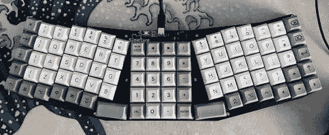
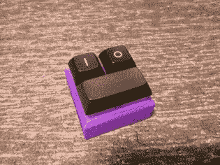
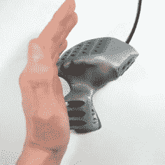

# 给我们看看你的奇怪的输入和特殊的外围设备！

> 原文：<https://hackaday.com/2022/05/24/show-us-your-odd-inputs-and-peculiar-peripherals/>

就像绝地幼徒必须建造他们的光剑一样，真正的极客建造他们自己的计算机界面也是一种仪式。没有什么比定制的键盘、定制的鼠标、无所不能的 macropad、时髦的滚轮或花哨的飞行轭更能让个人电脑个性化了。

在这次比赛中，我们鼓励你制作你最奇怪、最梦幻、最炫或最定制的计算机外设，并与我们其他人分享这些作品。[有线或无线，怪异或精彩，我们都想看](https://hackaday.io/contest/185414-odd-inputs-and-peculiar-peripherals)。Digi-Key 赞助了这次比赛，为三名获胜者提供了在他们的仓库进行网上购物的机会，每人 150 美元！更多零件，更多项目。

## 成为你的

任何人都可以出去买一个键盘，但是如果你想要一个完全适合你双手的[定制人体工程学键盘](https://hackaday.com/2021/11/04/back-to-the-office-ergo-brings-a-bit-of-home-sweet-home/)，你可能必须用你的双手制作一个*。如果你是一个[雕刻的黄铜鼠标](https://hackaday.com/2022/04/26/hand-built-metal-mouse-is-beautifully-engraved/)，那么，你必须做一些雕刻——罗技不会为你做一个。也许你[只输入二进制](https://hackaday.com/2016/07/20/binary-keyboard-is-the-purest-form-of-input-device/)，或者也许你需要一个有 450 个字母的[外星语言的键盘。或者可能是有史以来最小的键盘？你能行的。](https://hackaday.com/2020/09/19/a-big-computer-needs-a-big-keyboard/)*

 *[![[Ren]'s 450-key monstrosity](img/0c04b8eba4d4b965e2953ec0ab064f89.png "kbd")](https://hackaday.com/2020/09/19/a-big-computer-needs-a-big-keyboard/kbd-3/) [Ren]’s 450-key monstrosity  SuperLyra is super [![[Uri Tuchman]'s Fancy Mouse](img/7d955bf89d3207f5f6918f5d75c16a41.png "I Made a Solid Metal Engraved Computer Mouse 17-40 screenshot")](https://hackaday.com/2022/04/26/hand-built-metal-mouse-is-beautifully-engraved/i-made-a-solid-metal-engraved-computer-mouse-17-40-screenshot/) [Uri Tuchman]’s Fancy Mouse [![[TEC.IST]'s keyboard is not big.](img/f6e47bf00cfa4d32a0ba9ffd2361ad39.png "9785291615525474834")](https://hackaday.com/9785291615525474834/) [TEC.IST]’s keyboard is not big.  CIMDIT: Sharp corners, 3D Joystick  Haptic feedback enables endless interactions.  Real programmers only need ones and zeroes.  Lynx Meow-crow Pad comes from the future

但是为什么要停止使用“普通”外设呢？我们最近已经看到了许多模糊宏垫和多轴操纵杆之间界限的设备——既有[感性的有机形状](https://hackaday.com/2022/04/09/cat-is-not-your-average-meow-cropad/)也有[残酷的严肃矩形](https://hackaday.com/2022/03/18/modular-multi-input-macro-keypad-integrates-mouse-and-joystick/)。[scottbez1]用一个带屏幕的[触觉智能旋钮](https://hackaday.com/2022/03/13/haptic-smart-knob-does-several-jobs/)进行的探索绝对是鼓舞人心的。它不一定是一个现有的设备就很棒。

这是外围设备吗？这是一个 [USB 中间人设备，可以打开或关闭讽刺性的大写](https://hackaday.com/2022/01/26/turn-on-sarcasm-with-the-flip-of-a-switch/)，对于那些总是过于讽刺，但同时又懒得这样打字的人来说。

## 特殊类别

像往常一样，我们有一些特殊的类别作为出发点，让您发挥想象力。无论你的项目是否符合这些利基之一，你都有资格赢得奖金，但最终我们将在 Hackaday 上展示一些我们最喜欢的参赛作品。

*   **奇怪的拓扑:**厌倦了正常的老键盘？分裂，分层，交错，正交布局更符合你的风格吗？喜欢在球体上打字还是在碗中打字？我们想看看你最疯狂的键盘布局。
*   **制造更好的老鼠(陷阱):**家用电脑啮齿动物是外围个性化的主要目标。DIY 鼠标、轨迹球、触摸板或任何可以移动光标的东西在这里都是公平的游戏。
*   **按任意键:**有时候你只需要多按几个按钮或者转动一个旋钮。也许这是你的视频会议设备的特殊功能，或者只是一个友好的音量控制。这里有一类用途单一的帮手，可以让你的桌子真正属于你。
*   如果你有一台可穿戴电脑，你肯定会注意到可穿戴输入方式的匮乏。你对此做了什么？语音控制、手势检测手套或单手和弦键盘是受欢迎的替代品。让我们看看你的！
*   **虚拟现实:**说实话吧。与 VR 或 AR 场景交互的正常方式有点蹩脚，在键盘上玩驾驶游戏也不行。为你的飞行模拟器配备一个完整的驾驶舱，或者为你的虚拟剑斗配备一把实体剑，这一切都是不同的。向我们展示使虚拟或游戏世界更具沉浸感的外围设备。

## 你有六周时间

你们中的许多人已经在这方面领先了；你只需要在 Hackaday.io 上记录下来，然后参加比赛。其余的人，希望这是你们需要的灵感。从滚轮开始，或者全力以赴，发明自己的设备类别。是时候让你的电脑互动*成为你的*了。

再次感谢 Digi-Key 赞助这些奖项。

*