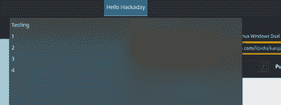

# Linux Fu:简单的小部件

> 原文：<https://hackaday.com/2022/06/02/linux-fu-easy-widgets/>

这里有一个场景。您有一个微控制器，可以读取许多项目，如温度、压力等，您希望在 Linux 桌面上有一个显示器，位于面板上并向您显示状态。如果你点击它，你会得到扩展状态，甚至可以发出一些命令。大多数桌面都支持窗口小部件的概念，但是开发它们确实很痛苦，对吗？即使你为 KDE 开发了一个，使用 Gnome 的人怎么办？

事实证明有一个简单的答案，而且它的灵感显然来自于 Mac 世界的一个工具。这个工具叫做 BitBar(现在的 [XBar](https://github.com/matryer/xbar) )。这个程序在你的菜单栏上放置了一个小部件，可以显示你想要的任何东西。你可以写任何你喜欢的程序——shell 脚本、C 语言等等。程序打印的输出使用一种简单的类似标记的语言来控制小部件上显示的内容。

这对于 Mac 来说很好，但是 Linux 呢？如果你使用 Gnome，有一个非常类似的项目叫做 [Argos](https://github.com/p-e-w/argos) 。它在很大程度上与 XBar 兼容，尽管它添加了一些特定于它的东西。如果你使用 KDE(像我一样)，那么你会想要[卡尔戈斯](https://github.com/lipido/kargos)，它或多或少是阿尔戈斯的一个港口，增加了一些自己的东西。

## 好消息，坏消息

好消息是，从理论上讲，您可以编写一个可以在所有三种系统下运行的脚本。坏消息是，每个人都有自己的差异和怪癖。很明显，如果你使用一个编译过的程序，除非你重新编译，否则会在 Mac 上造成问题。

更糟糕的是，Kargos 的文档似乎是错误的。这部分是因为 KDE 软件仓库中的版本已经过时了，即使你从 GitHub 上下载了最新的版本，它的文档仍然是过时的。你真的想从 GitHub 的克隆安装，而不是从发布包或 KDE 的 plasmoid 库。问题的一部分也在于文档是简洁的，有时有些东西是有效的，但不是在所有情况下都有效。目前还不清楚这是出于设计还是与一直在变化的 KDE 桌面的某种互动。

因为我使用了 KDE，所以我将把重点放在卡尔戈斯上，在我进行的过程中，我将指出一些关于阿尔戈斯的事情。但是你可以期待做一些实验。

## 基础

当你安装小部件时，你必须将它指向一个脚本。通常，脚本会定期运行。对于 Kargos，您可以用两种不同的方式设置间隔，我们稍后将讨论这两种方式。

在最简单的情况下，您可以让脚本输出一行将出现在面板上的文本、一个分隔符，然后是一行或多行当您单击小部件时将出现的文本。考虑一下这个:

```

#!/bin/bash
echo Hello Hackaday
echo ---
echo Test
echo 1
echo 2
echo 3
echo 4

```

[](https://hackaday.com/wp-content/uploads/2022/05/karss.png) 如果你把 Kargos 小工具放在一个面板上，并设置它来读取你的脚本，你将会在你的面板上看到 Hello Hackaday 这个文本。当你点击时，你会看到这样的内容:

## 兴奋

[](https://hackaday.com/wp-content/uploads/2022/05/icon.png)

A bit snazzier

事实上，这并不令人兴奋。然而，每一行文本都可以有一个竖线字符和一些属性来修饰和增加功能。将写着 Hello Hackaday 的一行替换为:

```

ICON=$( curl -s "https://hackaday.com/favicon.ico | base64 -w 0 )
echo "Hello Hackaday | image='$ICON' href=http://www.hackaday.com"

```

现在，这个面板看起来更时髦了，如果你点击这个小链接图标，你将访问你最喜欢的网站。当然，真正有趣的是当你可以改变物品的时候。如果您在配置屏幕上设置了刷新间隔，脚本将会经常运行。您也可以用重复间隔来命名脚本。例如，`haddemo.10s.sh`的脚本将每 10 秒运行一次，而`haddemo.2m.sh`将每两分钟运行一次。

您还可以向文本行添加一个 r `efresh=true`属性，使单击它再次运行脚本。假设你想 ping google on demand。您可以将计时器设置为 0，并执行以下操作:

```

#!/bin/bash
OUTPUT=$( ping -c 1 -q google.com | grep ^rtt | cut -d ' ' -f 4 | cut -d '/' -f 1 )
if [ -z "$OUTPUT" ]
then
   echo "Error click to refresh | refresh=true color=orange" bash="'/usr/bin/systemsettings kcm_networkmanagement'" terminal=false
fi
# get an integer to compare (bash doesn't like floats)
IOUT=$( echo $OUTPUT | sed s/\\.// )
COLOR=green
if [ $IOUT -gt 90000 ] # 900000 is 90 ms
then
   COLOR=red
fi 
echo "Google.com: $OUTPUT ms | refresh=true color=$COLOR" bash="'/usr/bin/systemsettings kcm_networkmanagement'" terminal=false
echo ---

```

现在你可以在你的工具栏上从谷歌获得一个 ping 时间。如果速度慢或无法 ping 通，它会变色。一个小按钮会让你打开网络管理。

## 然而…

颜色似乎对下拉菜单不起作用，这可能是桌面管理器强制主题颜色，所以你的里程可能会有所不同。与 Argos 相比也有一些不同。例如，Argos 有一个环境变量，告诉您小部件是否打开。这允许您不运行脚本中不必要的部分以获得更好的性能。

也有其他的不同，但是如果你坚持基本的，你应该没问题。即使情况有所不同，这仍然比为不同的系统编写两个完全不同的小部件要容易。

似乎还有一些奇怪的行为。例如，onclick 属性在下拉列表项中也不起作用。当然，它是开源的，所以如果你那么讨厌它，请随意修改它！

## 大例子

因为我喜欢关注 Hackday 上的头条新闻，所以我决定利用 Kargos 的一个特性。在前面的例子中，我在下拉分隔符(“—”)前只有一行。但是如果你有不止一行，你可以在 widget 设置中设置延迟时间，widget 会在这些行之间旋转。

使用`awk`可以很容易地阅读 Hackaday RSS 提要并提取标题和链接。一些图片，你就有了一个漂亮的 RSS 显示。解析可能不适用于任意的 RSS 提要，因为它非常简单，但是——理论上——您应该能够将它应用于其他提要。

代码如下:

```
</pre>
#!/bin/bash
curl "https://hackaday.com/feed/" 2>/dev/null |
  awk '
   BEGIN { n=-1; }  # skip first item
/<title>/ {
# read titles
    if (n==-1) next;
    gsub("[[:space:]]*</?title>[[:space:]]*",""); item[n]=$0; next;
   }
/<link>/ {
# read links
   if (n==-1) { n=0; next; }
   gsub("[[:space:]]*</?link>[[:space:]]*", ""); link[n++]=$0; next
   }
END {
# output widget text
   for (i=0;i<n;i++) {
   printf("%s | href=\"%s\" imageURL=https://hackaday.com/wp-content/themes/hackaday-2/img/logo.png\n",item[i],link[i]);
   }

print "---"
# output dropdown lines
for (i=0;i<n;i++) {
   printf("%s | href=\"%s\"\n",item[i],link[i]);
   }
}
'
<pre>
```

对于一个成熟的 RSS 阅读器来说，这并不是很多代码。你可以在面板中看到这些故事，或者点击它们，或者打开小部件一次看到一个列表。

## 后续步骤

因为数据只是文本，所以使用这个系统很容易生成小部件。例如，这是一个非常方便的内存状态小部件:

```

#!/bin/bash
cat /proc/meminfo
echo ---
echo "<b>Tools</b>"
echo "--System status | bash=/usr/bin/ksysguard onclick=bash"
echo "--Htop | bash=/usr/bin/htop" terminal=true
cat /proc/meminfo

```

显然，拥有一个从 ESP32 或 Arduino 读取数据的脚本是微不足道的。因为你想做的很多事情与操作系统无关，浏览 xbar 的一些[插件可能会给你一个想法。](https://github.com/matryer/xbar-plugins)

如果你想要更复杂的 KDE 的东西，看看[编剧](https://github.com/tubbadu/Scriptinator)。您可以对其进行更多的定制，但是管理起来有点复杂。

出于某种原因，我迷上了黑客日。我已经把它[变成了文件系统](https://github.com/matryer/xbar-plugins)。当我登录时，它还会向我打招呼。您将发现的一些插件在 bash 中，一些在 Python 中。别忘了你也可以[将它们混合在一起](https://hackaday.com/2021/05/04/linux-fu-mixing-bash-and-python/)。