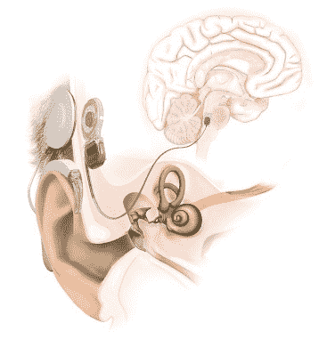
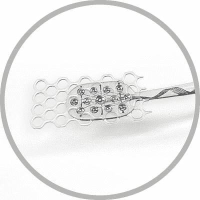

# 听觉脑干植入:另一种仿生听觉装置

> 原文：<https://hackaday.com/2022/05/26/auditory-brainstem-implants-the-other-bionic-hearing-device/>

你可能听说过人工耳蜗。这是一种电子设备，也被称为神经假体，作为人耳的仿生替代物。这些植入物改善了全世界成千上万人的听觉。

然而，耳蜗植入并不是镇上唯一的游戏。听觉脑干植入物是另一种设备，它有望给没有听觉的人带来听觉，尽管是通过不同的途径。

## 感官植入物

Cochlear implants have shown the best results when provided to patients earlier rather than later. It’s likely that ABIs would be subject to a similar effect, though users of all ages often cite measurable benefits from such implant devices. Credit: Matt Ralph. [CC-BY-2.0](https://commons.wikimedia.org/wiki/File:Child_wearing_Cochlear_implant.jpg#/media/File:Child_wearing_Cochlear_implant.jpg)

虽然人工耳蜗本身是一个高度复杂的设备，但其背后的基本概念很简单。耳朵接收来自空气的振动并将其转化为神经信号的常规机制被完全忽略了。取而代之的是，一个小型电子设备用麦克风捕捉声音。然后对声音进行处理，优先考虑最大化可听语音的感知。这种经过处理的声音用于驱动植入耳蜗本身的电极阵列。这些电极刺激耳蜗中的听觉神经，使佩戴者能够感知声音。

听觉脑干植入(ABI)在许多方面类似于耳蜗植入。基本理论确实是一样的:音频被电子捕获，然后用于刺激神经，为大脑提供听觉。ABI 的不同之处在于它完全跳过了耳朵内部的耳蜗。相反，ABI 刺激放置在脑干自身耳蜗核中的电极。

因此，ABI 具有这样的好处，即它可以向由于任何原因而不能将耳蜗植入物安装到内耳中的听觉神经上的患者提供听觉。患有 2 型神经纤维瘤病(NF2)的患者最初是使用 ABI 的主要人群。NF2 是一种影响神经系统的疾病，其相关治疗通常会对听觉神经造成损害。因此，对于患有这种疾病的患者，在传统的耳蜗植入不切实际的情况下，ABI 是合适的。在耳蜗中的听觉神经可能被损坏或破坏的情况下，ABI 可能是适用的。

The auditory brainstem implant (ABI) directs pulses to electrodes mounted in the brainstem, instead of the inner ear. Credit: Hear Hear!, [CC-BY-SA-4.0](https://en.wikipedia.org/wiki/File:ABI_diagram.jpg)

然而，ABI 的缺点是它需要比人工耳蜗更复杂的植入。手术包括打开颅骨以接近脑干，这比在内耳植入耳蜗设备所需的更简单的程序更具侵入性。

在理解语言方面，患者的结果总的来说不如人工耳蜗患者成功。通过结合使用 ABI 和唇读技术，许多患者继续学习理解语音，但是很少有人能够仅依靠 ABI 来理解语音。

这在很大程度上取决于电极的放置。耳蜗本身有一个相当直观的区域图，对应于高音调和低音调，可以通过直接植入来刺激。然而，当将电极插入脑干时，很难精确地绘制和刺激这些区域，因此 ABI 将很难像耳蜗植入一样向大脑传递尽可能多的音调信息。

The ABI typically uses a paddle-shaped electrode, in contrast to the linear-type electrode used with a traditional cochlear implant. Credit: Hear Hear!, [CC-BY-SA-4.0](https://commons.wikimedia.org/wiki/File:ABI_electrode.jpg)

较低的性能、更具侵入性的植入方法以及 ABI 的模糊应用意味着人工耳蜗在实践中被更普遍地使用。[全世界已经安装了超过 70 万个人工耳蜗](https://www.frontiersin.org/articles/10.3389/fnins.2019.00010/full)。然而，[最多只植入了几千个](https://www.ncbi.nlm.nih.gov/pmc/articles/PMC4477282/#:~:text=More%20than%201%2C000%20adult%20and,over%20the%20past%20four%20decades.) ABI 装置。

虽然 ABI 的结果可能达不到耳蜗植入的标准，但这些仿生设备仍然有价值。对于根本不能使用人工耳蜗的患者来说，ABI 仍然可以提供基本的听觉，这是非常有用的，尤其是在听到环境声音的时候。总的来说，这是与人工耳蜗相同的技术的一个有趣的应用，但却是一个独特的特定用例。