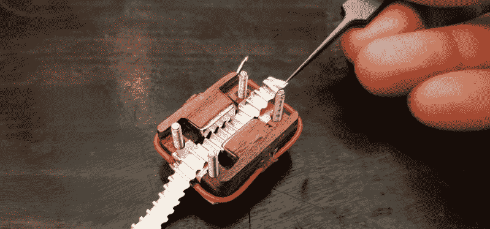

# 复古专业音频黑客聊天进入凹槽

> 原文：<https://hackaday.com/2022/05/27/vintage-pro-audio-hack-chat-gets-in-the-groove/>

尽管事实上我们已经做了很多年了，仍然很难预测黑客聊天会如何发展。毫无疑问，这将是一个小时的有趣的讨论，当然，这是必然的。但是，对话的动态范围可以从僵硬的问答(当你与主题专家的时间有限时，这并不意外)到与一群碰巧对同一件事感兴趣的人随意闲逛。

 本周的[*Vintage Pro Audio Hack Chat*与 Frank Olson](https://hackaday.io/event/185412-vintage-pro-audio-hack-chat) 肯定采取了后一种方式。分配的时间一眨眼就过去了，如此多的轶事和想法来来回回，有时很难跟上。但是不用担心，有了聊天记录，我们可以确保积累的第一手知识不会浪费。

那么我们在这次聊天中学到了什么？嗯，发现那些对音频设备有意见的人往往对它有强烈的意见，这可能并不令人惊讶。人们用一些相当宽的画笔绘画，特定的制造商甚至整个技术领域都受到了善意的嘲笑。如果你最喜欢的品牌或设备得到了一个特定的呼喊，试着不要把它看得太个人化——在一天结束时，大多数人似乎都同意声音是如此主观，以至于正确的选择往往是此刻对你来说听起来最好的。

这直接导致了弗兰克对定制话筒的研究。作为一名音乐家，他比任何人都了解自己想要的声音，所以他宁愿自己动手制作，也不愿花钱购买大牌设备。但真正吸引人的是它们独特的结构，这些部件使用意想不到的材料重新构思了上世纪中期商业设备的设计概念，例如用乙烯基切割机切割的薄核桃片。Frank 解释说，由于强大的钕磁铁的存在，麦克风的结构现在已经不那么重要了，这使得制造商在材料和工具方面有了更多的自由。他说，目标是激励其他人尝试用他们可以得到的东西来制造装备，而不是假设它不会工作，因为它是非传统的。

我们感谢弗兰克和其他所有人在本周前来参加如此生动友好的讨论。说实话，专门为那些想讨论个人和模糊概念的人而设的聊天，比如他们如何感知声音的温暖度，可能会变得有点激烈。但事实上，每个人都能够表达自己的意见或建设性地寻求建议，这是一个真正的社区信用。

* * *

Hack Chat 是一个每周一次的在线聊天会议，由来自硬件黑客世界各个角落的顶尖专家主持。对于黑客来说，这是一种有趣和非正式的联系方式，但如果你不能现场直播，这些概述帖子以及发布到 Hackaday.io 的[文字记录确保你不会错过。](https://hackaday.io/event/185412-vintage-pro-audio-hack-chat)