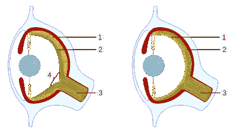
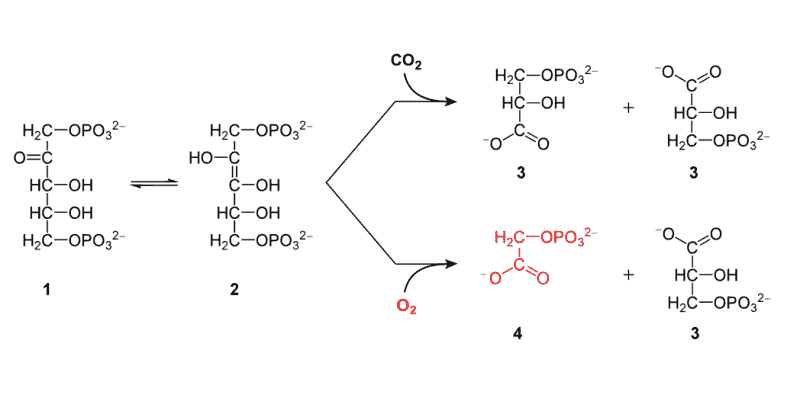
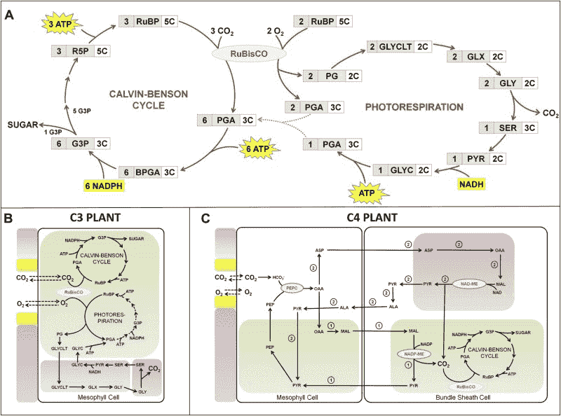
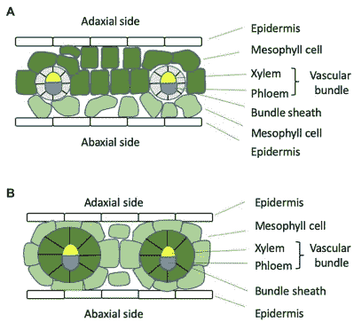
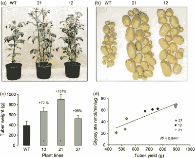

# 如何通过植物新陈代谢有所作为

> 原文：<https://hackaday.com/2022/06/07/how-to-make-a-difference-through-plant-metabolism/>

通常，当我们考虑我们周围的许多植物时，我们会想象它们通过叶子的光合作用有效地利用来自太阳的电磁辐射——从空气中吸收二氧化碳，通过根部从土壤中吸收水分，并以合理的速度生长。事实上，这一过程的效率不到输入能量的 10%，并且在进化过程中形成的不同类型的植物代谢并不完全相同。

在今天使用的植物代谢中，一些使用明显更有效的碳固定途径，而另一些则以不必要的复杂过程浪费了大量从光合作用中获得的能量，特别是在处理废物时。如果植物都进化出了最有效的固碳途径，它们能长多快已经成为过去几十年许多研究的主题，涉及从农作物到树木的一切。

正如这些研究向我们展示的那样，这些转基因植物不仅仅是科学和进化生物学上的好奇心，还为从食品生产到重新造林的方方面面提供了真正的机会。

## 用进化重新发明

Vertebrate versus cephalopod eye. Note the inversion of the retina (1) and nerves (2). Cephalopods lack the vertebrate blind spot (4).

在地球上数十亿年的过程中，进化过程导致了迷人的生物结构的形成，以及许多奇怪的分支路径和以不同方式改造同一结构的事件。例如脊椎动物和[头足类](https://en.wikipedia.org/wiki/Cephalopod) [的眼睛](https://en.wikipedia.org/wiki/Cephalopod_eye)，它们看起来是独立形成的，既非常相似又有很大的不同。这个过程被称为[收敛进化](https://en.wikipedia.org/wiki/Convergent_evolution)。

恐龙(鸟类)、哺乳动物和昆虫的眼睛和翅膀等趋同特征一样引人注目，也许不那么明显，但同样重要的是光合作用的趋同进化。在数百万年的过程中，早期植物的光合作用的粗略版本变成了许多不同的光合作用途径，都基于 [RuBisCO](https://en.wikipedia.org/wiki/RuBisCO) (核酮糖-1，5-二磷酸羧化酶-加氧酶)酶和相关的[卡尔文循环](https://en.wikipedia.org/wiki/Calvin_cycle)。

大多数工厂使用所谓的 [C [3] 碳固定](https://en.wikipedia.org/wiki/C3_carbon_fixation)，这使用了一个相当基本的卡尔文循环。这种[总效率](https://en.wikipedia.org/wiki/Photosynthetic_efficiency)最多为 3.5%(相对于太阳辐射能量输入)，而不太常见的 [C [4] 碳固定](https://en.wikipedia.org/wiki/C4_carbon_fixation)循环峰值超过 4%。C [4] 和 [CAM](https://en.wikipedia.org/wiki/Crassulacean_acid_metabolism) (景天酸代谢)是一种趋同进化的形式，两者都使用磷酸烯醇式丙酮酸(PEP)来捕获 CO [2] ，从而在 RuBiscCO 酶周围产生增加的 CO [2] 浓度，以减少[光呼吸](https://en.wikipedia.org/wiki/Photorespiration)。

The reactions of the RuBisCO enzyme with carbon-dioxide and oxygen.

从上面列出的反应中可以看出，RuBisCO 的一个核心问题是它同时与 CO [2] 和 O [2] 反应，而后一个反应由于缺少碳原子而明显不受欢迎。与氧气反应产生的 2-磷酸乙醇酸( [2-PG](https://en.wikipedia.org/wiki/2-Phosphoglycolate) ，或 C[2]H[2]O[6]P^(3-))代谢产物对植物有毒，因为它抑制了一些代谢途径，因此必须进行处理。这是 C [3] 植物光呼吸必不可少的地方，因为它允许 2-PG 转化为所需的[PGA](https://en.wikipedia.org/wiki/3-Phosphoglyceric_acid)(3-磷酸甘油酸)，用于植物茁壮成长所需的糖的形成，正如 [Williams 等人(2013)](https://elifesciences.org/articles/01403) 在 C [3] 和 C [4] 植物代谢途径的图表中所捕捉到的:

Metabolic pathways of C3 and C4 plants. (Credit: Williams et al., 2013)

这告诉我们，许多使用 C [3] 碳固定循环的植物——包括粮食作物和树种——正在花费大量从光合作用中获得的能量来分解这种由于 RuBisCO 和氧气之间的相互作用而形成的 2-PG。由于这种光呼吸过程，通过[气孔](https://en.wikipedia.org/wiki/Stoma)(毛孔)流失的水分也会增加。

由于当温度升高时，RuBisCO 更容易与氧气而不是二氧化碳结合，这就为 C [3] 植物的生存环境条件设置了自然限制，并解释了为什么 C [4] 特别是 CAM 植物会出现在更温暖、更干旱的条件下。因此，合乎逻辑的结论是，如果我们将 C [4] 、CAM 或其他途径中的适当元素移植到 C [3] 植物中，这可以通过减少光呼吸中浪费的能量来显著提高它们的生长速度。

## 现场测试

Diagram of the leaf anatomy of C3 (A) and C4 (B) plants. The latter split up CO2 concentration and the Calvin cycle into two cells. (Credit: Cui, 2021)

在最初尝试直接调整 RuBisCo 酶以增加其对二氧化碳的亲和力不太成功后，20 世纪 90 年代的重点转移到了理解和优化上。在这个时间点上，人们普遍认为，通过使用现有的 C [4] 工厂作为模板，在 C [3] 工厂进行工程 C [4] 式的碳固定是一条可行的前进道路。这里相关的是一个 C [3] 物种是否也有一个相关的 C [4] 物种，以使基因工程更加直接。崔(2021)指出，这里讨论的另一个活跃点是，是追求一个还是两个细胞战略。

其他研究人员试图找到增强光合作用的新方法，例如[nlke 等人(2014)](https://onlinelibrary.wiley.com/doi/full/10.1111/pbi.12178) ，他们将取自*大肠杆菌*乙醇酸脱氢酶(GlcDH)的多蛋白(DEFp)的表达添加到马铃薯植物(*马铃薯*)中，导致块茎产量增加 2.3 倍。这种同样的方法也可以潜在地应用于其他植物，可能会有类似的产量增加。

Impact of DEFp expression on potato phenotype and tuber yield. (Noelke et al., 2014)

[Wang 等人(2020 年)](https://www.sciencedirect.com/science/article/pii/S1674205220303531)使用与 lke 等人类似的方法报告了一种改良水稻品种，尽管结果不一。在这项研究之后， [Nayak 等人(2022)](https://pubmed.ncbi.nlm.nih.gov/34895540/) 报告了有希望的结果，这些结果可能导致转基因水稻在田间试验中的引入。相关田间试验数据可从 [South et al. (2019)](https://www.science.org/doi/full/10.1126/science.aat9077) 获得，他们使用转基因烟草植物进行了田间试验。与野生型相比，这些植物的有用生物质产量增加了约 40%。

很明显，在这些转基因物种分配给农民用于下一年的作物之前，必须进行更多的实验和田间试验，以确保这些转基因的有效性、长期稳定性和总体安全性。即便如此，这些实验还是提供了一个诱人的未来，即今天的农业产量增加了 150-200%，不需要额外的养分，需水量减少，对热浪的抵抗力更强，由于持续的气候变化，预计热浪会更频繁地发生。

这就提出了一个问题，是否可以用类似的方法让普通树木更有效地固定大气中的碳。

## 当你等待的时候，一片森林

传统观点告诉我们，树木需要很长时间才能生长。也许并不令人惊讶的是，大多数被称为“树”的植物类型(即没有“树”的生物学定义)使用 C [3] 碳固定代谢。在最近由 [Living Carbon 团队等人(2022)](https://www.biorxiv.org/content/10.1101/2022.02.16.480797v2.full) 发表的一篇预印本文章中，一种类似于之前讨论的基于作物的转基因物种的修饰被报道应用于杨树。这些杂交杨树随后被种植在[俄勒冈州的田地里，详见“生活碳”团队网站上的](https://www.livingcarbon.com/post/photosynthesis-enhanced-trees-grow-faster-and-capture-more-carbon)。预印本文章报道，相对于标准杨树，生物量增加了大约 50%,这将使人们相信 [Living Carbon](https://www.livingcarbon.com/) 网站的崇高目标

正如该项目的 [FAQ](https://www.livingcarbon.com/faq) 页面上所解释的，所有以这种方式种植的转基因植物都是雌性的，因此转基因不会通过花粉传播到其他野生杨树上，而是只限于种植的树木。该项目是与俄勒冈州立大学(OSU)合作完成的，已经种植了 600 多棵这种杂交杨树。目标是在未来几年种植尽可能多的这种树，作为碳捕获方法的一部分。

再加上大幅提高农作物产量的前景，森林的生长速度比传统森林快 50%，这似乎会让我们期待一个相当有趣的未来。

## 遗传工程

当谈到这个话题时，房间里的一头大象是转基因生物，或者更正确的说法是“基因工程”。许多国家立法禁止或严格限制转基因生物、产品、种子等的种植、进口和销售。毫无疑问，这将是让这些光合作用增强的植物被接受的最大障碍。

尽管可以为这些杂交树木的内在安全性提出许多论点，因为人类和牛一般都不太可能消耗森林和树木，但在这种情况下，科学的逻辑世界与普通人的情感驱动世界和日常新闻周期之间的分歧确实是明显的。

尽管如此，随着当前世界走向一个干旱、饥荒和所有其他非常令人不快的气候变化症状将被越来越多的人感受到的世界，科学为我们提供的工具可能会成为我们的救赎，让我们能够养活数百万人，并在相当大程度上减少大气中过量的二氧化碳，这一切都是通过让植物更好地储存碳来实现的。