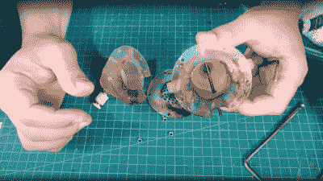

# 3D 打印水冷喷气发动机？

> 原文：<https://hackaday.com/2022/05/30/3d-printing-a-water-cooled-jet-engine/>

每个人都知道将蜡烛火焰放在气球上而不使其爆炸的诀窍——在空气中加入一点水，从相对冷的火焰中吸收热量。因此[Integza]在寻求 3D 打印喷气式发动机时，想知道同样的原理是否可以应用于 3D 打印的燃烧室。首先，这一小滩水被一个外部水库的泵流所取代，这给了薄塑料内表面至少一个模糊的生存机会。虽然这整个计划可能看起来很疯狂(虽然我们承认，如果你最近在频道里看过任何其他视频，就不会这么疯狂)，但这个想法有一些优点。我们注意到，许多火箭发动机设计中都使用了液体冷却燃烧夹套，德国二战 V2 火箭和其他许多火箭都成功地运用了这一理念。毕竟，一些材料只有在任何地方变得足够热时才会软化并变得结构脆弱，所以如果它足够导热，那么多余的热量可以从外表面带走，并将表面温度保持在可感知的范围内。由于树脂是一种热固性塑料，会燃烧，而不是熔化，这种行为会有所不同，但不一定更适合这种应用。

The combustion chamber itself didn’t burn

我们可以看到的问题是，平衡树脂壁的导热性和水流的冷却速度，同时使其足够厚，以承受燃烧的压力和任何冲击成分。如果你问我们，这是一项相当复杂的任务。树脂是这项工作的合适材料吗？可能不会，但无论如何发现它是很有趣的！最终[Integza]设法提出了一种设计，在金属注射器隔板的帮助下，存活了足够长的时间以维持某种燃烧，直到板过热并燃烧了其支撑周围的树脂。祝下次好运！

这不是第一次尝试将 3D 打印树脂用于这种应用，这里尝试使用带有燃烧室的[空气倍增器类型设置。当然，用厕纸架](https://hackaday.com/2022/01/28/the-air-multiplier-fan-principle-applied-to-a-jet-engine/)制作[燃烧室要明智得多，正如【colinfurze】将证明的那样，不要在家里尝试这个！](https://hackaday.com/2013/10/05/please-dont-build-a-jet-engine-from-a-toilet-paper-holder/)

 [https://www.youtube.com/embed/FGGw-5dfNiM?version=3&rel=1&showsearch=0&showinfo=1&iv_load_policy=1&fs=1&hl=en-US&autohide=2&wmode=transparent](https://www.youtube.com/embed/FGGw-5dfNiM?version=3&rel=1&showsearch=0&showinfo=1&iv_load_policy=1&fs=1&hl=en-US&autohide=2&wmode=transparent)

