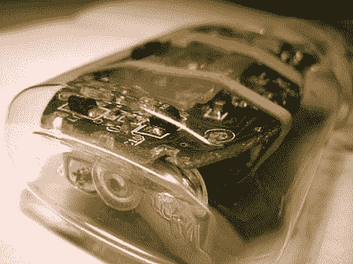

# Soap 鼠标是一个光滑的空中输入界面

> 原文：<https://hackaday.com/2022/05/28/soap-mouse-is-a-slippery-interface-for-mid-air-input/>

我们都有那些粗糙的伤疤，在我们第一次看到它们多年后，我们仍然会想起它们。对于连环密探[Inne]来说，其中一个是[Patrick Baudisch]的肥皂鼠标，这是一个 DIY 设备，可以在半空中用现成的和房子周围的组件做鼠标。

它是如何工作的？内脏被包裹在形状像扁平药丸的塑料里，然后塞进一只毛茸茸的袜子里。稍微挤压一下，塑料药丸就会旋转，让朝外的传感器一圈又一圈地旋转。虽然我们早在 2006 年就简要报道过 soap mouse，但我们认为它值得成为今天的焦点，特别是因为有一个完整的 PDF 指南来构建一个针对游戏优化的 soap mouse。如果您想要一个常规的定点设备，转换在中进行了描述。

【Patrick】在指南中使用 CompUSA (RIP)鼠标，但任何足够纤薄且短小的鼠标都应该可以工作，只要它有一个相当长的焦距范围，这对传感器看到船体是必要的。大量的旅行老鼠应该符合这个要求。

船体本身是由两个小瓶(空的)洗手液制成的，根据它们的大小、形状和塑料的透明度进行选择。最外面的外壳是一只缝有搭扣的婴儿袜。[Patrick]说将袜子贴着塑料移动是很困难的，他尝试了各种润滑方法，比如在一些塑料袋里放一点矿物油。

请务必在休息后观看视频，它在 5 分钟内很好地解释了从各种类型的交互到构建的一切。

自 2006 年以来，[Patrick]举办了一些研讨会，让人们制作自己的肥皂老鼠。你造了一个吗？请在评论中告诉我们。不要忘了 Digi-Key 赞助的[古怪输入和特殊外设竞赛](https://hackaday.io/contest/185414-odd-inputs-and-peculiar-peripherals)，它将持续到 7 月 4 日。宣布你独立于常规键盘和鼠标，赢得大奖！

 [https://www.youtube.com/embed/hohu8SSpduM?version=3&rel=1&showsearch=0&showinfo=1&iv_load_policy=1&fs=1&hl=en-US&autohide=2&wmode=transparent](https://www.youtube.com/embed/hohu8SSpduM?version=3&rel=1&showsearch=0&showinfo=1&iv_load_policy=1&fs=1&hl=en-US&autohide=2&wmode=transparent)

感谢您的提示，[Inne]！