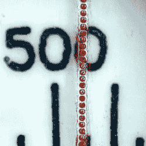

# 激光雕刻发际线:当线不是线时

> 原文：<https://hackaday.com/2022/05/29/laser-engraving-hairlines-when-a-line-isnt-a-line/>

什么时候一条线不是一条线？当然，当它是一系列小点的时候！

The line is actually tiny, laser-etched craters, 0.25 mm center-to-center.

这就是[Ed Nisley]用来在一块透明塑料上创造出一条超精细的彩色发际线的技术——这是他重建 20 世纪 60 年代经典 Tektronix 模拟计算器项目的一部分，但稍后会有更多内容。

[Ed]尝试了各种方法和技术，包括激光雕刻实线，以及用极其微小的 v 形工具铣削线条。结果是有用的，但是真正有用的是一系列用红色标记填充的微小激光蚀刻坑。这就产生了肉眼看来非常细的发际线。但是当放大后，如图所示，你可以看到它实际上是一系列的小陨石坑。这种颜色来自于用红色记号笔给线着色，然后用酒精擦掉多余的部分。残留在陨石坑中的颜料给出了恰到好处的颜色。

这都是[Ed]努力再造[泰克电路计算机](https://softsolder.com/homage-tektronix-circuit-computer/)的一部分，这是一个圆形计算尺，能够计算各种有用的电气工程相关的东西。如果你发现自己想从头开始设计和制作自己的圆形计算尺呢？[我们已经为您覆盖了](https://hackaday.com/2021/09/25/design-and-build-your-own-circular-slide-rule/)。