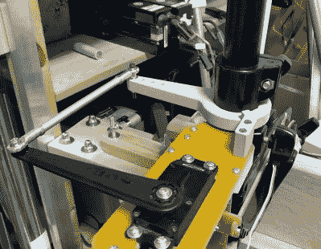

# 自主充气独木舟

> 原文：<https://hackaday.com/2022/05/29/inflatable-canoe-gets-remote-control-upgrade/>

随着夏季即将来临，许多人都梦想着在宁静的湖上度过温暖的下午。除非你是科林。显然，他的好时光是控制一个全尺寸的充气独木舟，不是在船上用一对桨，而是在岸上用遥控发射器。

The linkage design allows the motor to be adjusted vertically.

当然，正如休息后的视频所示，仅仅因为独木舟由远程操作的电动拖曳马达驱动并不意味着它不能承载人类居住者。事实上，随着 Matek F405 翼飞行控制器的加入，运行 ArduPilot 的 rover 版本，当你休息和放松时，这艘船甚至可以带你在湖上游览一番。

我们喜欢这个项目尽可能采取阻力最小的方式。Kolins 没有试着安装他自己定制的推进装置，也没有不可避免地应对防水的挑战，而是围绕着一个商业拖曳马达建立了他的系统。一个聪明的伺服机构以与人类操作员几乎相同的方式物理地转动马达，而速度则由 Traxxas 公司的一个适当结实的 ESC 控制，该 ESC 位于马达和铅酸电池之间。

它看起来不像有任何永久性的机械或电气变化，这使得整个事情更容易复制。我们过去已经讨论过相对罕见的低成本机器人船只，所以像这样的“螺栓连接”推进模块可以将廉价的充气船变成研究和实验的自主平台非常有趣。

 [https://www.youtube.com/embed/ZDq9nrBFCMs?version=3&rel=1&showsearch=0&showinfo=1&iv_load_policy=1&fs=1&hl=en-US&autohide=2&wmode=transparent](https://www.youtube.com/embed/ZDq9nrBFCMs?version=3&rel=1&showsearch=0&showinfo=1&iv_load_policy=1&fs=1&hl=en-US&autohide=2&wmode=transparent)

感谢[Neolker]的提示。