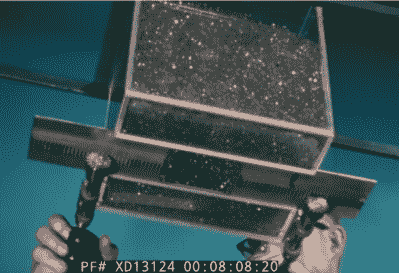
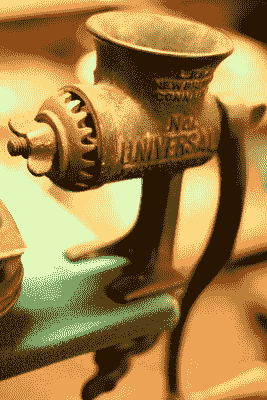
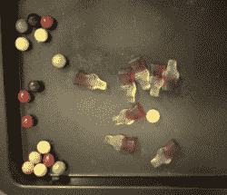

# 散装材料——这到底是什么东西？

> 原文：<https://hackaday.com/2022/06/01/bulk-material-what-is-this-stuff-anyway/>

我希望上周的[散装材料处理介绍](https://hackaday.com/2022/05/24/handling-bulk-material-why-does-my-catfood-get-stuck/)让你们都想出了惊人的窍门，我们很快就会报道大量的 DIY Cap'n Crunch 机器人。本周我们将学习如何测量颗粒大小，分离颗粒，甚至在需要时磨碎它们。

## 测量材料属性

上周我们谈到了凝聚力。散装材料的行为介于固体和液体之间——如果你做了功课，它会很好地顺着漏斗流下。但如果你没有，它会粘在一起，支撑起剩余的材料。内聚强度是衡量漏斗底部的材料能够承受多少重量的指标。

把材料装在一个底部有一个方孔的盒子里，就可以得到一个大概的尺寸。洞的一边应该有一个可伸缩的滑梯。慢慢撤回幻灯片，使孔矩形。物质会桥接，然后在某个时候，更大的一大块会掉出来。这大约是不会拱起的最小开口的大小，也是对材料粘结强度的实际测量。

Image capture from [The Million Dollar Rathole](https://www.youtube.com/watch?v=SjDXV2NwMxo) (video).

许多材料在潮湿时更容易粘合。在微波中干燥样品，通过在**前后称重来确定**百分比水分**。**

内聚强度与**剪切强度**密切相关。如果您想要测量剪切强度，请切割两个直径为 5 cm 的直径为 1 cm 的 PVC 管环，将它们堆叠在一起，用材料包装，在材料顶部放置一个圆盘并加载，然后用弹簧秤将顶部的环从底部拖出。单位面积上的力就是该压力下的剪切强度。如果它开始打包，你会在曲线上看到它。

**填充系数**是另一种有用的测量方法。轻轻摇动材料以填充刚性容器并称重。现在清空容器并重新填充，尽可能用 1 英寸长的销钉压紧材料。重新称重，这两个重量的比值告诉你材料包装得有多好。

真正的散装材料几乎总是由不同大小、形状和成分的颗粒组成。灰尘是不同种类的矿物质和有机物的颗粒，从直接的岩石到亚微米粘土颗粒。如果你有问题，得到一张材料尺寸分布图会有所帮助。

对于大约 75 微米以上的颗粒，可以用筛子来测量尺寸。如果你想变得花哨，他们出售底部有金属网的漂亮的金属筛。屏幕分类更便宜。在 75 微米以下，你必须使用比重计。这很麻烦，需要一段时间，但确实有效。

这个想法是将这种材料与肥皂水混合，然后使用汽车配件商店的比重计来测量密度。根据斯托克斯定律，大粒子先脱落。斯托克斯定律就是球体受到的拖曳力与半径的平方成正比。质量会随着半径的立方增加，所以大颗粒比小颗粒下落得快。当它们脱落时，液体的密度降低。本页描述了如何做，和[本页有一个方便的计算器](https://www.ajdesigner.com/phpstokeslaw/stokes_law_particle_diameter.php)用于解释结果。

## 没完没了的

您还可以更改混合中粒子的大小。如果颗粒太大，可以压碎或磨碎。你可以按大小分开，只研磨一些大小或丢弃一些材料。研磨是一门科学。越细越难磨。化妆品和制药公司到处都是研磨专家。

一般来说，有三种方法可以让东西变小——压碎、切开或击打。

粉碎很简单。使用滚筒或钳口、擀面杖或碎石机。不要忽视老虎钳。颚式破碎机只破碎大于颚空间的颗粒，有助于达到一定的尺寸。岩石破碎机有一个复杂的动作(视频)，尽管如此，黑客项目应该很容易模仿。业余爱好淘金者有一个容易接近的社区。

只有当颗粒足够小，以至于辊的表面变形而不是颗粒变形时，辊中的压碎作用才会起作用。在大部分历史中，石头被用来将谷物磨成面粉。

[Oldies Marketplace – Meat Grinder](https://www.flickr.com/photos/69764650@N00/3887548719) by amiefedora. CC BY-ND 2.0

切割最适合软的东西，像软糖虫，还有[硬的](https://www.youtube.com/watch?v=GomQQJybOJc) [东西](https://www.youtube.com/watch?v=GomQQJybOJc) [s](https://www.youtube.com/watch?v=GomQQJybOJc) (视频。).确保切割材料有一个容易的出口。想想老式的厨房绞肉机。。

如果你想要小颗粒，你需要一个冲击研磨机。咖啡研磨机或搅拌机的工作原理是用快速移动的冲击器撞击颗粒。这可以是一个刀片，如果材料首先需要被切碎，如在咖啡磨中，这是有用的，或者是钝的。许多工业研磨机在一根轴上使用两个旋转砝码，而这个装置只使用链条(视频)。

另一种冲击式磨机是球磨机。用钢珠和材料旋转侧面的鼓。球沿侧面向上运动，然后下落，撞击材料。

所有这些都是通过破坏材料来实现的。如果你想弄些不会破裂的东西，比如橡胶 O 型圈，该怎么办？为此，有*低温研磨*。

许多橡胶材料实际上是玻璃——在较高温度下是粘糊糊的液体，在较低温度下通常是易碎的，在两者之间是柔软的。你可能想到的玻璃在室温下是一种易碎的材料，但在高温下是液体。转变点是“玻璃化转变温度”。

那么我们的 O 型圈呢？如果它们是天然橡胶，它们的转变点大约是-70 摄氏度。低于这个温度，它们就变脆了，可以被碾碎。不幸的是，研磨会把热量带回去。所以考虑慢慢研磨——一些实验室用事先用液氮冷却的特殊研钵和研杵研磨生物材料，如皮肤样本。只要确保与材料接触的一切都已冷却，并使用具有大量热物质的厚壁容器。

## 将小麦从谷壳中分离出来

有时候你有一个混合体，需要把它分开。你的室友把所有的小熊软糖和奇怪的姜糖都倒进了一个碗里。上周我们介绍了粒子分离是一件坏事。但是当你想取消混合，这可能是一件好事。上周的任何技巧都有帮助。

筛子和筛网根据大小进行分离。除非材料不断在它们上面移动，否则它们会堵塞。一个简单的方法是让材料在倾斜板上的筛子上流过，首先是最细的筛子。还有一种就是机械的晃动屏幕。纸质过滤器只是精细的滤网，会堵塞。

滚筒筛是一个缓慢转动的圆筒，沿其长度方向有不同尺寸的筛壁。材料被送入细筛端，并慢慢向另一端移动。

如上所述，斯托克斯定律提供了另一种分离物质的方法。在垂直管道中产生向上的气流。将材料部分向上输送到管道中。阻力大于重量的材料会上升，较大的材料会下降。你可以用风速来控制粒子的大小。一种被称为空气分级机的工业机器通过高速气流将物料吹入旋转叶片组的边缘来实现这一目的。

它可能是你想要去除的空气(或其他气体)。有几种方法可以做到这一点。首先是[木材店熟悉的旋风](https://www.youtube.com/watch?v=50UtHTSGE24)。第二种方法更简单——将空气/材料混合物注入一个高而细的容器顶部，容器内有一根大约延伸到一半的管子。从屋顶的排气管放出空气。气流膨胀，速度减慢，物质脱落。

你可以把材料吹向一边——古老的小麦脱粒系统就是这样工作的。小麦来自带皮的植物，你用连枷打它使皮变松，给你麦粒和谷壳的混合物。把混合物放在毯子上，让四个农民反复搅拌。谷壳被风吹走了。

Inertial Separation

一种非常灵敏的分离技术是惯性分离。这是软糖可乐和糖豆的混合物。我们通过倾斜和轻轻摇动纸张来分离它们。在加速度超过某个临界值之前，材料会保持在原地不动，从而在板材上移动。然后它滚动或滑动。

如果你的材料是泥土之类的，用磁铁穿过它。很多土壤中都有铁矿石和人类制造的铁。它可以进入发动机等。如果你需要的话，让材料穿过磁铁。涡流分离器利用交流磁效应对有色金属进行同样的处理。

您也可以通过溶解来分离材料。食盐和白沙的混合物看起来是不可能的，但是如果你把它搅拌到水中，然后倾析并煮掉水，盐和沙子可以分别回收。但是我们认为我们正在转向化学，我们应该停下来。

下一次，我们将通过观察控制运动来结束:建造移动你的散装材料而不堵塞的门和装置。