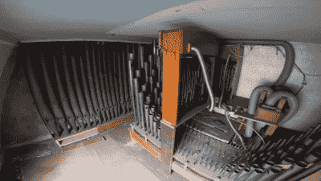

# 如何将一架全尺寸的教堂风琴从家里搬到博物馆

> 原文：<https://hackaday.com/2022/05/31/how-to-move-a-full-sized-church-organ-from-a-house-to-a-museum/>

作为电子爱好者，我们感谢我们的配偶和室友，他们优雅地容忍我们家中所有怪异的设备和混乱的项目。但与管风琴爱好者分享一个人的家需要不同程度的奉献:早在 20 世纪 70 年代，布里斯托尔的一位管风琴师就努力在他们的房子里安装了一个全尺寸的教堂风琴，有效地将一个不起眼的住所变成了一个巨大的乐器。然而，最近这栋房子转让给了新主人，可以理解，新主人急于收回一些空间，将整个系统列在了易贝。

No cash in this attic; just lots of zinc pipes and pneumatic tubing.

谢天谢地，这场拍卖的赢家不是一些废金属经销商，而是我们最喜欢的古怪乐器专家【看，妈妈，没有电脑】。他从肯特郡一路开车来帮助拆卸风琴，并将几十根管子、几英里长的电缆和许多阀门、管子、插销和开关塞进他的货车。回到家后，他面临着一项艰巨的任务，那就是把所有的东西重新组装成能够播放音乐的东西，他目前正在录制一个视频系列。

管风琴的新家是[这座博物馆(并未)过时](https://this-museum-is-not-obsolete.com/)，它有自己的房间，装饰风格类似于它生活了大部分时间的房子。让它工作的第一步是启动鼓风机，这实际上是一个强大的电动气泵和一个压力调节机构。一旦工作正常，就增加一排管道来测试驱动系统。它由一组电磁阀组成，这些电磁阀可以简单地打开或关闭每个管道的气源。[LMNC]仍然拥有早期项目中基于 Arduino 的风琴驱动系统，该系统允许他将 MIDI 键盘连接到部分完成的乐器，并在其上弹奏一些音符。

还有很多事情要做，但我们对[LMNC]迄今为止取得的成就印象深刻，迫不及待地想看到这个器官恢复昔日的辉煌。我们已经知道你可以通过 MIDI 控制管风琴，而且我们已经看到[从零开始建造小得多的管风琴](https://hackaday.com/2021/10/19/the-quadrivium-ensemblebot-is-a-labour-of-love/)。感谢提示，[hackbyte]！

 [https://www.youtube.com/embed/8PwwRR8deHk?version=3&rel=1&showsearch=0&showinfo=1&iv_load_policy=1&fs=1&hl=en-US&autohide=2&wmode=transparent](https://www.youtube.com/embed/8PwwRR8deHk?version=3&rel=1&showsearch=0&showinfo=1&iv_load_policy=1&fs=1&hl=en-US&autohide=2&wmode=transparent)

