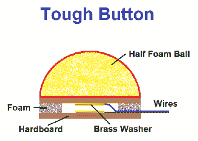

# 令人惊讶的可踩软开关

> 原文：<https://hackaday.com/2022/06/02/surprisingly-stomp-able-soft-switches/>

竞争确实会激发人的兽性，不是吗？那么，当你需要一堆开关，让人们可以反复敲打或踩踏，而不会受到伤害时，你该怎么办呢？你可以看看吉他踏板行业和他们坚固的锁定开关，或者你可以像[wannabemadsci]所做的那样简单地[制造自己的防砸按钮](https://www.instructables.com/Smash-Resistant-Buttons-Fist-Pounding-Tough/)。

 这些开关的主要特点是它们不容易被鞋子或愤怒的拳头损坏。这是因为按钮闪亮的红色按钮部分是通过将泡沫球切成两半制成的。

请注意，不容易被压碎的泡沫聚苯乙烯——像室内足球一样粘糊糊的涂层泡沫。它被安装在一个由硬纸板和几块来自工艺漆刷的易压缩泡沫制成的夹层顶部。

一个黄铜垫圈安装在两块硬纸板的中间，上面焊接有电线，可以读取按钮的压力。然后，就像任何其他瞬间一样，只需将其连接到微控制器即可。

你可以把各种各样的东西切成两半放在上面，比如网球。或者，像[Sprite_TM]所做的那样[使用倒置的塑料碗](https://hackaday.com/2012/01/20/numerous-quiz-buttons-built-on-the-cheap/)。